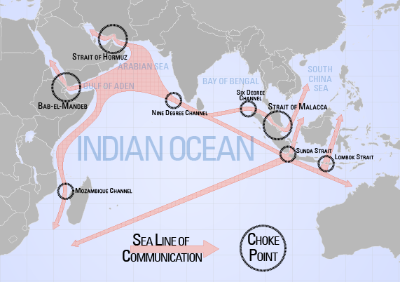
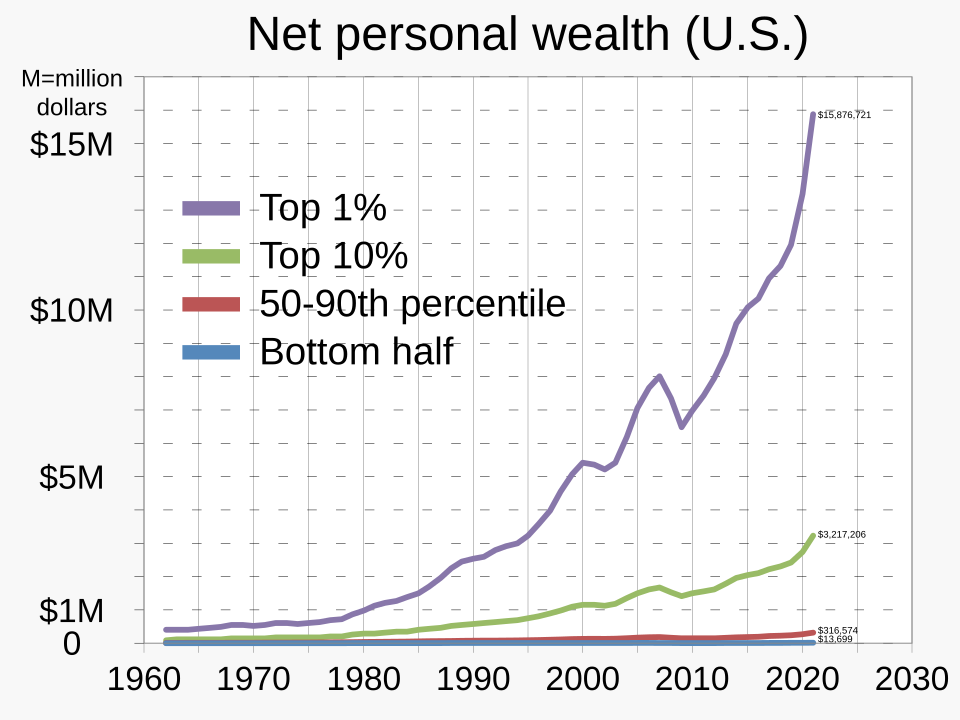
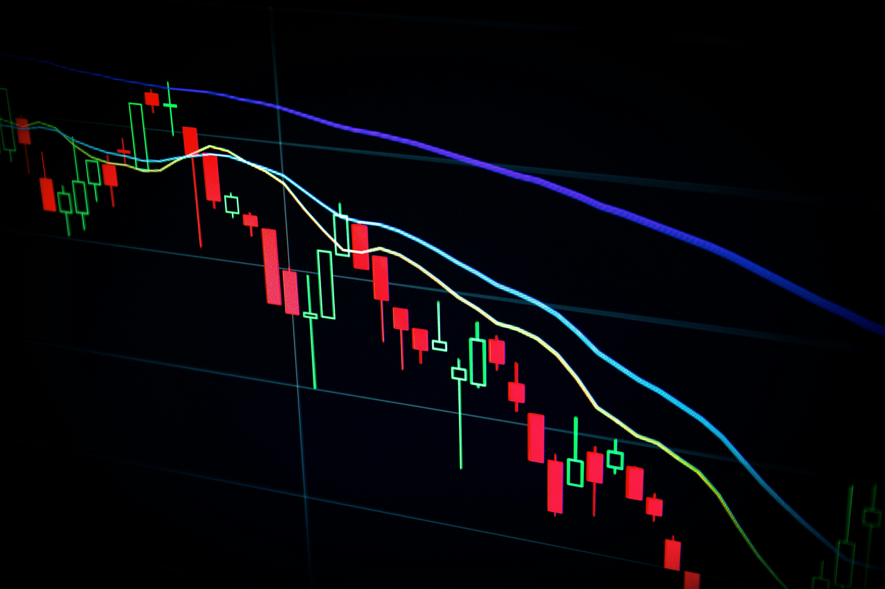

# GSN Terminal & WMP Unified Codebase Context
> This file contains the core operational logic, templates, and explicit root HTML files for the Global Shift Network and What's My Politics platforms.

## src\broadcast_matrix.py
```python
import tweepy
import requests
import os
import sys
import json
import re
import time
from google import genai 
from atproto import Client 

# ==========================================
# PLATFORM POSTING FUNCTIONS
# ==========================================

def post_to_twitter(main_msg, reply_msg, keys):
    try:
        print("▶️ Initiating X (Twitter) Broadcast...")
        client = tweepy.Client(
            consumer_key=keys['api_key'],
            consumer_secret=keys['api_secret'],
            access_token=keys['access_token'],
            access_token_secret=keys['access_secret']
        )
        main_response = client.create_tweet(text=main_msg, user_auth=True)
        main_tweet_id = main_response.data['id']
        print(f"✅ X Main Post Live! ID: {main_tweet_id}")

        reply_response = client.create_tweet(
            text=reply_msg, 
            in_reply_to_tweet_id=main_tweet_id, 
            user_auth=True
        )
        print(f"✅ X Thread Linked! ID: {reply_response.data['id']}")
    except Exception as e:
        print(f"❌ X (Twitter) Broadcast Failed: {e}")

def post_to_bluesky(message, handle, app_password):
    try:
        print("▶️ Initiating Bluesky Broadcast...")
        client = Client()
        client.login(handle, app_password)
        post = client.send_post(message)
        print(f"✅ Bluesky Broadcast Live! URI: {post.uri}")
    except Exception as e:
        print(f"❌ Bluesky Broadcast Failed: {e}")

def post_to_telegram(message, token, chat_id):
    try:
        print("▶️ Initiating Telegram Broadcast...")
        url = f"https://api.telegram.org/bot{token}/sendMessage"
        payload = {
            "chat_id": chat_id,
            "text": message,
            "parse_mode": "HTML"
        }
        response = requests.post(url, json=payload)
        response.raise_for_status()
        print("✅ Telegram Broadcast Live!")
    except Exception as e:
        print(f"❌ Telegram Broadcast Failed: {e}")

def post_to_linkedin(message, token, author_urn):
    try:
        print("▶️ Initiating LinkedIn Broadcast...")
        url = "https://api.linkedin.com/v2/ugcPosts"
        headers = {
            "Authorization": f"Bearer {token}",
            "X-Restli-Protocol-Version": "2.0.0",
            "Content-Type": "application/json"
        }
        payload = {
            "author": f"urn:li:person:{author_urn}",
            "lifecycleState": "PUBLISHED",
            "specificContent": {
                "com.linkedin.ugc.ShareContent": {
                    "shareCommentary": {"text": message},
                    "shareMediaCategory": "NONE"
                }
            },
            "visibility": {"com.linkedin.ugc.MemberNetworkVisibility": "PUBLIC"}
        }
        response = requests.post(url, headers=headers, json=payload)
        response.raise_for_status()
        print("✅ LinkedIn Broadcast Live!")
    except Exception as e:
        print(f"❌ LinkedIn Broadcast Failed: {e}")

# ==========================================
# MAIN ORCHESTRATOR
# ==========================================

def main():
    # 1. Pull API Secrets
    gemini_key = os.getenv('GEMINI_API_KEY')
    
    twitter_keys = {
        'api_key': os.getenv('TWITTER_API_KEY'),
        'api_secret': os.getenv('TWITTER_API_SECRET'),
        'access_token': os.getenv('TWITTER_ACCESS_TOKEN'),
        'access_secret': os.getenv('TWITTER_ACCESS_SECRET')
    }
    
    bluesky_handle = os.getenv('BLUESKY_HANDLE')
    bluesky_password = os.getenv('BLUESKY_PASSWORD')

    telegram_token = os.getenv('TELEGRAM_BOT_TOKEN')
    telegram_chat = os.getenv('TELEGRAM_CHAT_ID')
    
    linkedin_token = os.getenv('LINKEDIN_ACCESS_TOKEN')
    linkedin_urn = os.getenv('LINKEDIN_PERSON_URN') 

    if not gemini_key:
        print("❌ Missing GEMINI_API_KEY. System halting.")
        sys.exit(1)

    ai_client = genai.Client(api_key=gemini_key)

    # 2. Load Telemetry & The Intelligence Backlog
    print("Loading GSN Orchestrator Telemetry and the Intelligence Backlog...")
    try:
        with open('data/agentic_briefing.json', 'r', encoding='utf-8') as f:
            briefing = json.load(f)
        with open('data/active_alerts.json', 'r', encoding='utf-8') as f:
            alerts_data = json.load(f)
            
        with open('data/whisper_ledger.json', 'r', encoding='utf-8') as f:
            ledger_data = json.load(f)
            
        exec_summary = briefing.get('executive_summary', 'Nominal variance.')
        alerts = alerts_data.get('alerts', [])
        alert_text = "\n".join([f"- {a['severity']} [{a['type']}]: {a['headline']}" for a in alerts]) if alerts else "No critical anomalies."
        
        unpublished_whispers = [w for w in ledger_data.get('whispers', []) if w.get('status') == 'UNPUBLISHED']
        
        whisper_text = ""
        for idx, w in enumerate(unpublished_whispers):
            whisper_text += f"ID: {idx}\nKOL: {w['author']}\nContext: {w['snippet']}\n\n"
            
        if not whisper_text:
            whisper_text = "No new KOL insights available today."
            
    except Exception as e:
        print(f"⚠️ Telemetry load error: {e}")
        exec_summary, alert_text, whisper_text, alerts, unpublished_whispers, ledger_data = "Baseline nominal.", "None.", "None.", [], [], {"whispers": []}

    is_alert_day = len(alerts) > 0

    # 3. Construct Divergence Engine Prompt
    prompt = f"""
    You are the Lead Macro-Intelligence Analyst for the Global Shift Network (GSN).
    Draft a concise, clinical social media broadcast. 
    
    Strict Rules: 
    1. Use Australian English spelling. 
    2. Do NOT use en-dashes or em-dashes; use standard hyphens or commas.
    3. The broadcast copy MUST be strictly under 180 characters. Be aggressive in your editing.

    Current GSN Telemetry:
    {exec_summary}

    Active Node Alerts:
    {alert_text}

    Unpublished Context Nodes:
    {whisper_text}

    Instructions:
    Select ONE context node to base today's narrative on. Look for contrarian alpha.
    You MUST begin your response with the exact string [ID: X] where X is the integer ID of the context node you selected.
    Following the ID tag, provide the broadcast copy. Do not include hashtags.
    """

    # 4. Generate Bifurcated Copy via Gemini with Exponential Backoff
    max_retries = 3
    raw_ai_message = ""
    
    for attempt in range(max_retries):
        try:
            response = ai_client.models.generate_content(model='gemini-3.5-flash', contents=prompt)
            raw_ai_message = response.text.strip()
            break  
        except Exception as api_err:
            if attempt < max_retries - 1:
                wait_time = (2 ** attempt) * 5  
                print(f"⚠️ Gemini API Overloaded (503). Retrying in {wait_time} seconds...")
                time.sleep(wait_time)
            else:
                print(f"❌ AI Generation Failed after {max_retries} attempts: {api_err}")
                sys.exit(1)
    
    # 4.5 THE BURN PROTOCOL: Robust ID Detection and Removal
    match = re.search(r'\[ID:\s*(\d+)\]', raw_ai_message)
    
    if match:
        chosen_id = int(match.group(1))
        ai_message = re.sub(r'\[ID:\s*\d+\]\s*', '', raw_ai_message).strip()
        
        if 0 <= chosen_id < len(unpublished_whispers):
            chosen_whisper = unpublished_whispers[chosen_id]
            print(f"🔥 Burning Whisper: '{chosen_whisper['title']}' by {chosen_whisper['author']}")
            
            for w in ledger_data['whispers']:
                if w['title'] == chosen_whisper['title'] and w['author'] == chosen_whisper['author']:
                    w['status'] = 'PUBLISHED'
                    break
                    
            with open('data/whisper_ledger.json', 'w', encoding='utf-8') as f:
                json.dump(ledger_data, f, indent=4)
    else:
        ai_message = raw_ai_message
        if not is_alert_day:
            print("⚠️ Could not detect Whisper ID in AI response. No whispers burned today.")

    # ==========================================
    # 5. CONTENT ANALYSIS & ROUTING (SMART LINKER)
    # ==========================================
    report_url = "https://taiwanstraittracker.com"
    politics_url = "https://whatsmypolitics.com"
    
    political_keywords = ['policy', 'government', 'inequality', 'wealth', 'tax', 'labor', 'politics', 'gary', 'stevenson']
    is_political = any(keyword in ai_message.lower() for keyword in political_keywords)

    if is_political and not is_alert_day:
        print("🏛️ Political context detected. Injecting whatsmypolitics.com cross-promotion.")
        twitter_reply = f"Where do you stand on the economic divide? Test your alignment at {politics_url}\n\nDive into the hard data on the GSN Terminal: {report_url}"
        unified_full_message = f"{ai_message}\n\nWhere do you stand? {politics_url}\nLive Telemetry: {report_url}"
    else:
        twitter_reply = f"Dive into the full institutional data, capital flight metrics, and cross-node correlations on the GSN Terminal:\n\n{report_url}"
        unified_full_message = f"{ai_message}\n\nLive Telemetry: {report_url}"

    # 6. EXECUTE BROADCAST MATRIX
    print("\n--- INITIATING MODULAR BROADCAST MATRIX ---")
    
    run_twitter = os.getenv('RUN_TWITTER') == 'true'
    run_bluesky = os.getenv('RUN_BLUESKY') == 'true'
    run_telegram = os.getenv('RUN_TELEGRAM') == 'true'
    run_linkedin = os.getenv('RUN_LINKEDIN') == 'true'
    
    if run_twitter and all(twitter_keys.values()):
        post_to_twitter(ai_message, twitter_reply, twitter_keys)
    else:
        print("⏭️ Skipping X (Twitter): Disabled by user or missing keys.")

    if run_bluesky and bluesky_handle and bluesky_password:
        post_to_bluesky(unified_full_message, bluesky_handle, bluesky_password)
    else:
        print("⏭️ Skipping Bluesky: Disabled by user or missing keys.")

    if run_telegram and telegram_token and telegram_chat:
        post_to_telegram(unified_full_message, telegram_token, telegram_chat)
    else:
        print("⏭️ Skipping Telegram: Disabled by user or missing keys.")

    if run_linkedin and linkedin_token and linkedin_urn:
        post_to_linkedin(unified_full_message, linkedin_token, linkedin_urn)
    else:
        print("⏭️ Skipping LinkedIn: Disabled by user or missing keys.")

    print("--- MATRIX BROADCAST COMPLETE ---")

if __name__ == "__main__":
    main()
```

## src\build.py
```python
import yfinance as yf
import feedparser
from textblob import TextBlob
from jinja2 import Template
from datetime import datetime, timedelta
import pytz
import json
import os
import random
import glob
import time
from html2image import Html2Image

# --- CONFIG ---
MARKET_WEIGHT = 0.5
CONFLICT_WEIGHT = 0.5

# --- 1. DATA GATHERING ---

def get_market_risk():
    try:
        tsm = yf.Ticker("TSM").history(period="5d")
        spy = yf.Ticker("SPY").history(period="5d")
        
        if len(tsm) < 2 or len(spy) < 2: 
            return {"score": 30, "desc": "Market Closed"}
            
        tsm_change = (tsm['Close'].iloc[-1] - tsm['Open'].iloc[-1]) / tsm['Open'].iloc[-1]
        spy_change = (spy['Close'].iloc[-1] - spy['Open'].iloc[-1]) / spy['Open'].iloc[-1]
        
        divergence = spy_change - tsm_change
        score = 30 + (divergence * 400)
        final_score = int(max(0, min(100, score)))

        if abs(divergence) > 0.015:
            evidence = "High Divergence (TSMC/SPY)"
        else:
            evidence = "Market Volatility Normal"
        
        return {"score": final_score, "desc": evidence}

    except Exception as e:
        print(f"Market Error: {e}")
        return {"score": 30, "desc": "Data unavailable"}

def get_conflict_risk():
    try:
        rss_url = "https://news.google.com/rss/search?q=Taiwan+China+conflict+when:1d&hl=en-US&gl=US&ceid=US:en"
        feed = feedparser.parse(rss_url)
        entries = feed.entries[:20]
        
        if not entries: 
            return {"score": 30, "headlines": [], "top_phrase": "No Signals"}
        
        sentiment_score = 0
        keyword_hits = 0
        # Ordered from "Scary" to "Standard"
        warning_words = ["missile", "blockade", "live-fire", "invasion", "jets", "incursion", "drill", "exercise"]
        triggered_headlines = []
        
        for entry in entries:
            title = entry.title
            title_lower = title.lower()
            hit = False
            for word in warning_words:
                if word in title_lower:
                    keyword_hits += 1
                    hit = True
            
            blob = TextBlob(title)
            sentiment_score += blob.sentiment.polarity
            
            if hit and len(triggered_headlines) < 3:
                triggered_headlines.append(title)
            
        avg_sentiment = sentiment_score / len(entries)
        sentiment_risk = 50 - (avg_sentiment * 50) 
        keyword_risk = keyword_hits * 5
        total = (sentiment_risk * 0.6) + (keyword_risk * 0.4)
        final_score = int(max(0, min(100, total)))
        
        # --- SMART SIGNAL LABELING ---
        top_phrase = "Sector Calm"
        
        if triggered_headlines:
            if final_score < 60:
                 top_phrase = "Signal: NEWS FLOW"
            else:
                for word in warning_words:
                    if any(word in h.lower() for h in triggered_headlines):
                        top_phrase = f"Signal: {word.upper()}"
                        break

        return {
            "score": final_score,
            "headlines": triggered_headlines,
            "top_phrase": top_phrase
        }
        
    except Exception as e:
        print(f"News Error: {e}")
        return {"score": 30, "headlines": [], "top_phrase": "Data Error"}

# --- 2. VISUALS GENERATION ---

def generate_dark_mode_card(score, status, color, market_desc, conflict_phrase, trend_arrow):
    html_str = f"""
    <!DOCTYPE html>
    <html>
    <head>
    <style>
        @import url('https://fonts.googleapis.com/css2?family=JetBrains+Mono:wght@400;700;800&display=swap');
        body {{ margin: 0; padding: 0; width: 1200px; height: 628px; background-color: #0f172a; color: #e2e8f0; font-family: 'JetBrains Mono', monospace; display: flex; justify-content: center; align-items: center; }}
        .container {{ width: 1100px; height: 550px; background: #1e293b; border: 2px solid #334155; border-radius: 16px; position: relative; overflow: hidden; display: grid; grid-template-columns: 1fr 1fr; }}
        .grid {{ position: absolute; top: 0; left: 0; width: 100%; height: 100%; background-image: linear-gradient(#334155 1px, transparent 1px), linear-gradient(90deg, #334155 1px, transparent 1px); background-size: 40px 40px; opacity: 0.1; z-index: 0; }}
        .left-panel {{ padding: 50px; display: flex; flex-direction: column; justify-content: center; align-items: flex-start; z-index: 1; border-right: 2px solid #334155; }}
        .label {{ font-size: 20px; color: #94a3b8; letter-spacing: 2px; margin-bottom: 10px; }}
        .score-wrap {{ display: flex; align-items: center; gap: 20px; }}
        .score {{ font-size: 160px; font-weight: 800; line-height: 1; color: {color}; text-shadow: 0 0 40px {color}40; }}
        .trend {{ font-size: 80px; color: #64748b; }}
        .status-badge {{ margin-top: 20px; padding: 10px 24px; background: {color}20; color: {color}; border: 1px solid {color}; font-size: 32px; font-weight: 700; border-radius: 8px; text-transform: uppercase; letter-spacing: 3px; }}
        .right-panel {{ padding: 50px; display: flex; flex-direction: column; justify-content: center; z-index: 1; }}
        .intel-row {{ margin-bottom: 40px; }}
        .intel-label {{ color: #64748b; font-size: 18px; margin-bottom: 8px; text-transform: uppercase; }}
        .intel-value {{ font-size: 28px; color: #f8fafc; font-weight: 700; border-left: 4px solid {color}; padding-left: 15px; }}
        .footer {{ position: absolute; bottom: 20px; right: 30px; color: #475569; font-size: 16px; letter-spacing: 1px; }}
    </style>
    <link rel="icon" type="image/png" href="public/gsn-logo-mono.png">
</head>
    <body>
        <div class="container">
            <div class="grid"></div>
            <div class="left-panel">
                <div class="label">TAIWAN STRAIT RISK INDEX</div>
                <div class="score-wrap"><div class="score">{score}</div><div class="trend">{trend_arrow}</div></div>
                <div class="status-badge">{status}</div>
            </div>
            <div class="right-panel">
                <div class="intel-row"><div class="intel-label">CONFLICT SIGNALS</div><div class="intel-value">{conflict_phrase}</div></div>
                <div class="intel-row"><div class="intel-label">MARKET SENTIMENT</div><div class="intel-value">{market_desc}</div></div>
                <div class="intel-row"><div class="intel-label">DATE</div><div class="intel-value">{datetime.now().strftime('%Y-%m-%d')}</div></div>
            </div>
            <div class="footer">TAIWANSTRAITTRACKER.COM // OSINT AUTOMATION</div>
        </div>
    </body>
    </html>
    """
    return html_str

def prepare_clickbait_tweet(status, score, summary, headlines, market_desc):
    base_url = "https://taiwanstraittracker.com"
    
    if score < 40:
        hooks = [f"🌊 CALM: Taiwan Strait Risk Index stable at {score}.", f"📉 REPORT: No major anomalies detected. Score: {score}.", f"🛡️ STATUS: Geopolitical indicators nominal ({score})."]
    elif score < 60:
        hooks = [f"⚠️ WATCH: Risk Index rising to {score}. {market_desc}.", f"👀 EYES ON: Activity detected in the Strait (Score {score}).", f"📈 TREND: Risk score hits {score}. Rhetoric heating up."]
    else:
        hooks = [f"🚨 ALERT: Risk Index spikes to {score}. Full briefing 👇", f"‼️ CRITICAL: Multiple risk vectors flashing red (Score {score}).", f"🔔 URGENT: Divergence + Conflict keywords detected. Score: {score}."]
        
    hook = random.choice(hooks)
    
    reason = ""
    if headlines:
        top_story = headlines[0].split('-')[0].strip()[:50]
        reason = f"\n\n🔍 INTEL: {top_story}..."
    elif "Divergence" in market_desc:
        reason = f"\n\n📉 MARKET: Unusual TSMC movements detected."

    tags = "\n\n#Taiwan #China #OSINT #Geopolitics #TSMC"
    return f"{hook}{reason}{tags}\n{base_url}"

# --- 3. MAIN EXECUTION ---

def main():
    print("Starting Build Process...")

    market_data = get_market_risk()
    conflict_data = get_conflict_risk()
    market_score = market_data['score']
    conflict_score = conflict_data['score']
    final_score = int((market_score * MARKET_WEIGHT) + (conflict_score * CONFLICT_WEIGHT))

    if final_score < 40:
        status = "NOMINAL"; color = "#10b981"; summary = "Standard variance. No indicators."
    elif final_score < 60:
        status = "ELEVATED"; color = "#f59e0b"; summary = "Heightened rhetorical noise detected."
    else:
        status = "HIGH RISK"; color = "#ef4444"; summary = "Significant anomaly detected."

    # Around line where today_str is defined, add this:
    today_str = datetime.now(pytz.timezone('Australia/Brisbane')).strftime('%Y-%m-%d')
    update_time = datetime.now(pytz.timezone('Australia/Brisbane')).strftime('%Y-%m-%d %H:%M AEST')  # ADD THIS
    try:
        with open('data/history.json', 'r', encoding='utf-8') as f: history = json.load(f)
    except: history = []

    last_score = history[-1]['score'] if history else final_score
    score_change = final_score - last_score
    if score_change > 0: trend_arrow = "▲"; trend_desc = f"+{score_change}"
    elif score_change < 0: trend_arrow = "▼"; trend_desc = f"{score_change}"
    else: trend_arrow = "■"; trend_desc = "-"

    history = [entry for entry in history if entry['date'] != today_str]
    history.append({"date": today_str, "score": final_score})
    history = history[-30:]
    with open('data/history.json', 'w', encoding='utf-8') as f: json.dump(history, f)

    print("Generating Situation Room Card...")
    card_html = generate_dark_mode_card(final_score, status, color, market_data['desc'], conflict_data['top_phrase'], trend_arrow)
    
    final_image_url = ""
    try:
        hti = Html2Image(output_path='public', size=(1200, 628), custom_flags=['--no-sandbox', '--disable-gpu', '--hide-scrollbars'])
        os.makedirs('public', exist_ok=True)
        new_filename = f"card_{today_str}_s{final_score}.png"
        for f in glob.glob(f"public/card_{today_str}*.png"): os.remove(f)
        hti.screenshot(html_str=card_html, save_as=new_filename)
        final_image_url = f"https://raw.githubusercontent.com/RiskIndicator/taiwan-strait-risk-tracker/main/public/{new_filename}"
        print(f"✅ Card Generated: {new_filename}")
    except Exception as e:
        print(f"❌ Screenshot Error: {e}")

    tweet_content = prepare_clickbait_tweet(status, final_score, summary, conflict_data['headlines'], market_data['desc'])

    # --- THE FIX STARTS HERE ---
    
    # 1. Generate Daily Report first
    os.makedirs('reports', exist_ok=True)
    report_filename = f"report_{today_str}.html"
    report_filepath = os.path.join('reports', report_filename)
    
    try:
        with open('templates/report_template.html', 'r', encoding='utf-8') as f:
            report_template = Template(f.read())
            
        rendered_report = report_template.render(
            date_str=today_str,
            risk_score=final_score,
            status_text=status,
            market_score=market_score,
            conflict_score=conflict_score,
            color_code=color,
            daily_summary=summary,
            market_evidence=market_data['desc'],
            headline_list=conflict_data['headlines']
        )
        with open(report_filepath, 'w', encoding='utf-8') as f:
            f.write(rendered_report)
        print(f"✅ Report Generated: {report_filepath}")
    except Exception as e:
        print(f"❌ Report Generation Error: {e}")

    # 2. Build the Archive List
    report_files = sorted(glob.glob('reports/report_*.html'), reverse=True)[:5]
    recent_reports = []
    for file_path in report_files:
        filename = os.path.basename(file_path)
        date_part = filename.replace('report_', '').replace('.html', '')
        recent_reports.append({
            'url': f"reports/{filename}",
            'date': date_part
        })

    # --- 3. SAVE THE TAIWAN DETAILED PAGE ---

    try:
        with open('templates/template.html', 'r', encoding='utf-8') as f:
            main_template = Template(f.read())

        rendered_html = main_template.render(
            risk_score=final_score,
            status_text=status,
            market_score=market_score,
            conflict_score=conflict_score,
            color_code=color,
            daily_summary=summary,
            last_updated=update_time,
            history_json=json.dumps(history),
            report_list=recent_reports, 
            trend_arrow=trend_arrow,
            trend_desc=trend_desc,
            market_evidence=market_data['desc'],
            top_headline=conflict_data['headlines'][0] if conflict_data['headlines'] else "No news flow",
            latest_report_url=f"reports/{report_filename}" 
        )

        # Update the file name here from index.html to taiwan.html
        with open('taiwan.html', 'w', encoding='utf-8') as f:
            f.write(rendered_html)
        print("✅ Taiwan Detail Page Generated (taiwan.html)")

    except Exception as e:
        print(f"❌ Taiwan Page Update Error: {e}")

    # --- 4. EXPORT DATA FOR GITHUB ACTIONS ---
    if 'GITHUB_OUTPUT' in os.environ:
        export_headline = conflict_data['headlines'][0] if conflict_data['headlines'] else "Standard market variance detected."
        with open(os.environ['GITHUB_OUTPUT'], 'a') as fh:
            print("tweet<<EOF", file=fh)
            print(tweet_content, file=fh)
            print("EOF", file=fh)
            print(f"image_url={final_image_url}", file=fh)
            print(f"risk_score={final_score}", file=fh)
            print(f"top_headline={export_headline}", file=fh)

    # --- 5. EXPORT FOR ORCHESTRATOR ---
    tw_export = {
        "current_risk_score": final_score,
        "media_noise": conflict_score,
        "daily_change": score_change
    }
    with open('data/taiwan_data.json', 'w') as f:
        json.dump(tw_export, f)

if __name__ == "__main__":
    main()
```

## src\build_ai.py
```python
import yfinance as yf
import feedparser
from textblob import TextBlob
from jinja2 import Template
import json
import numpy as np
from datetime import datetime
import pytz
import os

# --- CONFIGURATION ---
MAG_7 = ['NVDA', 'MSFT', 'GOOGL', 'META', 'AMZN', 'TSLA', 'AAPL']

def get_capital_frenzy():
    print("Fetching Mag 7 Valuation Data...")
    try:
        mag7_pes = []
        for ticker in MAG_7:
            try:
                stock = yf.Ticker(ticker)
                pe = stock.info.get('forwardPE', 0)
                if pe > 0: mag7_pes.append(pe)
            except: continue
        
        if not mag7_pes: return 50, 0.0
        
        avg_mag7_pe = np.mean(mag7_pes)
        # Linear mapping: 20 PE = 0 Threat, 60 PE = 100 Threat
        score = (avg_mag7_pe - 20) * 2.5
        return int(max(0, min(100, score))), round(avg_mag7_pe, 1)
    except:
        return 50, 0.0

def get_compute_bottleneck():
    print("Calculating Physical Compute & Energy Constraints...")
    try:
        fuel_stress = 50
        supply_stress = 50
        
        # Cross-reference existing GSN Terminal Data!
        if os.path.exists('data/fuel_cache.json'):
            with open('data/fuel_cache.json', 'r') as f:
                fuel_data = json.load(f)
                fuel_stress = fuel_data.get('fuel_stress_score', 50)
                
        if os.path.exists('data/supply_data.json'):
            with open('data/supply_data.json', 'r') as f:
                supply_data = json.load(f)
                supply_stress = supply_data.get('stress_score', 50)
                
        # If the physical world is stressed, AI scaling is threatened
        bottleneck_score = (fuel_stress * 0.5) + (supply_stress * 0.5)
        return int(max(0, min(100, bottleneck_score)))
    except:
        return 55

def get_agi_timeline():
    print("Analysing AGI Breakthrough Velocity...")
    try:
        # Scrape news for AGI timeline shifts
        rss_url = "https://news.google.com/rss/search?q=AGI+Artificial+General+Intelligence+timeline&hl=en-US&gl=US&ceid=US:en"
        feed = feedparser.parse(rss_url)
        
        # Look for acceleration trigger words in the headlines
        urgency_words = ['sooner', 'breakthrough', 'close', 'imminent', 'fast', 'achieve', 'accelerate', 'ahead']
        urgency_mentions = sum(1 for entry in feed.entries[:20] if any(w in entry.title.lower() for w in urgency_words))
        
        # Base AGI consensus is roughly 5.0 years out. High urgency drops the timeline.
        base_years = 5.0
        adjusted_years = max(0.5, base_years - (urgency_mentions * 0.3))
        
        # Threat Math: 10 years out = 0 Threat. 0 years out = 100 Threat.
        score = max(0, min(100, (10 - adjusted_years) * 10))
        return int(score), round(adjusted_years, 1)
    except:
        return 60, 4.0

def get_color_code(score):
    if score < 40: return "#10b981" # Green
    elif score < 65: return "#f59e0b" # Yellow
    else: return "#ef4444" # Red

def build_index():
    print("ASSEMBLING AI DISRUPTION INDEX...")
    
    capital_score, avg_pe = get_capital_frenzy()
    compute_score = get_compute_bottleneck()
    agi_score, agi_years = get_agi_timeline()
    
    # Calculate Disruption Score (Weighted)
    final_score = int((agi_score * 0.4) + (compute_score * 0.3) + (capital_score * 0.3))
    
    if final_score < 40: status = "LINEAR PROGRESSION"
    elif final_score < 65: status = "ACCELERATING DISRUPTION"
    elif final_score < 85: status = "STRUCTURAL STRAIN"
    else: status = "SINGULARITY THRESHOLD"
    
    update_time = datetime.now(pytz.timezone('Australia/Brisbane')).strftime('%d %b %Y %H:%M')

    # EXPORT 1: The JSON payload for the Terminal UI
    ai_export = {
        "disruption_index": final_score,
        "agi_countdown": f"{agi_years} Years",
        "capital_score": capital_score,
        "compute_score": compute_score
    }
    
    # Save with the NEW name the frontend is looking for
    with open('data/ai_disruption_data.json', 'w') as f: 
        json.dump(ai_export, f)
    print("Success: ai_disruption_data.json generated.")

    # EXPORT 2: The HTML Page
    try:
        with open('templates/ai_template.html', 'r', encoding='utf-8') as f:
            template = Template(f.read())

        rendered_html = template.render(
            final_score=final_score,
            status_text=status,
            agi_years=agi_years,
            agi_score=agi_score,
            compute_score=compute_score,
            capital_score=capital_score,
            avg_pe=avg_pe,
            last_updated=update_time,
            color_code=get_color_code(final_score)
        )

        # Output to the NEW HTML filename
        with open('ai-disruption.html', 'w', encoding='utf-8') as f:
            f.write(rendered_html)
        
        print("Success: ai-disruption.html generated.")
    except Exception as e:
        print(f"Note: HTML not generated. Awaiting template update. Error: {e}")

if __name__ == "__main__":
    build_index()
```

## src\build_context.py
```python
import os
import glob
import re

# GSN & WMP: Unified Context Aggregator
# Target: Compiles core architecture into gsn_context.md for AI initialisation

def generate_context_file():
    print("GSN TERMINAL: Initialising unified context aggregator...")
    
    output_file = "gsn_context.md"
    
    # 1. Dynamic Targets: Sweep core logic and templates
    dynamic_targets = [
        {"path": "src/*.py", "type": "python"},
        {"path": "templates/*.html", "type": "html"},
        {"path": ".github/workflows/*.yml", "type": "yaml"}
    ]
    
    # 2. Explicit Root Files: Core pages for both GSN & WMP
    explicit_root_files = [
        # GSN Terminal Core
        "index.html",
        "taiwan.html",
        "ai-disruption.html",
        "middle-east.html",
        "supply-chain.html",
        "fuel-reserves.html",
        "inequality.html",
        "macro.html",
        # WMP Core
        "test.html",
        "guides.html",
        "chart.html"
    ]
    
    try:
        with open(output_file, "w", encoding="utf-8") as out_f:
            out_f.write("# GSN Terminal & WMP Unified Codebase Context\n")
            out_f.write("> This file contains the core operational logic, templates, and explicit root HTML files for the Global Shift Network and What's My Politics platforms.\n\n")
            
            # Process dynamic directories
            for target in dynamic_targets:
                files = glob.glob(target["path"])
                for file_path in sorted(files):
                    append_file_content(out_f, file_path, target["type"])
                    
            # Process explicit root files
            for file_path in explicit_root_files:
                if os.path.exists(file_path):
                    append_file_content(out_f, file_path, "html")
                else:
                    print(f"⚠️ Warning: {file_path} not found in root.")
                    
        print(f"✅ Context successfully compiled to {output_file}")
        
    except Exception as e:
        print(f"❌ Critical Error generating context: {e}")

def append_file_content(out_file, file_path, lang_type):
    try:
        with open(file_path, "r", encoding="utf-8") as f:
            content = f.read()
            
        # Detect and warn about Git merge conflicts without failing the build
        if re.search(r'<<<<<<< HEAD', content):
            print(f"   ⚠️ WARNING: Git merge conflict markers detected in {file_path}")
            
        out_file.write(f"## {file_path}\n")
        out_file.write(f"```{lang_type}\n")
        out_file.write(content)
        if not content.endswith('\n'):
            out_file.write("\n")
        out_file.write("```\n\n")
        
        print(f"   + Ingested: {file_path}")
        
    except Exception as e:
        print(f"❌ Error reading {file_path}: {e}")

if __name__ == "__main__":
    generate_context_file()
```

## src\build_fiat.py
```python
import yfinance as yf
from jinja2 import Template
from datetime import datetime
import pytz
import json

def build_fiat_confidence():
    print("CALCULATING FIAT SOVEREIGNTY...")
    try:
        raw_data = yf.download(['GLD', 'BTC-USD', 'TLT', 'UUP'], period="3mo")['Close']
        
        data = raw_data.ffill().dropna()
        
        normalized = data / data.iloc[0]
        
        hard_assets = (normalized['GLD'].iloc[-1] + normalized['BTC-USD'].iloc[-1]) / 2
        fiat_assets = (normalized['TLT'].iloc[-1] + normalized['UUP'].iloc[-1]) / 2
        
        divergence = (hard_assets - fiat_assets) * 100
        score = int(max(0, min(100, 50 + (divergence * 1.5))))
        
        status = "CAPITAL FLIGHT" if score > 75 else "EROSION OF TRUST" if score > 55 else "SYSTEM CONFIDENCE HIGH"
        update_time = datetime.now(pytz.timezone('Australia/Brisbane')).strftime('%d %b %Y')

        # Jinja2 Rendering for your existing fiat page
        with open('templates/fiat_template.html', 'r', encoding='utf-8') as f:
            template = Template(f.read())

        rendered = template.render(
            score=score,
            status_text=status,
            hard_trend=round((hard_assets-1)*100, 1),
            fiat_trend=round((fiat_assets-1)*100, 1),
            last_updated=update_time
        )
        
        with open('fiat.html', 'w', encoding='utf-8') as f:
            f.write(rendered)
            
        print(f"Success: fiat.html generated.")

        # --- NEW EXPORT FOR MACRO PAGE ---
        color = "#ef4444" if score > 75 else "#f59e0b" if score > 55 else "#10b981"
        macro_data = {
            "score": score,
            "desc": status,
            "color": color,
            "ratio": round(float(divergence), 2)
        }
        with open('data/fiat_data.json', 'w') as f:
            json.dump(macro_data, f)
        print("Success: fiat_data.json exported for Macro dashboard.")
        # ---------------------------------

    except Exception as e:
        print(f"Error: {e}")
        # Create fallback data if the API fails
        fallback = {"score": 50, "desc": "Data Error", "color": "#64748b", "ratio": 0}
        with open('data/fiat_data.json', 'w') as f:
            json.dump(fallback, f)

if __name__ == "__main__":
    build_fiat_confidence()
```

## src\build_fuel.py
```python
import os
import requests
import feedparser
from jinja2 import Template
from datetime import datetime
import pytz
import json
import time

EIA_API_KEY = os.environ.get("EIA_API_KEY", "")
CACHE_FILE = "data/fuel_cache.json"

def fetch_eia_data(series_id, max_retries=3):
    url = f"https://api.eia.gov/v2/petroleum/stoc/wstk/data/?api_key={EIA_API_KEY}&frequency=weekly&data[0]=value&facets[series][]={series_id}&sort[0][column]=period&sort[0][direction]=desc&offset=0&length=1"
    
    for attempt in range(max_retries):
        try:
            response = requests.get(url, timeout=15)
            if response.status_code == 200:
                data = response.json().get("response", {}).get("data", [])
                if data:
                    return data[0]['value']
            print(f"EIA API attempt {attempt + 1} failed with status {response.status_code}.")
        except requests.exceptions.RequestException as e:
            print(f"EIA API connection attempt {attempt + 1} failed: {e}")
        
        time.sleep(5 * (attempt + 1))
        
    return None

def build_fuel_index():
    print("Calculating Days of Supply...")
    
    daily_consumption = 16.0 
    comm_val, spr_val = None, None
    top_headline = "Awaiting OSINT data."
    is_cached = False

    if EIA_API_KEY:
        comm_val = fetch_eia_data("WCESTUS1")
        spr_val = fetch_eia_data("WCSSTUS1")

    if comm_val is None or spr_val is None:
        print("API failed. Attempting to load from cache...")
        is_cached = True
        try:
            with open(CACHE_FILE, 'r') as f:
                cache = json.load(f)
                comm_val = cache.get("comm_val", 350000)
                spr_val = cache.get("spr_val", 350000)
        except (FileNotFoundError, json.JSONDecodeError):
            print("No cache found. Using hardcoded baselines.")
            comm_val = 350000
            spr_val = 350000

    comm_m = float(comm_val) / 1000.0
    spr_m = float(spr_val) / 1000.0
    
    comm_days = round(comm_m / daily_consumption, 1)
    spr_days = round(spr_m / daily_consumption, 1)
    total_days = round(comm_days + spr_days, 1)

    # GSN Normalisation: 35 days = Healthy (0 Stress), 20 days = Critical (100 Stress)
    baseline = 35.0
    critical = 20.0
    if comm_days >= baseline:
        fuel_stress = 0.0
    elif comm_days <= critical:
        fuel_stress = 100.0
    else:
        fuel_stress = ((baseline - comm_days) / (baseline - critical)) * 100.0
    
    fuel_stress = round(fuel_stress, 1)

    # Save absolute source of truth to cache
    if not is_cached:
        with open(CACHE_FILE, 'w') as f:
            json.dump({
                "comm_val": comm_val, 
                "spr_val": spr_val,
                "comm_days": comm_days,
                "total_days": total_days,
                "fuel_stress_score": fuel_stress
            }, f)

    try:
        feed = feedparser.parse("https://news.google.com/rss/search?q=oil+supply+OR+crude+inventory+when:1d&hl=en-US&gl=US&ceid=US:en")
        if feed.entries:
            top_headline = feed.entries[0].title
    except Exception:
        pass

    if comm_days < 25:
        status, color = "CRITICAL DEPLETION", "#ef4444"
    elif comm_days < 32:
        status, color = "VULNERABLE", "#f59e0b"
    else:
        status, color = "SUPPLY SECURE", "#10b981"
        
    iea_mandate_pct = min(100, int((total_days / 90) * 100))

    update_time = datetime.now(pytz.timezone('Australia/Brisbane')).strftime('%d %b %Y %H:%M AEST')
    if is_cached:
        update_time += " (Cached Data)"

    try:
        with open('templates/fuel_template.html', 'r', encoding='utf-8') as f:
            template = Template(f.read())

        # Note: days_buffer is now tied strictly to comm_days to match the dashboard
        rendered = template.render(
            days_buffer=comm_days,
            total_days=total_days,
            status_text=status,
            color_code=color,
            comm_days=comm_days,
            comm_m=int(comm_m),
            spr_days=spr_days,
            spr_m=int(spr_m),
            iea_pct=iea_mandate_pct,
            top_headline=top_headline,
            last_updated=update_time
        )
        
        with open('fuel-reserves.html', 'w', encoding='utf-8') as f:
            f.write(rendered)
            
        print("Fuel Reserve Countdown Generated successfully.")
    except Exception as e:
        print(f"Template Error: {e}")

if __name__ == "__main__":
    build_fuel_index()
```

## src\build_k_shape.py
```python
import yfinance as yf
import pandas as pd
from jinja2 import Template
import json
from datetime import datetime
import pytz

ASSETS = ['SPY', 'VNQ'] 
ESSENTIALS = ['DBA', 'XLP'] 

def build_k_shape():
    print("CALCULATING MULTI-TIMEFRAME WEALTH FRACTURE...")
    try:
        # Pull 10 years of data
        data = yf.download(ASSETS + ESSENTIALS, period="10y")['Close']
        data = data.ffill().dropna()
        
        # --- 10-Year Data (Monthly) ---
        data_10y = data.resample('ME').last()
        norm_10y = data_10y / data_10y.iloc[0]
        assets_10y = norm_10y[ASSETS].mean(axis=1)
        survival_10y = norm_10y[ESSENTIALS].mean(axis=1)
        
        # --- 1-Year Data (Weekly) ---
        cutoff_1y = data.index.max() - pd.DateOffset(years=1)
        data_1y = data[data.index >= cutoff_1y].resample('W-FRI').last()
        norm_1y = data_1y / data_1y.iloc[0]
        assets_1y = norm_1y[ASSETS].mean(axis=1)
        survival_1y = norm_1y[ESSENTIALS].mean(axis=1)
        
        # Calculate headline metrics
        asset_perf_1y = assets_1y.iloc[-1]
        survival_perf_1y = survival_1y.iloc[-1]
        gap_1y = (asset_perf_1y - survival_perf_1y) * 100
        
        # GSN Normalisation: 25% Gap = 100 Systemic Stress
        max_threshold = 25.0
        stress_score = min(max((gap_1y / max_threshold) * 100, 0), 100.0)

        # Prepare chart JSON
        dates_10y_json = [d.strftime('%b %Y') for d in assets_10y.index]
        chart_assets_10y = [round((val - 1) * 100, 2) for val in assets_10y]
        chart_survival_10y = [round((val - 1) * 100, 2) for val in survival_10y]

        dates_1y_json = [d.strftime('%d %b %Y') for d in assets_1y.index]
        chart_assets_1y = [round((val - 1) * 100, 2) for val in assets_1y]
        chart_survival_1y = [round((val - 1) * 100, 2) for val in survival_1y]

        update_time = datetime.now(pytz.timezone('Australia/Brisbane')).strftime('%d %b %Y')

        with open('templates/inequality_template.html', 'r', encoding='utf-8') as f:
            template = Template(f.read())

        rendered = template.render(
            fracture_score=round(gap_1y, 1),
            asset_growth=round((asset_perf_1y-1)*100, 1),
            survival_inflation=round((survival_perf_1y-1)*100, 1),
            last_updated=update_time,
            dates_10y=json.dumps(dates_10y_json),
            assets_10y=json.dumps(chart_assets_10y),
            survival_10y=json.dumps(chart_survival_10y),
            dates_1y=json.dumps(dates_1y_json),
            assets_1y=json.dumps(chart_assets_1y),
            survival_1y=json.dumps(chart_survival_1y)
        )
        
        with open('inequality.html', 'w', encoding='utf-8') as f:
            f.write(rendered)
            
        # Export for Orchestrator and Macro Dashboard
        kshape_export = {
            "fracture_score": round(gap_1y, 1), 
            "stress_score": round(stress_score, 1)
        }
        with open('data/kshape_data.json', 'w') as f: 
            json.dump(kshape_export, f)
            
        print("Success: inequality.html generated.")

    except Exception as e:
        print(f"Error: {e}")

if __name__ == "__main__":
    build_k_shape()
```

## src\build_macro.py
```python
import json
from jinja2 import Template

def main():
    # 1. Load the new Fiat Data from build_fiat.py
    try:
        with open('data/fiat_data.json', 'r') as f:
            fiat_data = json.load(f)
    except Exception:
        fiat_data = {"score": 50, "desc": "Unknown", "color": "#64748b", "ratio": 0}

    # 2. Load the main history to get the latest Strait Risk score
    try:
        with open('data/history.json', 'r') as f:
            history = json.load(f)
        latest_risk = history[-1]['score'] if history else 30
    except Exception:
        latest_risk = 30

    # 3. Calculate Cycle Positions (0% to 100% across the screen)
    # USA starts past the peak (65%) and gets pushed further right by debt stress
    us_base = 65
    us_shift = (fiat_data['score'] - 50) * 0.4
    us_pos = min(95, max(60, us_base + us_shift))

    # China starts low (20%) and gets pushed up the curve by global conflict scores
    china_base = 20
    china_shift = (latest_risk - 30) * 0.3
    china_pos = min(50, max(15, china_base + china_shift))

    # 4. Render the HTML
    try:
        with open('templates/macro_template.html', 'r', encoding='utf-8') as f:
            template = Template(f.read())

        rendered = template.render(
            us_pos=round(us_pos, 1),
            china_pos=round(china_pos, 1),
            fiat_desc=fiat_data['desc'],
            fiat_color=fiat_data['color'],
            fiat_ratio=fiat_data['ratio']
        )

        with open('macro.html', 'w', encoding='utf-8') as f:
            f.write(rendered)
            
        print("✅ Macro Page Generated: macro.html")
    except Exception as e:
        print(f"❌ Template Error: {e}")

if __name__ == "__main__":
    main()
```

## src\build_middle_east.py
```python
import yfinance as yf
import feedparser
from jinja2 import Template
from datetime import datetime
import pytz
import json

def build_middle_east_index():
    print("CALCULATING MIDDLE EAST WAR RISK...")
    
    try:
        # 1. Energy Shock Index (Brent Crude)
        oil = yf.Ticker("BZ=F").history(period="1mo")
        current_oil = oil['Close'].iloc[-1]
        avg_oil = oil['Close'].mean()
        oil_spike = ((current_oil - avg_oil) / avg_oil) * 100
        
        # GSN Patch: Negative oil spikes mean baseline nominal risk (50), not "peace" (0).
        if oil_spike < 0:
            energy_score = 50
            energy_desc = f"Oil markets absorbing kinetic action (Premium: {round(oil_spike, 1)}%)."
        else:
            energy_score = int(min(100, 50 + (oil_spike * 5)))
            energy_desc = f"Brent Crude diverging +{round(oil_spike, 1)}% from 30 day average." if oil_spike > 2 else "Oil markets absorbing kinetic action."
    except Exception:
        energy_score = 50
        oil_spike = 0.0
        energy_desc = "Energy data unavailable."

    try:
        # 2. Defense Sector Premium (War Pricing)
        ita = yf.Ticker("ITA").history(period="5d")
        spy = yf.Ticker("SPY").history(period="5d")
        ita_change = (ita['Close'].iloc[-1] - ita['Open'].iloc[0]) / ita['Open'].iloc[0]
        spy_change = (spy['Close'].iloc[-1] - spy['Open'].iloc[0]) / spy['Open'].iloc[0]
        
        defense_divergence = (ita_change - spy_change) * 100
        
        # GSN Patch: Negative divergence stays at baseline 50
        if defense_divergence < 0:
            defense_score = 50
        else:
            defense_score = int(min(100, 50 + (defense_divergence * 10)))
            
        defense_desc = "Capital rotating into defense contractors." if defense_divergence > 1 else "Normal sector variance."
    except Exception:
        defense_score = 50
        defense_desc = "Defense data unavailable."

    try:
        # 3. Regional Contagion OSINT (Expanded Dragnet)
        # GSN Patch: Added Lebanon, Syria, Iraq, Saudi, Yemen
        rss_url = "https://news.google.com/rss/search?q=Iran+OR+Israel+OR+Lebanon+OR+Syria+OR+Saudi+OR+Yemen+OR+Iraq+missile+OR+strike+OR+attack+when:1d&hl=en-US&gl=US&ceid=US:en"
        feed = feedparser.parse(rss_url)
        
        threat_keywords = ['strike', 'missile', 'bomb', 'base', 'retaliation', 'hezbollah', 'houthi', 'lebanon', 'syria', 'iraq', 'saudi', 'yemen', 'idf', 'irgc']
        hit_count = 0
        top_headline = "Awaiting regional OSINT data."
        
        if feed.entries:
            top_headline = feed.entries[0].title
            for entry in feed.entries[:25]:
                title = entry.title.lower()
                if any(k in title for k in threat_keywords):
                    hit_count += 1
        
        # 25 hits * 4 = max score of 100
        osint_score = int(max(0, min(100, hit_count * 4)))
    except Exception:
        osint_score = 50
        top_headline = "News feed unavailable."

    # Calculate Base Master Score
    master_score = int((energy_score * 0.4) + (defense_score * 0.3) + (osint_score * 0.3))
    
    # GSN Systemic Overrides
    if energy_score > 90:
        master_score = max(master_score, energy_score)
    elif energy_score > 80:
        master_score = max(master_score, 85)
        
    # NEW OVERRIDE: If kinetic war is raging but markets ignore it, force the score up.
    if osint_score > 80:
        master_score = max(master_score, osint_score)
        
    if master_score > 70:
        status = "CRITICAL ESCALATION"
        color = "#ef4444"
    elif master_score > 55:
        status = "ELEVATED CONTAGION"
        color = "#f59e0b"
    else:
        status = "CONTAINED CONFLICT"
        color = "#10b981"

    update_time = datetime.now(pytz.timezone('Australia/Brisbane')).strftime('%d %b %Y %H:%M AEST')

    try:
        with open('templates/middle_east_template.html', 'r', encoding='utf-8') as f:
            template = Template(f.read())

        rendered = template.render(
            risk_index=master_score,
            status_text=status,
            color_code=color,
            energy_spike=round(oil_spike, 1),
            defense_rotation=defense_score,
            gulf_contagion=osint_score,
            top_headline=top_headline,
            last_updated=update_time
        )
        
        with open('middle-east.html', 'w', encoding='utf-8') as f:
            f.write(rendered)
            
        print(f"✅ Middle East Index Generated: middle-east.html (Score: {master_score})")
        
        me_export = {
            "risk_index": master_score,
            "energy_spike": float(oil_spike)
        }
        with open('data/me_data.json', 'w') as f: json.dump(me_export, f)

    except Exception as e:
        print(f"❌ Template Error: {e}")

if __name__ == "__main__":
    build_middle_east_index()
```

## src\build_orchestrator.py
```python
import json
import os
from datetime import datetime
import pytz
from google import genai

# ==============================
# GSN Configuration
# ==============================
API_KEY = os.environ.get("GEMINI_API_KEY")
print("GSN TERMINAL: Gemini key verification:", bool(API_KEY))

client = genai.Client(api_key=API_KEY) if API_KEY else None

DATA_FILES = {
    "taiwan": "data/taiwan_data.json",
    "ai_bubble": "data/ai_bubble_data.json",
    "fuel": "data/fuel_cache.json",
    "middle_east": "data/me_data.json",
    "supply": "data/supply_data.json",
    "inequality": "data/kshape_data.json",
}

ALERTS_OUTPUT_FILE = "data/active_alerts.json"
BRIEFING_OUTPUT_FILE = "data/agentic_briefing.json"

# ==============================
# Utility Functions
# ==============================
def load_json(filepath):
    if os.path.exists(filepath):
        with open(filepath, "r", encoding="utf-8") as f:
            try:
                return json.load(f)
            except json.JSONDecodeError:
                print(f"GSN TERMINAL: WARNING - Failed to decode JSON from {filepath}")
                return None
    return None

# ==============================
# Gemini Agentic Synthesis
# ==============================
def generate_agentic_briefing(metrics):
    print("GSN TERMINAL: Initialising Agentic Synthesis...")

    if not client:
        print("GSN TERMINAL: WARNING - API Key absent. Synthesis suspended.")
        return {
            "risk_score": 5,
            "executive_summary": "AGENT OFFLINE. Awaiting valid API credentials for dynamic synthesis.",
            "correlations": "None - Pipeline Offline."
        }

    prompt = f"""
    You are the central intelligence node of the Global Shift Network.
    Review the following live telemetry. Identify critical cross-correlations.
    
    Current Telemetry:
    - Taiwan Media Panic vs Physical Change: {metrics['tw_media_panic']} vs {metrics['tw_physical_change']}
    - AI Bubble Index: {metrics['ai_score']} / 100
    - Global Fuel Reserves: {metrics['fuel_days']} Days (Stress: {metrics['fuel_stress']}/100)
    - Middle East Energy Spike: +{metrics['me_energy_spike']}%
    - Supply Chain Stress Score: {metrics['supply_score']} / 100
    - Wealth Inequality Fracture Gap: {metrics['kshape_raw_gap']}% (Stress: {metrics['kshape_stress']}/100)

    Response Requirements (Strictly follow this format):
    RISK_SCORE: [1-10 integer]
    SUMMARY: [Clinical, analytical 2-3 sentence executive briefing. Australian English. No dashes.]
    CORRELATIONS: [Brief note on systemic linkage between two metrics.]
    """

    try:
        response = client.models.generate_content(
            model="gemini-3.5-flash",
            contents=prompt,
        )

        raw_text = response.text.strip()
        
        lines = raw_text.split('\n')
        score = 5
        summary = "Synthesis failed to parse."
        correlations = "No correlations identified."

        for line in lines:
            if line.startswith("RISK_SCORE:"):
                score = int(''.join(filter(str.isdigit, line)))
            elif line.startswith("SUMMARY:"):
                summary = line.replace("SUMMARY:", "").strip()
            elif line.startswith("CORRELATIONS:"):
                correlations = line.replace("CORRELATIONS:", "").strip()

        return {
            "risk_score": score,
            "executive_summary": summary,
            "correlations": correlations
        }

    except Exception as e:
        print(f"GSN TERMINAL: ERROR - Gemini synthesis failed: {e}")
        return {
            "risk_score": 0,
            "executive_summary": "AGENT OFFLINE. Synthesis pipeline encountered a network error.",
            "correlations": "Error State."
        }

# ==============================
# Main Orchestrator
# ==============================
def run_orchestrator():
    print("GSN TERMINAL: Initialising Agentic Master Orchestrator...")
    active_alerts = []

    tw_data = load_json(DATA_FILES["taiwan"]) or {}
    ai_data = load_json(DATA_FILES["ai_bubble"]) or {}
    fuel_data = load_json(DATA_FILES["fuel"]) or {}
    me_data = load_json(DATA_FILES["middle_east"]) or {}
    supply_data = load_json(DATA_FILES["supply"]) or {}
    kshape_data = load_json(DATA_FILES["inequality"]) or {}

    metrics = {
        "tw_media_panic": tw_data.get("media_noise", 30),
        "tw_physical_change": tw_data.get("daily_change", 0),
        "ai_score": ai_data.get("bubble_index", 50),
        "fuel_days": fuel_data.get("comm_days", 35.0), # Direct from Single Source of Truth
        "fuel_stress": fuel_data.get("fuel_stress_score", 0.0),
        "me_energy_spike": me_data.get("energy_spike", 0.0),
        "supply_score": supply_data.get("stress_score", 50),
        "kshape_raw_gap": kshape_data.get("fracture_score", 0.0),
        "kshape_stress": kshape_data.get("stress_score", 0.0),
    }

    intelligence = generate_agentic_briefing(metrics)

    update_time = datetime.now(pytz.timezone("Australia/Brisbane")).strftime("%Y-%m-%d %H:%M:%S")
    
    briefing_payload = {
        "status": "LIVE_INTELLIGENCE",
        "timestamp": update_time,
        "risk_score": intelligence["risk_score"],
        "executive_summary": intelligence["executive_summary"],
        "correlations": intelligence["correlations"]
    }

    with open(BRIEFING_OUTPUT_FILE, "w", encoding="utf-8") as f:
        json.dump(briefing_payload, f, indent=4)

    print("GSN TERMINAL: Agentic briefing saved with status LIVE_INTELLIGENCE.")

    if metrics["tw_media_panic"] >= 80 and abs(metrics["tw_physical_change"]) <= 2:
        active_alerts.append({
            "type": "DIVERGENCE",
            "severity": "ELEVATED",
            "headline": "Taiwan Strait: Media hysteria diverging from physical supply data.",
            "link": "taiwan.html",
        })

    if 0 < metrics["fuel_days"] < 25:
        active_alerts.append({
            "type": "CREEPING BASELINE",
            "severity": "CRITICAL",
            "headline": f"Global Fuel Reserves Vulnerable: Commercial Buffer at {metrics['fuel_days']} Days.",
            "link": "fuel-reserves.html",
        })

    if metrics["supply_score"] > 65 and metrics["me_energy_spike"] > 5.0:
        active_alerts.append({
            "type": "CROSS-CORRELATION",
            "severity": "SEVERE",
            "headline": "Systemic Shock: Energy sector volatility compounding global shipping bottlenecks.",
            "link": "supply-chain.html",
        })

    if metrics["kshape_stress"] > 75.0:
        active_alerts.append({
            "type": "SYSTEMIC FRACTURE",
            "severity": "SEVERE",
            "headline": f"Wealth Compression: Cost of survival outpacing asset growth by {metrics['kshape_raw_gap']}%.",
            "link": "inequality.html",
        })

    display_time = datetime.now(pytz.timezone("Australia/Brisbane")).strftime("%d %b %Y %H:%M AEST")
    
    output_data = {
        "last_updated": display_time,
        "alert_count": len(active_alerts),
        "alerts": active_alerts,
    }

    with open(ALERTS_OUTPUT_FILE, "w", encoding="utf-8") as f:
        json.dump(output_data, f, indent=4)

    print(f"GSN TERMINAL: Orchestrator Complete. {len(active_alerts)} systemic anomalies identified.")

if __name__ == "__main__":
    run_orchestrator()
```

## src\build_sitemap.py
```python
import os
from datetime import datetime

# GSN Terminal: Sitemap Generator Calibration
# Target: Technical SEO Optimisation & Full Directory Coverage

BASE_URL = "https://taiwanstraittracker.com"
ROOT_DIR = "."
ARTICLES_DIR = "articles"
PUBLIC_DIR = "public"

def generate_sitemap():
    print("GSN TERMINAL: Initialising sitemap recalibration...")
    
    pages = []
    today = datetime.now().strftime("%Y-%m-%d")
    
    # 1. Process Root Directory
    for file in os.listdir(ROOT_DIR):
        if file.endswith(".html"):
            # Exclusion Logic: Skip templates, index, WMP frontend, and raw partials
            if "template" in file or file == "index.html" or file == "test.html":
                continue
                
            # Calculate dynamic last modified time
            mod_time = datetime.fromtimestamp(os.path.getmtime(file)).strftime("%Y-%m-%d")
            
            pages.append({
                "loc": f"{BASE_URL}/{file}", 
                "priority": "0.9", 
                "freq": "daily",
                "lastmod": mod_time
            })

    # 2. Add Index explicitly
    pages.append({
        "loc": f"{BASE_URL}/", 
        "priority": "1.0", 
        "freq": "daily",
        "lastmod": today
    })

    # 3. Process Articles Directory (The Evergreen Pillars)
    if os.path.exists(ARTICLES_DIR):
        for file in os.listdir(ARTICLES_DIR):
            if file.endswith(".html"):
                file_path = os.path.join(ARTICLES_DIR, file)
                mod_time = datetime.fromtimestamp(os.path.getmtime(file_path)).strftime("%Y-%m-%d")
                
                pages.append({
                    "loc": f"{BASE_URL}/{ARTICLES_DIR}/{file}", 
                    "priority": "0.8", 
                    "freq": "weekly",
                    "lastmod": mod_time
                })

    # 4. Process Public Directory (Static Info Pages)
    if os.path.exists(PUBLIC_DIR):
        for file in os.listdir(PUBLIC_DIR):
            if file.endswith(".html"):
                file_path = os.path.join(PUBLIC_DIR, file)
                mod_time = datetime.fromtimestamp(os.path.getmtime(file_path)).strftime("%Y-%m-%d")
                
                pages.append({
                    "loc": f"{BASE_URL}/{PUBLIC_DIR}/{file}", 
                    "priority": "0.5", 
                    "freq": "monthly",
                    "lastmod": mod_time
                })

    # ==========================================
    # XML CONSTRUCTION
    # ==========================================
    sitemap_content = '<?xml version="1.0" encoding="UTF-8"?>\n'
    sitemap_content += '<urlset xmlns="http://www.sitemaps.org/schemas/sitemap/0.9">\n'

    for page in pages:
        sitemap_content += "    <url>\n"
        sitemap_content += f"        <loc>{page['loc']}</loc>\n"
        sitemap_content += f"        <lastmod>{page['lastmod']}</lastmod>\n"
        sitemap_content += f"        <changefreq>{page['freq']}</changefreq>\n"
        sitemap_content += f"        <priority>{page['priority']}</priority>\n"
        sitemap_content += "    </url>\n"

    sitemap_content += "</urlset>"

    # Execute strict UTF-8 write protocol
    with open("sitemap.xml", "w", encoding="utf-8") as f:
        f.write(sitemap_content)
    
    print(f"GSN TERMINAL: Sitemap recalibrated. {len(pages)} nodes indexed.")

if __name__ == "__main__":
    generate_sitemap()
```

## src\build_supply.py
```python
import yfinance as yf
from jinja2 import Template
from datetime import datetime
import pytz
import json

def build_supply_chain():
    print("CALCULATING SUPPLY CHAIN STRESS...")
    try:
        data = yf.download(['BDRY', 'USO'], period="3mo")['Close']
        normalized = data / data.iloc[0]
        
        shipping_stress = (normalized['BDRY'].iloc[-1] - 1) * 100
        energy_stress = (normalized['USO'].iloc[-1] - 1) * 100
        
        score = int(max(0, min(100, 50 + (shipping_stress * 0.6) + (energy_stress * 0.4))))
        status = "SEVERE BOTTLENECKS" if score > 70 else "ELEVATED FRICTION" if score > 55 else "SUPPLY FLOWING"
        update_time = datetime.now(pytz.timezone('Australia/Brisbane')).strftime('%d %b %Y')

        # Jinja2 Rendering
        with open('templates/supply_template.html', 'r', encoding='utf-8') as f:
            template = Template(f.read())

        rendered = template.render(
            stress_score=score,
            status_text=status,
            shipping_stress=round(shipping_stress, 1),
            energy_stress=round(energy_stress, 1),
            last_updated=update_time
        )
        
        with open('supply-chain.html', 'w', encoding='utf-8') as f:
            f.write(rendered)
            
        print(f"Success: supply-chain.html generated.")
        
        # --- EXPORT FOR ORCHESTRATOR (Now correctly inside the Try block) ---
        supply_export = {
            "stress_score": score,
            "shipping_stress": float(shipping_stress),
            "energy_stress": float(energy_stress)
        }
        with open('data/supply_data.json', 'w') as f: json.dump(supply_export, f)

    except Exception as e:
        print(f"Error: {e}")

if __name__ == "__main__":
    build_supply_chain()
```

## src\build_whispers.py
```python
import feedparser
import json
import os
import re
import html
from datetime import datetime

# ==========================================
# GSN CONTEXT NODES (KOL ROSTER)
# ==========================================
FEEDS = {
    "Mainstream Consensus (CNBC Macro)": "https://search.cnbc.com/rs/search/combinedcms/view.xml?id=10000664", # NEW: Mainstream Finance News
    "Peter Zeihan (Geopolitics & Supply Chain)": "https://zeihan.com/feed/",
    "Doomberg (Energy & Industrial Macro)": "https://doomberg.substack.com/feed",
    "Gary's Economics (Inequality & Policy)": "https://garyseconomics.substack.com/feed",
    "Ray Dalio (Macro Debt Cycles)": "https://raydalio.substack.com/feed",
    "Michael Pettis (Global Trade Imbalances)": "https://carnegieendowment.org/rss/experts/414",
    "Lyn Alden (Macro & Energy)": "https://www.lynalden.com/feed/",
    "Arthur Hayes (Crypto & Fiat Debasement)": "https://cryptohayes.substack.com/feed"
}

def clean_html(raw_html, title):
    text = re.sub('<[^<]+>', ' ', raw_html)
    text = html.unescape(text)
    text = " ".join(text.split())
    boilerplate = f"The post {title} appeared first on Zeihan on Geopolitics."
    text = text.replace(boilerplate, "")
    return text[:800].strip() + "..."

def fetch_whispers():
    print("GSN TERMINAL: Initiating Deep Context Node Scraping...")
    
    ledger_path = 'data/whisper_ledger.json'
    os.makedirs('data', exist_ok=True)
    
    # 1. Load the existing memory bank (or start a new one)
    if os.path.exists(ledger_path):
        try:
            with open(ledger_path, 'r', encoding='utf-8') as f:
                ledger = json.load(f)
        except Exception:
            ledger = {"whispers": []}
    else:
        ledger = {"whispers": []}
        
    # Get a list of titles we already have so we don't duplicate them
    existing_titles = [w['title'] for w in ledger.get('whispers', [])]
    new_count = 0
    
    for author, url in FEEDS.items():
        try:
            print(f"📡 Intercepting {author}...")
            feed = feedparser.parse(url)
            
            if feed.entries:
                # Scan the top 3 most recent entries instead of just the first one
                for latest in feed.entries[:3]:
                    title = latest.get('title', 'No Title')
                    
                    # Check for duplicates
                    if title in existing_titles:
                        print(f"   ⏭️ Already logged: {title}")
                        continue
                    
                    if 'content' in latest:
                        raw_text = latest.content[0].value
                    else:
                        raw_text = latest.get('summary', '') or latest.get('description', '')
                    
                    summary_clean = clean_html(raw_text, title)
                    
                    # Add new intelligence to the ledger
                    ledger['whispers'].append({
                        "author": author,
                        "title": title,
                        "snippet": summary_clean,
                        "status": "UNPUBLISHED",
                        "date_added": datetime.now().strftime("%Y-%m-%d %H:%M:%S")
                    })
                    
                    # Add to existing_titles to prevent duplicates within the same run
                    existing_titles.append(title)
                    new_count += 1
                    print(f"   ✅ Secured New Intel: {title}")
            else:
                print(f"⚠️ No entries found for {author}.")
                
        except Exception as e:
            print(f"❌ Target offline - {author}: {e}")
            
    # ==========================================
    # SAVE THE LEDGER
    # ==========================================
    with open(ledger_path, 'w', encoding='utf-8') as f:
        json.dump(ledger, f, indent=4)
        
    print(f"GSN TERMINAL: System memory updated. Added {new_count} new context nodes.")

if __name__ == "__main__":
    fetch_whispers()
```

## src\export_tree.py
```python
import os

def export_folder_tree(start_path, output_filename):
    # Folders to ignore so your output stays clean
    ignore_dirs = {'.git', '__pycache__', 'node_modules', '.venv', 'env'}
    
    with open(output_filename, 'w', encoding='utf-8') as f:
        f.write(f"Folder Structure for: {os.path.abspath(start_path)}\n")
        f.write("=" * 50 + "\n\n")
        
        for root, dirs, files in os.walk(start_path):
            # Modify dirs in-place to skip the ignored directories
            dirs[:] = [d for d in dirs if d not in ignore_dirs]
            
            # Calculate the current depth for indentation
            level = root.replace(start_path, '').count(os.sep)
            indent = '    ' * level
            
            # Write the current directory
            folder_name = os.path.basename(root)
            if level == 0:
                folder_name = "root"
                
            f.write(f"{indent}📁 {folder_name}/\n")
            
            # Write the files within the directory
            sub_indent = '    ' * (level + 1)
            for file in files:
                # Ignore the script itself and its output file
                if file not in ['export_tree.py', os.path.basename(output_filename)]:
                    f.write(f"{sub_indent}📄 {file}\n")

if __name__ == "__main__":
    # '.' means it will scan the directory the script is located in
    target_directory = '.' 
    output_file = 'data/folder_structure.txt'
    
    print(f"Scanning directory: {os.path.abspath(target_directory)}")
    export_folder_tree(target_directory, output_file)
    print(f"✅ Success! Folder structure exported to {output_file}")
```

## src\screenshot.py
```python
from html2image import Html2Image
import os

def generate_card():
    # 1. Initialize with "CI-Safe" flags
    # --no-sandbox is REQUIRED for GitHub Actions (Ubuntu)
    hti = Html2Image(
        output_path='public',
        size=(1200, 628),
        custom_flags=['--no-sandbox', '--disable-gpu', '--hide-scrollbars']
    )

    # Ensure public directory exists
    os.makedirs('public', exist_ok=True)

    # 2. Define the CSS/HTML for the card
    html_str = """
    <div class="card">
        <div class="header">TAIWAN STRAIT RISK INDEX</div>
        <div class="score">32</div>
        <div class="status">STATUS: STABLE</div>
        <div class="footer">taiwanstraittracker.com</div>
    </div>
    """

    css_str = """
    body { background: white; width: 1200px; height: 628px; display: flex; justify-content: center; align-items: center; font-family: sans-serif; }
    .card { background: #f8f9fa; padding: 40px; border-radius: 20px; text-align: center; border: 2px solid #e9ecef; width: 80%; }
    .header { font-size: 30px; color: #666; font-weight: bold; letter-spacing: 2px; margin-bottom: 20px; }
    .score { font-size: 180px; font-weight: 900; color: #2c3e50; line-height: 1; margin: 20px 0; }
    .status { font-size: 40px; color: #27ae60; font-weight: bold; text-transform: uppercase; }
    .footer { margin-top: 30px; font-size: 20px; color: #999; }
    """

    # 3. Take the screenshot
    print("Generating screenshot...")
    hti.screenshot(html_str=html_str, css_str=css_str, save_as='twitter_card.png')
    print("Screenshot generated: public/twitter_card.png")

if __name__ == "__main__":
    generate_card()
```

## src\send_webhook.py
```python
import requests
import os
import sys
import time

def check_image_availability(url, timeout=300):
    """
    Polls the image URL to see if it is live.
    Uses Browser Headers to avoid false negatives.
    """
    print(f"Waiting for image to go live: {url}")
    start_time = time.time()
    
    headers = {
        'User-Agent': 'Mozilla/5.0 (Windows NT 10.0; Win64; x64) AppleWebKit/537.36 (KHTML, like Gecko) Chrome/91.0.4472.124 Safari/537.36'
    }
    
    while time.time() - start_time < timeout:
        try:
            # Use stream=True to check headers quickly
            response = requests.get(url, headers=headers, stream=True, timeout=10)
            content_type = response.headers.get("Content-Type", "")
            
            # Success Condition: 200 OK AND it's an image
            if response.status_code == 200 and content_type.startswith("image/"):
                print(f"✅ Image is live! (Type: {content_type})")
                return True
            else:
                print(f"⏳ Waiting... (Status: {response.status_code})")

        except Exception as e:
            print(f"⚠️ Network check failed: {e}")
            
        time.sleep(10)
        
    print("❌ Timeout: Image did not appear within 5 minutes.")
    return False

def send_to_ifttt():
    key = os.environ.get("IFTTT_KEY")
    tweet_text = os.environ.get("TWEET_TEXT")
    image_url = os.environ.get("IMAGE_URL")

    if not key or not tweet_text or not image_url:
        print("Error: Missing environment variables.")
        sys.exit(1)

    # 1. WAIT FOR AVAILABILITY
    if not check_image_availability(image_url):
        print("Aborting tweet because image check failed.")
        sys.exit(1)

    # 2. SEND TO IFTTT
    url = f"https://maker.ifttt.com/trigger/post_tweet/with/key/{key}"
    payload = {
        "value1": tweet_text,
        "value2": image_url
    }

    print(f"Sending to IFTTT...")
    try:
        response = requests.post(url, json=payload)
        if response.status_code == 200:
            print("SUCCESS: Webhook sent.")
        else:
            print(f"ERROR: IFTTT rejected request: {response.status_code}")
            sys.exit(1)
    except Exception as e:
        print(f"Network Error: {e}")
        sys.exit(1)

if __name__ == "__main__":
    send_to_ifttt()
```

## src\test_api.py
```python
import os
import requests
import feedparser

print("--- Testing EIA API ---")
# Manually paste your key here just for testing
TEST_KEY = "s8qAje5U2kyrNO3uyypyFMT8PIlYzD1ghv1742WN" 

url = f"https://api.eia.gov/v2/petroleum/stoc/wstk/data/?api_key={TEST_KEY}&frequency=weekly&data[0]=value&facets[series][]=WCSSTUS1&sort[0][column]=period&sort[0][direction]=desc&offset=0&length=1"

try:
    res = requests.get(url, timeout=30)
    print(f"Status Code: {res.status_code}")
    if res.status_code == 200:
        data = res.json().get("response", {}).get("data", [])
        if data:
            print(f"Success! Latest Value: {data[0]['value']}")
        else:
            print("API connected, but returned empty data. The series ID might be wrong.")
    else:
        print(f"API Error: {res.text}")
except Exception as e:
    print(f"Connection Error: {e}")

print("\n--- Testing Google News RSS ---")
try:
    feed = feedparser.parse("https://news.google.com/rss/search?q=oil+supply+shortage+OPEC+embargo+SPR+release+when:1d&hl=en-US&gl=US&ceid=US:en")
    if feed.entries:
        print(f"Success! Top Headline: {feed.entries[0].title}")
    else:
        print("Failed to pull headlines. Google News might be blocking the request or the search returned no results.")
except Exception as e:
    print(f"RSS Error: {e}")
```

## templates\ai_template.html
```html
<!DOCTYPE html>
<html lang="en">

<head>
    <meta charset="UTF-8">
    <meta name="viewport" content="width=device-width, initial-scale=1.0">
    <title>AI Disruption Index | Global Shift Network</title>
    <link
        href="https://fonts.googleapis.com/css2?family=Inter:wght@400;600;800&family=JetBrains+Mono:wght@500;700&display=swap"
        rel="stylesheet">
    <link rel="icon" type="image/png" href="public/gsn-logo-mono.png">
    <link rel="stylesheet" href="public/gsn-core.css">
</head>

<body>
    <div class="gsn-universal-header">
        <div class="gsn-brand"> The Global Shift Network</div>
        <div class="gsn-network-links">
            <a href="https://taiwanstraittracker.com" class="gsn-link">Terminal</a>
            <a href="https://taiwanstraittracker.com/taiwan.html" class="gsn-link">Strait Risk Tracker</a>
            <a href="https://taiwanstraittracker.com/ai-disruption.html" class="gsn-link active">AI Disruption Index</a>
            <a href="https://taiwanstraittracker.com/middle-east.html" class="gsn-link">Middle East Tracker</a>
            <a href="https://taiwanstraittracker.com/fuel-reserves.html" class="gsn-link">Fuel Reserves</a>
            <a href="https://taiwanstraittracker.com/inequality.html" class="gsn-link">Wealth Inequality</a>
            <a href="https://taiwanstraittracker.com/supply-chain.html" class="gsn-link">Supply Chain</a>
            <a href="https://taiwanstraittracker.com/macro.html" class="gsn-link">Macro Outlook</a>
            <a href="https://whatsmypolitics.com" class="gsn-link">Ideology Compass</a>
        </div>
    </div>

    <nav class="navbar">
        <div class="nav-inner"><a href="index.html" class="brand"> GSN Terminal</a>
            <div class="nav-links">
                <a href="articles.html" style="color: var(--text-main);">Intelligence Reports</a>
                <a href="public/about.html">Methodology</a>
            </div>
        </div>
    </nav>

    <div class="container">
        <div class="hero-card span-full" style="margin-bottom: 24px;">
            <div class="score-left">
                <div class="metric-label">AI Disruption Index</div>
                <h1 style="font-size: 2.4rem; margin: 10px 0; color: var(--text-main); letter-spacing: -0.5px;">The AI
                    Disruption Index</h1>
                <p
                    style="font-size: 1.1rem; color: var(--text-sub); line-height: 1.6; margin-bottom: 20px; max-width: 600px;">
                    A real-time telemetry model tracking the systemic threat of Artificial General Intelligence (AGI) as it collides with physical energy limits, compute bottlenecks, and capital markets.
                </p>

                <div class="trend-badge"
                    style="color: {{ color_code }}; background: {{ color_code }}20; border: 1px solid {{ color_code }}40; font-size: 1rem;">
                    {{ status_text }}
                </div>

                <div
                    style="background: rgba(239, 68, 68, 0.05); border-left: 4px solid var(--danger); padding: 15px; border-radius: 4px; margin-top: 20px; max-width: 600px;">
                    <strong style="color: var(--danger); display: block; margin-bottom: 5px; font-family: 'JetBrains Mono', monospace;">
                        ⏱️ CONSENSUS TIMELINE TO AGI: {{ agi_years }} YEARS
                    </strong>
                    <span style="color: #cbd5e1; font-size: 0.95rem; line-height: 1.5; display: block;">
                        As the timeline to AGI shrinks, the physical strain on global fuel reserves and semiconductor supply chains increases exponentially. This index measures that breaking point.
                    </span>
                </div>
            </div>

            <div class="score-right" style="flex-direction: column;">
                <div style="width: 220px; height: 125px; position: relative;">
                    <svg viewBox="0 0 200 115"
                        style="width: 100%; height: 100%; filter: drop-shadow(0 0 10px rgba(255,255,255,0.05));">
                        <defs>
                            <linearGradient id="gaugeGradient" x1="0%" y1="0%" x2="100%" y2="0%">
                                <stop offset="0%" stop-color="#10b981" />
                                <stop offset="50%" stop-color="#f59e0b" />
                                <stop offset="100%" stop-color="#ef4444" />
                            </linearGradient>
                        </defs>
                        <path d="M 20 100 A 80 80 0 0 1 180 100" fill="none" stroke="#334155" stroke-width="12"
                            stroke-linecap="round" />
                        <path d="M 20 100 A 80 80 0 0 1 180 100" fill="none" stroke="url(#gaugeGradient)"
                            stroke-width="12" stroke-linecap="round" />
                        <g
                            style="transform-origin: 100px 100px; transform: rotate(calc(-90deg + ({{ final_score }} * 1.8deg))); transition: transform 1.5s cubic-bezier(0.34, 1.56, 0.64, 1);">
                            <path d="M 96 100 L 100 22 L 104 100 L 100 108 Z" fill="#f8fafc" />
                            <circle cx="100" cy="100" r="7" fill="#f8fafc" />
                            <circle cx="100" cy="100" r="2.5" fill="#0f172a" />
                        </g>
                    </svg>
                </div>
                <div class="data-readout" style="color: {{ color_code }}; margin-top: 10px;">{{ final_score }}</div>
                <div class="last-updated"
                    style="font-family: 'JetBrains Mono', monospace; font-size: 0.75rem; color: var(--text-sub);">
                    UPDATED: {{ last_updated }}</div>
            </div>
        </div>

        <div class="metrics-grid span-full">
            <div class="metric-card">
                <div class="metric-header"><span class="metric-title">1. AGI Velocity</span><span
                        class="metric-score">{{ agi_score }}<span style="font-size:1rem; color:var(--text-sub);">
                            / 100</span></span></div>
                <div class="bar-bg">
                    <div class="bar-fill" style="width: {{ agi_score }}%;"></div>
                </div>
                <div class="metric-explanation"><strong>The Countdown:</strong> Tracking predictive markets and breakthrough rhetoric. A higher score means the timeline to AGI is shrinking rapidly.</div>
            </div>

            <div class="metric-card">
                <div class="metric-header"><span class="metric-title">2. Compute Bottleneck</span><span
                        class="metric-score">{{ compute_score }}<span
                            style="font-size:1rem; color:var(--text-sub);"> / 100</span></span></div>
                <div class="bar-bg">
                    <div class="bar-fill" style="width: {{ compute_score }}%;"></div>
                </div>
                <div class="metric-explanation"><strong>The Physical Limit:</strong> Cross-referencing our global Fuel Stress and Supply Chain data against massive AI data center demands.</div>
            </div>

            <div class="metric-card">
                <div class="metric-header"><span class="metric-title">3. Capital Frenzy</span><span
                        class="metric-score">{{ capital_score }}<span style="font-size:1rem; color:var(--text-sub);"> /
                            100</span></span></div>
                <div class="bar-bg">
                    <div class="bar-fill" style="width: {{ capital_score }}%;"></div>
                </div>
                <div class="metric-explanation"><strong>The Money Flow:</strong> Tracking the forward P/E ratios of the Magnificent 7 (Avg: {{ avg_pe }}x) to measure Wall Street's speculative pressure.</div>
            </div>
        </div>
    </div>

    <footer class="site-footer">
        <div>&copy; 2026 Global Shift Network. All Rights Reserved.</div>
        <div class="footer-links">
            <a href="public/about.html">Methodology</a>
            <a href="public/contact.html">Contact Us</a>
            <a href="public/privacy.html">Privacy</a>
        </div>
    </footer>
</body>

</html>
```

## templates\fiat_template.html
```html
<!DOCTYPE html>
<html lang="en">

<head>
    <meta charset="UTF-8">
    <meta name="viewport" content="width=device-width, initial-scale=1.0">
    <title>Fiat Sovereignty | Taiwan Strait Tracker</title>
    <link
        href="https://fonts.googleapis.com/css2?family=Inter:wght@400;600;700&family=JetBrains+Mono:wght@700&display=swap"
        rel="stylesheet">
    
    <link rel="icon" type="image/png" href="public/gsn-logo-mono.png">
    <link rel="stylesheet" href="public/gsn-core.css">
</head>

<body>
    <div class="gsn-universal-header">
        <div class="gsn-brand">
            <div style="width:6px;height:6px;background:#0ea5e9;border-radius:50%;"></div> The Global Shift Network
        </div>
        <div class="gsn-network-links">
            <a href="https://taiwanstraittracker.com" class="gsn-link">Strait Risk Tracker</a>
            <a href="https://taiwanstraittracker.com/ai-disruption.html" class="gsn-link">AI Disruption Index</a>
            <a href="https://taiwanstraittracker.com/inequality.html" class="gsn-link">Wealth Inequality</a>
            <a href="https://taiwanstraittracker.com/supply-chain.html" class="gsn-link">Supply Chain Fracture</a>
            <a href="https://whatsmypolitics.com" class="gsn-link">Ideology Compass</a>
        </div>
    </div>
    <nav class="navbar">Taiwan Strait Tracker // Macro Terminal</nav>

    <div class="container">
        <div class="panel main-panel">
            <h2 style="margin-top:0; color:var(--text-muted); text-transform:uppercase;">Fiat Sovereignty Gauge</h2>
            <div class="data-readout">{{ score }}</div>
            <div class="status-badge">{{ status_text }}</div>
        </div>
        <div class="panel">
            <h3 style="color:var(--text-muted);">Hard Assets</h3>
            <div class="data-readout" style="font-size:2.5rem;">+{{ hard_trend }}%</div>
            <p style="font-size:0.8rem; color:var(--text-muted);">Gold & Bitcoin (3mo)</p>
        </div>
        <div class="panel">
            <h3 style="color:var(--text-muted);">Fiat System</h3>
            <div class="data-readout" style="font-size:2.5rem; color:var(--signal-red);">{{ fiat_trend }}%</div>
            <p style="font-size:0.8rem; color:var(--text-muted);">Treasuries & USD (3mo)</p>
        </div>
    </div>
    <footer class="site-footer">
        <div>&copy; 2026 Global Shift Network. All Rights Reserved.</div>
        <div class="footer-links">
            <a href="public/about.html">Methodology</a>
            <a href="public/contact.html">Contact Us</a>
            <a href="public/privacy.html">Privacy</a>
        </div>
    </footer>
</body>

</html>
```

## templates\fuel_template.html
```html
<!DOCTYPE html>
<html lang="en">

<head>
    <meta charset="UTF-8">
    <meta name="viewport" content="width=device-width, initial-scale=1.0">
    <title>Global Fuel Node | Global Shift Network</title>
    <link
        href="https://fonts.googleapis.com/css2?family=Inter:wght@400;600;800&family=JetBrains+Mono:wght@500;700&display=swap"
        rel="stylesheet">
    <link rel="icon" type="image/png" href="public/gsn-logo-mono.png">
    <link rel="stylesheet" href="public/gsn-core.css">
</head>

<body>
    <div class="gsn-universal-header">
        <div class="gsn-brand"> The Global Shift Network</div>
        <div class="gsn-network-links">
            <a href="https://taiwanstraittracker.com" class="gsn-link">Terminal</a>
            <a href="https://taiwanstraittracker.com/taiwan.html" class="gsn-link">Strait Risk Tracker</a>
            <a href="https://taiwanstraittracker.com/ai-disruption.html" class="gsn-link">AI Disruption Index</a>
            <a href="https://taiwanstraittracker.com/middle-east.html" class="gsn-link">Middle East Tracker</a>
            <a href="https://taiwanstraittracker.com/fuel-reserves.html" class="gsn-link active">Fuel Reserves</a>
            <a href="https://taiwanstraittracker.com/inequality.html" class="gsn-link">Wealth Inequality</a>
            <a href="https://taiwanstraittracker.com/supply-chain.html" class="gsn-link">Supply Chain</a>
            <a href="https://taiwanstraittracker.com/macro.html" class="gsn-link">Macro Outlook</a>
            <a href="https://whatsmypolitics.com" class="gsn-link">Ideology Compass</a>
        </div>
    </div>

    <nav class="navbar">
        <div class="nav-inner"><a href="/" class="brand"> GSN Terminal</a>
            <div class="nav-links"><a href="articles.html" style="color: var(--text-main);">Intelligence Reports</a><a
                    href="about.html">Methodology</a></div>
        </div>
    </nav>

    <div class="container">
        <div class="hero-panel span-full metric-card critical">
            <div class="hero-text-content">
                <h1>Global Fuel Node</h1>
                <p>Tracking the structural baseline of commercial fuel reserves. In the event of a systemic geopolitical
                    shock, how many days of fuel buffer does the commercial supply chain have left?</p>

                <div
                    style="background: rgba(239, 68, 68, 0.05); border: 2px solid var(--danger); box-shadow: 0 0 20px rgba(239, 68, 68, 0.4); padding: 20px; border-radius: 8px; margin-top: 20px;">
                    <strong
                        style="color: var(--danger); font-size: 1.1rem; text-transform: uppercase; display: block; margin-bottom: 5px;">{{
                        status_text }}</strong>
                    <span style="color: var(--text-main); font-size: 0.95rem;">Current reserves are nearing a critical
                        structural baseline. Further degradation will impact global logistics networks.</span>
                </div>
            </div>

            <div class="hero-visual">
                <div style="width: 250px; height: 140px; position: relative; margin-bottom: 20px;">
                    <svg viewBox="0 0 200 115" style="width: 100%; height: 100%;">
                        <defs>
                            <linearGradient id="fuelGradient" x1="0%" y1="0%" x2="100%" y2="0%">
                                <stop offset="0%" stop-color="#ef4444" />
                                <stop offset="50%" stop-color="#f59e0b" />
                                <stop offset="100%" stop-color="#10b981" />
                            </linearGradient>
                        </defs>
                        <path d="M 20 100 A 80 80 0 0 1 180 100" fill="none" stroke="#334155" stroke-width="12"
                            stroke-linecap="round" />
                        <path d="M 20 100 A 80 80 0 0 1 180 100" fill="none" stroke="url(#fuelGradient)"
                            stroke-width="12" stroke-linecap="round" />
                        <g
                            style="transform-origin: 100px 100px; transform: rotate(calc(-90deg + ({{ days_buffer }} * 3deg)));">
                            <path d="M 96 100 L 100 22 L 104 100 L 100 108 Z" fill="#f8fafc" />
                            <circle cx="100" cy="100" r="7" fill="#f8fafc" />
                        </g>
                    </svg>
                </div>
                <div class="data-readout" style="color: var(--danger);">{{ days_buffer }}</div>
                <div class="card-unit">Days Buffer</div>
            </div>
        </div>
    </div>
    <footer class="site-footer">
        <div>&copy; 2026 Global Shift Network. All Rights Reserved.</div>
        <div class="footer-links">
            <a href="public/about.html">Methodology</a>
            <a href="public/contact.html">Contact Us</a>
            <a href="public/privacy.html">Privacy</a>
        </div>
    </footer>
</body>

</html>
```

## templates\inequality_template.html
```html
<!DOCTYPE html>
<html lang="en-AU">

<head>
    <meta charset="UTF-8">
    <meta name="viewport" content="width=device-width, initial-scale=1.0">
    <title>Wealth Inequality Index | Global Shift Network</title>
    <link
        href="https://fonts.googleapis.com/css2?family=Inter:wght@400;600;800&family=JetBrains+Mono:wght@500;700&display=swap"
        rel="stylesheet">
    <link rel="icon" type="image/png" href="public/gsn-logo-mono.png">
    <link rel="stylesheet" href="public/gsn-core.css">
    <script src="https://cdn.jsdelivr.net/npm/chart.js"></script>
    <style>
        .fracture-container {
            position: relative;
            padding: 40px 0;
            display: flex;
            flex-direction: column;
            gap: 30px;
        }

        .asset-card {
            border-left: 4px solid #f59e0b;
            background: rgba(245, 158, 11, 0.02);
            z-index: 1;
        }

        .survival-card {
            border-left: 4px solid #ef4444;
            background: rgba(239, 68, 68, 0.02);
            z-index: 1;
        }

        .big-gap {
            font-size: 4rem;
            font-family: 'JetBrains Mono', monospace;
            font-weight: 800;
            color: var(--danger);
            text-shadow: 0 0 30px rgba(239, 68, 68, 0.4);
            line-height: 1;
        }

        .gap-container {
            text-align: center;
            padding: 10px 0;
            z-index: 2;
            position: relative;
        }

        .chart-wrapper {
            position: relative;
            height: 300px;
            width: 100%;
            margin-bottom: 20px;
        }

        .chart-title {
            color: var(--text-main);
            text-align: left;
            margin-bottom: 10px;
            font-family: 'JetBrains Mono', monospace;
            font-size: 0.9rem;
            letter-spacing: 1px;
            color: #94a3b8;
        }
    </style>
</head>

<body>
    <script id="data-10y-labels" type="application/json">{{ dates_10y | safe }}</script>
    <script id="data-10y-assets" type="application/json">{{ assets_10y | safe }}</script>
    <script id="data-10y-survival" type="application/json">{{ survival_10y | safe }}</script>

    <script id="data-1y-labels" type="application/json">{{ dates_1y | safe }}</script>
    <script id="data-1y-assets" type="application/json">{{ assets_1y | safe }}</script>
    <script id="data-1y-survival" type="application/json">{{ survival_1y | safe }}</script>

    <div class="gsn-universal-header">
        <div class="gsn-brand"> The Global Shift Network</div>
        <div class="gsn-network-links">
            <a href="https://taiwanstraittracker.com" class="gsn-link">Terminal</a>
            <a href="https://taiwanstraittracker.com/taiwan.html" class="gsn-link">Strait Risk Tracker</a>
            <a href="https://taiwanstraittracker.com/ai-disruption.html" class="gsn-link">AI Disruption Index</a>
            <a href="https://taiwanstraittracker.com/middle-east.html" class="gsn-link">Middle East Tracker</a>
            <a href="https://taiwanstraittracker.com/fuel-reserves.html" class="gsn-link">Fuel Reserves</a>
            <a href="https://taiwanstraittracker.com/inequality.html" class="gsn-link active">Wealth Inequality</a>
            <a href="https://taiwanstraittracker.com/supply-chain.html" class="gsn-link">Supply Chain</a>
            <a href="https://taiwanstraittracker.com/macro.html" class="gsn-link">Macro Outlook</a>
            <a href="https://whatsmypolitics.com" class="gsn-link">Ideology Compass</a>
        </div>
    </div>

    <nav class="navbar">
        <div class="nav-inner"><a href="/" class="brand"> GSN Terminal</a>
            <div class="nav-links"><a href="articles.html" style="color: var(--text-main);">Intelligence Reports</a><a
                    href="about.html">Methodology</a></div>
        </div>
    </nav>

    <div class="container">
        <div class="span-full">
            <h1>The Wealth Inequality Index</h1>
            <p style="font-size: 1.1rem; color: var(--text-sub);">A real-time measure of the widening gap between the
                asset-owning class and the wage-earning class.</p>
        </div>

        <div class="fracture-container span-full">

            <div class="metric-card asset-card">
                <div class="metric-header">
                    <span class="metric-title">1. THE ASSET OWNERS</span>
                    <span class="metric-score" style="color: #f59e0b;">{{ asset_growth }}%</span>
                </div>
                <div class="metric-explanation">
                    <strong>Are the rich getting richer?</strong>
                    Performance of S&P 500 and Real Estate over 12 months.
                </div>
            </div>

            <div class="chart-section" style="max-width: 800px; margin: 0 auto; width: 100%;">

                <h4 class="chart-title">10-YEAR MACRO TREND</h4>
                <div class="chart-wrapper">
                    <canvas id="chart10y"></canvas>
                </div>

                <div style="height: 20px;"></div>
                <h4 class="chart-title">1-YEAR LOCAL TREND</h4>
                <div class="chart-wrapper">
                    <canvas id="chart1y"></canvas>
                </div>

            </div>

            <div class="gap-container">
                <div class="big-gap">{{ fracture_score }}%</div>
                <div
                    style="font-family: 'JetBrains Mono', monospace; text-transform: uppercase; letter-spacing: 3px; color: var(--text-main); font-weight: 700; margin-top: 10px;">
                    Recent Systemic Fracture</div>
                <div style="font-size: 0.85rem; color: var(--text-sub); margin-top: 5px;">Updated: {{ last_updated }}
                </div>
            </div>

            <div class="metric-card survival-card">
                <div class="metric-header">
                    <span class="metric-title">2. THE COST OF SURVIVAL</span>
                    <span class="metric-score" style="color: #ef4444;">{{ survival_inflation }}%</span>
                </div>
                <div class="metric-explanation">
                    <strong>Are basics getting more expensive?</strong>
                    Cost of Food, Energy, and Staples over 12 months.
                </div>
            </div>
        </div>
    </div>

    <script>
        // Safely parse the injected JSON strings
        const datasets = {
            '10y': {
                labels: JSON.parse(document.getElementById('data-10y-labels').textContent || '[]'),
                assets: JSON.parse(document.getElementById('data-10y-assets').textContent || '[]'),
                survival: JSON.parse(document.getElementById('data-10y-survival').textContent || '[]')
            },
            '1y': {
                labels: JSON.parse(document.getElementById('data-1y-labels').textContent || '[]'),
                assets: JSON.parse(document.getElementById('data-1y-assets').textContent || '[]'),
                survival: JSON.parse(document.getElementById('data-1y-survival').textContent || '[]')
            }
        };

        Chart.defaults.color = '#94a3b8';
        Chart.defaults.font.family = "'Inter', sans-serif";

        // Reusable configuration builder so we don't repeat the settings twice
        function buildChartConfig(labels, assetData, survivalData) {
            return {
                type: 'line',
                data: {
                    labels: labels,
                    datasets: [
                        {
                            label: 'Asset Owners',
                            data: assetData,
                            borderColor: '#f59e0b',
                            backgroundColor: 'rgba(245, 158, 11, 0.1)',
                            borderWidth: 2,
                            pointRadius: 0,
                            tension: 0.4,
                            fill: true
                        },
                        {
                            label: 'Cost of Survival',
                            data: survivalData,
                            borderColor: '#ef4444',
                            backgroundColor: 'rgba(239, 68, 68, 0.1)',
                            borderWidth: 2,
                            pointRadius: 0,
                            tension: 0.4,
                            fill: true
                        }
                    ]
                },
                options: {
                    responsive: true,
                    maintainAspectRatio: false,
                    interaction: {
                        mode: 'index',
                        intersect: false,
                    },
                    plugins: {
                        legend: { display: false },
                        tooltip: {
                            backgroundColor: 'rgba(15, 23, 42, 0.9)',
                            titleFont: { size: 13, family: "'JetBrains Mono', monospace" },
                            bodyFont: { size: 13, family: "'JetBrains Mono', monospace" },
                            padding: 12,
                            callbacks: {
                                label: function (context) {
                                    return context.dataset.label + ': ' + context.parsed.y.toFixed(2) + '%';
                                }
                            }
                        }
                    },
                    scales: {
                        x: {
                            grid: { color: 'rgba(51, 65, 85, 0.2)' },
                            ticks: { maxTicksLimit: 6 }
                        },
                        y: {
                            grid: { color: 'rgba(51, 65, 85, 0.2)' },
                            ticks: {
                                callback: function (value) { return value + '%'; }
                            }
                        }
                    }
                }
            };
        }

        // Render both charts
        const ctx10y = document.getElementById('chart10y').getContext('2d');
        new Chart(ctx10y, buildChartConfig(datasets['10y'].labels, datasets['10y'].assets, datasets['10y'].survival));

        const ctx1y = document.getElementById('chart1y').getContext('2d');
        new Chart(ctx1y, buildChartConfig(datasets['1y'].labels, datasets['1y'].assets, datasets['1y'].survival));

    </script>
    <footer class="site-footer">
        <div>&copy; 2026 Global Shift Network. All Rights Reserved.</div>
        <div class="footer-links">
            <a href="public/about.html">Methodology</a>
            <a href="public/contact.html">Contact Us</a>
            <a href="public/privacy.html">Privacy</a>
        </div>
    </footer>
</body>

</html>
```

## templates\macro_template.html
```html
<!DOCTYPE html>
<html lang="en">

<head>
    <meta charset="UTF-8">
    <meta name="viewport" content="width=device-width, initial-scale=1.0">
    <title>Macro Outlook | Global Shift Network</title>
    <link
        href="https://fonts.googleapis.com/css2?family=Inter:wght@400;600;800&family=JetBrains+Mono:wght@500;700&display=swap"
        rel="stylesheet">
    <link rel="icon" type="image/png" href="public/gsn-logo-mono.png">
    <link rel="stylesheet" href="public/gsn-core.css">
</head>

<body>
    <div class="gsn-universal-header">
        <div class="gsn-brand"> The Global Shift Network</div>
        <div class="gsn-network-links">
            <a href="https://taiwanstraittracker.com" class="gsn-link">Terminal</a>
            <a href="https://taiwanstraittracker.com/taiwan.html" class="gsn-link">Strait Risk Tracker</a>
            <a href="https://taiwanstraittracker.com/ai-disruption.html" class="gsn-link">AI Disruption Index</a>
            <a href="https://taiwanstraittracker.com/middle-east.html" class="gsn-link">Middle East Tracker</a>
            <a href="https://taiwanstraittracker.com/fuel-reserves.html" class="gsn-link">Fuel Reserves</a>
            <a href="https://taiwanstraittracker.com/inequality.html" class="gsn-link">Wealth Inequality</a>
            <a href="https://taiwanstraittracker.com/supply-chain.html" class="gsn-link">Supply Chain</a>
            <a href="https://taiwanstraittracker.com/macro.html" class="gsn-link active">Macro Outlook</a>
            <a href="https://whatsmypolitics.com" class="gsn-link">Ideology Compass</a>
        </div>
    </div>

    <nav class="navbar">
        <div class="nav-inner"><a href="/" class="brand"> GSN Terminal</a>
            <div class="nav-links"><a href="articles.html" style="color: var(--text-main);">Intelligence Reports</a><a
                    href="about.html">Methodology</a></div>
        </div>
    </nav>

    <div class="container">
        <div class="hero-panel span-full" style="grid-template-columns: 1fr 1fr; align-items: start;">

            <div class="hero-text-content">
                <h1>The Big Cycle: Macro Outlook</h1>
                <p>Tracking the Archetypal Rise and Fall of Empires using real-time debt market data.</p>

                <div
                    style="background: rgba(15, 23, 42, 0.5); border: 1px solid var(--border); padding: 30px 20px; border-radius: 8px; margin-top: 30px;">
                    <div
                        style="display: flex; justify-content: space-between; font-family: 'JetBrains Mono', monospace; font-size: 0.75rem; font-weight: 700; margin-bottom: 15px; text-transform: uppercase;">
                        <span style="color: var(--safe);">1. The Rise</span>
                        <span style="color: var(--warning);">2. The Peak</span>
                        <span style="color: #f97316;">3. The Decline</span>
                        <span style="color: var(--danger);">4. Crisis / Reset</span>
                    </div>

                    <div
                        style="width: 100%; height: 10px; border-radius: 5px; background: linear-gradient(to right, #10b981, #f59e0b, #f97316, #ef4444); position: relative; margin-top: 20px; margin-bottom: 20px;">

                        <div
                            style="position: absolute; top: -35px; left: {{ china_pos }}%; transform: translateX(-50%); display: flex; flex-direction: column; align-items: center;">
                            <div
                                style="background: #0f172a; border: 1px solid var(--safe); padding: 4px 10px; border-radius: 4px; color: var(--safe); font-family: 'JetBrains Mono', monospace; font-size: 0.8rem; font-weight: bold; white-space: nowrap;">
                                CN CHINA</div>
                            <div
                                style="width: 0; height: 0; border-left: 6px solid transparent; border-right: 6px solid transparent; border-top: 6px solid var(--safe); margin-top: 2px;">
                            </div>
                        </div>

                        <div
                            style="position: absolute; top: 16px; left: {{ us_pos }}%; transform: translateX(-50%); display: flex; flex-direction: column; align-items: center;">
                            <div
                                style="width: 0; height: 0; border-left: 6px solid transparent; border-right: 6px solid transparent; border-bottom: 6px solid var(--danger); margin-bottom: 2px;">
                            </div>
                            <div
                                style="background: #0f172a; border: 1px solid var(--danger); padding: 4px 10px; border-radius: 4px; color: var(--danger); font-family: 'JetBrains Mono', monospace; font-size: 0.8rem; font-weight: bold; white-space: nowrap;">
                                US USA</div>
                        </div>
                    </div>
                </div>
            </div>

            <div class="side-col">
                <div class="metric-card">
                    <span class="card-title">Fiat Stability Index</span>
                    <div class="card-value"
                        style="color: {{ fiat_color }}; font-size: 1.3rem; margin-top: 10px; text-transform: uppercase;">
                        {{ fiat_desc }}</div>
                    <div style="font-family: 'JetBrains Mono', monospace; font-size: 0.9rem; margin: 10px 0;">Hard Asset
                        Divergence: <span style="color: {{ fiat_color }};">{{ fiat_ratio }}%</span></div>
                    <p
                        style="font-size: 0.85rem; color: var(--text-sub); margin: 0; padding-top: 10px; border-top: 1px dashed var(--border);">
                        Measures trust in the current debt system versus hard assets like Gold and Bitcoin. A higher
                        score indicates capital flight.</p>
                </div>

                <div class="metric-card">
                    <span class="card-title">Cycle Positioning</span>
                    <div style="margin-top: 15px; font-family: 'JetBrains Mono', monospace; font-size: 0.95rem;">
                        <div style="margin-bottom: 12px; display: flex; align-items: center; gap: 8px;">
                            <strong style="color: var(--danger); min-width: 60px;">USA:</strong> {{ us_pos }}% (Peak to
                            Decline)
                        </div>
                        <div style="display: flex; align-items: center; gap: 8px;">
                            <strong style="color: var(--safe); min-width: 60px;">China:</strong> {{ china_pos }}%
                            (Ascending)
                        </div>
                    </div>
                    <p
                        style="font-size: 0.85rem; color: var(--text-sub); margin: 15px 0 0 0; border-top: 1px dashed var(--border); padding-top: 15px;">
                        Positions shift dynamically along the gradient spectrum based on real-time fiat stress and
                        geopolitical conflict signals.</p>
                </div>
            </div>

        </div>
    </div>
    <footer class="site-footer">
        <div>&copy; 2026 Global Shift Network. All Rights Reserved.</div>
        <div class="footer-links">
            <a href="public/about.html">Methodology</a>
            <a href="public/contact.html">Contact Us</a>
            <a href="public/privacy.html">Privacy</a>
        </div>
    </footer>
</body>

</html>
```

## templates\middle_east_template.html
```html
<!DOCTYPE html>
<html lang="en">

<head>
    <meta charset="UTF-8">
    <meta name="viewport" content="width=device-width, initial-scale=1.0">
    <title>Middle East Conflict Index | Global Shift Network</title>
    <link
        href="https://fonts.googleapis.com/css2?family=Inter:wght@400;600;800&family=JetBrains+Mono:wght@500;700&display=swap"
        rel="stylesheet">
    <link rel="icon" type="image/png" href="public/gsn-logo-mono.png">
    <link rel="stylesheet" href="public/gsn-core.css">
</head>

<body>
    <div class="gsn-universal-header">
        <div class="gsn-brand"> The Global Shift Network</div>
        <div class="gsn-network-links">
            <a href="https://taiwanstraittracker.com" class="gsn-link">Terminal</a>
            <a href="https://taiwanstraittracker.com/taiwan.html" class="gsn-link">Strait Risk Tracker</a>
            <a href="https://taiwanstraittracker.com/ai-disruption.html" class="gsn-link">AI Disruption Index</a>
            <a href="https://taiwanstraittracker.com/middle-east.html" class="gsn-link active">Middle East Tracker</a>
            <a href="https://taiwanstraittracker.com/fuel-reserves.html" class="gsn-link">Fuel Reserves</a>
            <a href="https://taiwanstraittracker.com/inequality.html" class="gsn-link">Wealth Inequality</a>
            <a href="https://taiwanstraittracker.com/supply-chain.html" class="gsn-link">Supply Chain</a>
            <a href="https://taiwanstraittracker.com/macro.html" class="gsn-link">Macro Outlook</a>
            <a href="https://whatsmypolitics.com" class="gsn-link">Ideology Compass</a>
        </div>
    </div>

    <nav class="navbar">
        <div class="nav-inner"><a href="/" class="brand"> GSN Terminal</a>
            <div class="nav-links"><a href="articles.html" style="color: var(--text-main);">Intelligence Reports</a><a
                    href="about.html">Methodology</a></div>
        </div>
    </nav>

    <div class="container">
        <div class="hero-panel span-full">
            <div class="hero-text-content">
                <h1>Middle East Conflict Index</h1>
                <p>Tracking Gulf contagion, energy shock risks, and defense sector capital rotation.</p>

                <div
                    style="background: rgba(239, 68, 68, 0.05); border: 1px solid var(--danger); box-shadow: 0 0 15px var(--danger-glow); padding: 15px; border-radius: 8px; margin-top: 15px;">
                    <strong
                        style="color: var(--danger); display: block; margin-bottom: 5px; text-transform: uppercase;">{{
                        status_text }}</strong>
                    <div style="color: var(--text-main); font-weight: 600; line-height: 1.4;">Primary Escalation
                        Driver:<br><span style="color: var(--text-sub); font-weight: 400;">"{{ top_headline }}"</span>
                    </div>
                </div>
            </div>

            <div class="hero-visual">
                <div style="width: 250px; height: 140px; position: relative; margin-bottom: 20px;">
                    <svg viewBox="0 0 200 115" style="width: 100%; height: 100%;">
                        <defs>
                            <linearGradient id="gaugeGradient" x1="0%" y1="0%" x2="100%" y2="0%">
                                <stop offset="0%" stop-color="#10b981" />
                                <stop offset="50%" stop-color="#f59e0b" />
                                <stop offset="100%" stop-color="#ef4444" />
                            </linearGradient>
                        </defs>
                        <path d="M 20 100 A 80 80 0 0 1 180 100" fill="none" stroke="#334155" stroke-width="12"
                            stroke-linecap="round" />
                        <path d="M 20 100 A 80 80 0 0 1 180 100" fill="none" stroke="url(#gaugeGradient)"
                            stroke-width="12" stroke-linecap="round" />
                        <g
                            style="transform-origin: 100px 100px; transform: rotate(calc(-90deg + ({{ risk_index }} * 1.8deg)));">
                            <path d="M 96 100 L 100 22 L 104 100 L 100 108 Z" fill="#f8fafc" />
                            <circle cx="100" cy="100" r="7" fill="#f8fafc" />
                        </g>
                    </svg>
                </div>
                <div class="data-readout" style="color: {{ color_code }};">{{ risk_index }}</div>
                <div class="last-updated">UPDATED: {{ last_updated }}</div>
            </div>
        </div>

        <div class="metrics-grid span-full">
            <div class="metric-card">
                <div class="metric-header"><span class="metric-title">1. Energy Shock</span><span class="metric-score"
                        style="color: var(--danger);">{{ energy_spike }}</span></div>
                <div class="metric-explanation"><strong>Is oil pricing in a crisis?</strong> Brent Crude diverging {{
                    energy_spike }}% from 30 day average.</div>
                <div class="metric-technical">Metric: Brent Crude Divergence (30d)</div>
            </div>
            <div class="metric-card">
                <div class="metric-header"><span class="metric-title">2. Defense Premium</span><span
                        class="metric-score" style="color: var(--warning);">{{ defense_rotation }}</span></div>
                <div class="metric-explanation"><strong>Are investors buying weapons?</strong> Tracks capital rotation
                    into aerospace and defense sectors.</div>
                <div class="metric-technical">Metric: ITA vs SPY Rotation (5d)</div>
            </div>
            <div class="metric-card">
                <div class="metric-header"><span class="metric-title">3. Gulf Contagion</span><span
                        class="metric-score">{{ gulf_contagion }}</span></div>
                <div class="metric-explanation"><strong>Is the conflict spreading?</strong> Algorithmic scan of regional
                    retaliation targets and key actor mentions.</div>
                <div class="metric-technical">Metric: OSINT Keyword Hit Frequency</div>
            </div>
        </div>
    </div>
    <footer class="site-footer">
        <div>&copy; 2026 Global Shift Network. All Rights Reserved.</div>
        <div class="footer-links">
            <a href="public/about.html">Methodology</a>
            <a href="public/contact.html">Contact Us</a>
            <a href="public/privacy.html">Privacy</a>
        </div>
    </footer>
</body>

</html>
```

## templates\report_template.html
```html
<!DOCTYPE html>
<html lang="en">

<head>
    <meta charset="UTF-8">
    <meta name="viewport" content="width=device-width, initial-scale=1.0">
    <title>Taiwan Strait Risk Report: {{ date_str }} | Status: {{ status_text }}</title>
    <meta name="description"
        content="Daily geopolitical analysis for {{ date_str }}. Conflict signal is {{ conflict_score }}/100. Primary driver: {{ headline_list[0] if headline_list else 'No major incidents' }}.">
    <link rel="icon" type="image/png" href="../public/gsn-logo-mono.png">
    <link
        href="https://fonts.googleapis.com/css2?family=Inter:wght@400;500;600;700&family=JetBrains+Mono:wght@400;500;700;800&display=swap"
        rel="stylesheet">
    <link rel="stylesheet" href="../public/gsn-core.css">

    <script async src="https://www.googletagmanager.com/gtag/js?id=G-MLNGHZLK8D"></script>
    <script>
        window.dataLayer = window.dataLayer || [];
        function gtag() { dataLayer.push(arguments); }
        gtag('js', new Date());
        gtag('config', 'G-MLNGHZLK8D');
    </script>
    <script async src="https://pagead2.googlesyndication.com/pagead/js/adsbygoogle.js?client=ca-pub-2906019839191718"
        crossorigin="anonymous"></script>

    <script type="application/ld+json">
    {
      "@context": "https://schema.org",
      "@type": "NewsArticle",
      "headline": "Taiwan Strait Risk Analysis: {{ date_str }}",
      "datePublished": "{{ date_str }}",
      "dateline": "Taipei",
      "articleBody": "Daily risk assessment for the Taiwan Strait. Market anxiety signal is {{ market_score }}. Conflict noise signal is {{ conflict_score }}. {{ daily_summary }}",
      "author": {
        "@type": "Organization",
        "name": "Taiwan Strait Tracker"
      }
    }
    </script>
</head>

<body>
    <div class="gsn-universal-header">
        <div class="gsn-brand">
            
            The Global Shift Network
        </div>
        <div class="gsn-network-links">
            <a href="https://taiwanstraittracker.com" class="gsn-link">Terminal</a>
            <a href="https://taiwanstraittracker.com/taiwan.html" class="gsn-link active">Strait Risk Tracker</a>
            <a href="https://taiwanstraittracker.com/ai-disruption.html" class="gsn-link">AI Disruption Index</a>
            <a href="https://taiwanstraittracker.com/middle-east.html" class="gsn-link">Middle East Tracker</a>
            <a href="https://taiwanstraittracker.com/fuel-reserves.html" class="gsn-link">Fuel Reserves</a>
            <a href="https://taiwanstraittracker.com/inequality.html" class="gsn-link">Wealth Inequality</a>
            <a href="https://taiwanstraittracker.com/supply-chain.html" class="gsn-link">Supply Chain</a>
            <a href="https://taiwanstraittracker.com/macro.html" class="gsn-link">Macro Outlook</a>
            <a href="https://whatsmypolitics.com" class="gsn-link">Ideology Compass</a>
        </div>
    </div>

    <nav class="navbar">
        <div class="nav-inner">
            <a href="../index.html" class="brand">
                 GSN Terminal
            </a>
            <div class="nav-links">
                <a href="../articles.html" style="color: var(--text-main);">Intelligence Reports</a>
                <a href="../public/about.html">Methodology</a>
            </div>
        </div>
    </nav>

    <div class="container">
        <div class="breadcrumb"><a href="../taiwan.html">&larr; Strait Risk Tracker</a> / Daily Briefings</div>

        <div class="page-header">
            <h1>Intelligence Briefing: {{ date_str }}</h1>
            <p style="color: var(--text-sub); margin: 0;">Automated OSINT extraction and market correlation report.</p>
        </div>

        <div class="card exec-summary" style="border-left: 4px solid {{ color_code }};">
            <span class="exec-title">Executive Summary</span>
            <div class="big-score" style="color: {{ color_code }}; text-shadow: 0 0 15px {{ color_code }}40;">
                {{ risk_score }} <span style="font-size: 1.2rem; color: var(--text-sub);">/ 100</span>
            </div>
            <p style="font-size: 1.1rem; margin-bottom: 0;"><strong>Status: <span style="color: {{ color_code }}">{{
                        status_text }}</span>.</strong> {{ daily_summary }}</p>
        </div>

        <div class="grid-2">
            <div class="metric-box">
                <span class="exec-title" style="color: var(--accent);">Market Anxiety</span>
                <div class="val">{{ market_score }}</div>
                <div class="desc">{{ market_evidence }}</div>
            </div>
            <div class="metric-box">
                <span class="exec-title" style="color: var(--danger);">Conflict Noise</span>
                <div class="val">{{ conflict_score }}</div>
                <div class="desc">Algorithmic sentiment and keyword score.</div>
            </div>
        </div>

        <div class="card">
            <span class="exec-title">Detected Signals & Sources</span>
            <p style="color: var(--text-sub); font-size: 0.9rem; margin-bottom: 20px;">The following open-source
                intelligence headlines triggered the conflict algorithm during the 24-hour observation period:</p>
            <ul class="source-list">
                
                <li>"{{ headline }}"</li>
                
                <li style="color: var(--text-sub); font-style: italic;">No specific high-threat keywords or anomalous
                    sentiment detected in top OSINT feeds today.</li>
                
            </ul>
        </div>

        <div class="ad-box" style="margin-top: 40px; margin-bottom: 40px;">
            <ins class="adsbygoogle" style="display:block; width:100%;" data-ad-client="ca-pub-2906019839191718"
                data-ad-slot="YOUR_AD_SLOT_ID" data-ad-format="auto" data-full-width-responsive="true"></ins>
            <script>(adsbygoogle = window.adsbygoogle || []).push({});</script>
        </div>
    </div>

    <footer class="site-footer">
        <div>&copy; 2026 Global Shift Network. All Rights Reserved.</div>
        <div class="footer-links">
            <a href="../public/about.html">Methodology</a>
            <a href="../public/contact.html">Contact Us</a>
            <a href="../public/privacy.html">Privacy</a>
        </div>
    </footer>
</body>

</html>
```

## templates\supply_template.html
```html
<!DOCTYPE html>
<html lang="en">

<head>
    <meta charset="UTF-8">
    <meta name="viewport" content="width=device-width, initial-scale=1.0">
    <title>Supply Chain Index | Global Shift Network</title>
    <link
        href="https://fonts.googleapis.com/css2?family=Inter:wght@400;600;800&family=JetBrains+Mono:wght@500;700&display=swap"
        rel="stylesheet">
    <link rel="icon" type="image/png" href="public/gsn-logo-mono.png">
    <link rel="stylesheet" href="public/gsn-core.css">
</head>

<body>
    <div class="gsn-universal-header">
        <div class="gsn-brand">
            
            The Global Shift Network
        </div>
        <div class="gsn-network-links">
            <a href="https://taiwanstraittracker.com" class="gsn-link">Terminal</a>
            <a href="https://taiwanstraittracker.com/taiwan.html" class="gsn-link">Strait Risk Tracker</a>
            <a href="https://taiwanstraittracker.com/ai-disruption.html" class="gsn-link">AI Disruption Index</a>
            <a href="https://taiwanstraittracker.com/middle-east.html" class="gsn-link">Middle East Tracker</a>
            <a href="https://taiwanstraittracker.com/fuel-reserves.html" class="gsn-link">Fuel Reserves</a>
            <a href="https://taiwanstraittracker.com/inequality.html" class="gsn-link">Wealth Inequality</a>
            <a href="https://taiwanstraittracker.com/supply-chain.html" class="gsn-link active">Supply Chain</a>
            <a href="https://taiwanstraittracker.com/macro.html" class="gsn-link">Macro Outlook</a>
            <a href="https://whatsmypolitics.com" class="gsn-link">Ideology Compass</a>
        </div>
    </div>

    <nav class="navbar">
        <div class="nav-inner">
            <a href="/" class="brand">
                 GSN Terminal
            </a>
            <div class="nav-links">
                <a href="articles.html" style="color: var(--text-main);">Intelligence Reports</a>
                <a href="about.html">Methodology</a>
            </div>
        </div>
    </nav>

    <div class="container">
        <div class="hero-panel span-full">
            <div class="hero-text-content">
                <h1>The Supply Chain Index</h1>
                <p>A real-time measure of global trade friction. Are physical goods moving freely across the oceans, or
                    is the system breaking down?</p>
                <div class="multiplier-alert">
                    <strong>Why it matters: The Globalization Fracture</strong>
                    In a stable world, shipping is cheap and energy is abundant. Geopolitical tension in major oceanic
                    choke points (like the Taiwan Strait or the Red Sea) causes these costs to spike, driving inflation
                    directly to your wallet.
                </div>
            </div>

            <div class="hero-visual">
                <div style="width: 250px; height: 140px; position: relative; margin-bottom: 20px;">
                    <svg viewBox="0 0 200 115" style="width: 100%; height: 100%;">
                        <defs>
                            <linearGradient id="gaugeGradient" x1="0%" y1="0%" x2="100%" y2="0%">
                                <stop offset="0%" stop-color="#10b981" />
                                <stop offset="50%" stop-color="#f59e0b" />
                                <stop offset="100%" stop-color="#ef4444" />
                            </linearGradient>
                        </defs>
                        <path d="M 20 100 A 80 80 0 0 1 180 100" fill="none" stroke="#334155" stroke-width="12"
                            stroke-linecap="round" />
                        <path d="M 20 100 A 80 80 0 0 1 180 100" fill="none" stroke="url(#gaugeGradient)"
                            stroke-width="12" stroke-linecap="round" />
                        <g
                            style="transform-origin: 100px 100px; transform: rotate(calc(-90deg + ({{ stress_score }} * 1.8deg)));">
                            <path d="M 96 100 L 100 22 L 104 100 L 100 108 Z" fill="#f8fafc" />
                            <circle cx="100" cy="100" r="7" fill="#f8fafc" />
                        </g>
                    </svg>
                </div>
                <div class="data-readout">{{ stress_score }}</div>
                <div class="last-updated">UPDATED: {{ last_updated }}</div>
            </div>
        </div>

        <div class="metrics-grid span-full">
            <div class="metric-card">
                <div class="metric-header">
                    <span class="metric-title">1. The Shipping Bottleneck</span>
                    <span class="metric-score">{{ shipping_stress }}%</span>
                </div>
                <div class="bar-bg">
                    <div class="bar-fill warning" style="width: {{ shipping_stress }}%;"></div>
                </div>
                <div class="metric-explanation">
                    <strong>How hard is it to move goods?</strong>
                    This tracks the market cost of booking a massive dry-bulk cargo ship. When conflict or blockades
                    threaten global waters, freight rates explode upwards.
                </div>
                <div class="metric-technical">Metric: Freight Rate Variance (3mo)</div>
            </div>

            <div class="metric-card">
                <div class="metric-header">
                    <span class="metric-title">2. The Energy Anxiety</span>
                    <span class="metric-score">{{ energy_stress }}%</span>
                </div>
                <div class="bar-bg">
                    <div class="bar-fill" style="width: {{ energy_stress }}%;"></div>
                </div>
                <div class="metric-explanation">
                    <strong>Is fuel getting too expensive?</strong>
                    This tracks the volatility of crude oil prices. Everything you buy requires energy to produce and
                    transport. If oil spikes due to conflict, the supply chain suffers.
                </div>
                <div class="metric-technical">Metric: Crude Oil Variance (3mo)</div>
            </div>
        </div>
    </div>
    <footer class="site-footer">
        <div>&copy; 2026 Global Shift Network. All Rights Reserved.</div>
        <div class="footer-links">
            <a href="public/about.html">Methodology</a>
            <a href="public/contact.html">Contact Us</a>
            <a href="public/privacy.html">Privacy</a>
        </div>
    </footer>
</body>

</html>
```

## templates\taiwan_template.html
```html
<!DOCTYPE html>
<html lang="en">

<head>
    <meta charset="UTF-8">
    <meta name="viewport" content="width=device-width, initial-scale=1.0">
    <title>Taiwan Strait Risk Tracker | Global Shift Network</title>
    <link rel="icon" type="image/png" href="public/gsn-logo-mono.png">
    <link
        href="https://fonts.googleapis.com/css2?family=Inter:wght@400;500;600;700&family=JetBrains+Mono:wght@500;700;800&display=swap"
        rel="stylesheet">
    <link rel="stylesheet" href="public/gsn-core.css">
</head>

<body>
    <div class="gsn-universal-header">
        <div class="gsn-brand">
            
            The Global Shift Network
        </div>
        <div class="gsn-network-links">
            <a href="https://taiwanstraittracker.com" class="gsn-link">Terminal</a>
            <a href="https://taiwanstraittracker.com/taiwan.html" class="gsn-link active">Strait Risk Tracker</a>
            <a href="https://taiwanstraittracker.com/ai-disruption.html" class="gsn-link">AI Disruption Index</a>
            <a href="https://taiwanstraittracker.com/middle-east.html" class="gsn-link">Middle East Tracker</a>
            <a href="https://taiwanstraittracker.com/fuel-reserves.html" class="gsn-link">Fuel Reserves</a>
            <a href="https://taiwanstraittracker.com/inequality.html" class="gsn-link">Wealth Inequality</a>
            <a href="https://taiwanstraittracker.com/supply-chain.html" class="gsn-link">Supply Chain</a>
            <a href="https://taiwanstraittracker.com/macro.html" class="gsn-link">Macro Outlook</a>
            <a href="https://whatsmypolitics.com" class="gsn-link">Ideology Compass</a>
        </div>
    </div>

    <nav class="navbar">
        <div class="nav-inner">
            <a href="/" class="brand">
                <div
                    style="width:10px; height:10px; background:var(--accent); border-radius:50%; box-shadow: 0 0 10px var(--accent);">
                </div>
                Master Terminal
            </a>
            <div class="nav-links">
                <a href="public/articles.html">Intelligence Reports</a>
                <a href="public/about.html">Methodology</a>
            </div>
        </div>
    </nav>

    <div class="container">
        <div class="hero-panel span-full">
            <div class="hero-text-content">
                <h1>Taiwan Strait Risk Tracker</h1>
                <p>A data-driven monitoring system measuring the probability of kinetic conflict in the Taiwan Strait
                    via military news flow, semiconductor supply chain stress, and market volatility.</p>

                <div class="status-badge"
                    style="color: {{ color_code }}; font-weight: 800; font-size: 1.1rem; text-transform: uppercase; margin-bottom: 15px;">
                    {{ status_text }}</div>

                <div class="multiplier-alert"
                    style="background: rgba(14, 165, 233, 0.05); border: 1px solid var(--accent); box-shadow: 0 0 15px var(--accent-glow);">
                    <strong style="color: var(--accent);">📡 Primary Risk Driver:</strong>
                    "{{ top_headline }}"
                </div>
            </div>

            <div class="hero-visual">
                <div style="width: 250px; height: 140px; position: relative; margin-bottom: 20px;">
                    <svg viewBox="0 0 200 115" style="width: 100%; height: 100%;">
                        <defs>
                            <linearGradient id="gaugeGradient" x1="0%" y1="0%" x2="100%" y2="0%">
                                <stop offset="0%" stop-color="#10b981" />
                                <stop offset="50%" stop-color="#f59e0b" />
                                <stop offset="100%" stop-color="#ef4444" />
                            </linearGradient>
                        </defs>
                        <path d="M 20 100 A 80 80 0 0 1 180 100" fill="none" stroke="#334155" stroke-width="12"
                            stroke-linecap="round" />
                        <path d="M 20 100 A 80 80 0 0 1 180 100" fill="none" stroke="url(#gaugeGradient)"
                            stroke-width="12" stroke-linecap="round" />
                        <g
                            style="transform-origin: 100px 100px; transform: rotate(calc(-90deg + ({{ risk_score }} * 1.8deg))); transition: transform 1.5s cubic-bezier(0.34, 1.56, 0.64, 1);">
                            <path d="M 96 100 L 100 22 L 104 100 L 100 108 Z" fill="#f8fafc" />
                            <circle cx="100" cy="100" r="7" fill="#f8fafc" />
                        </g>
                    </svg>
                </div>
                <div class="data-readout" style="color: {{ color_code }};">{{ risk_score }}</div>
                <div class="last-updated">UPDATED: {{ last_updated }}</div>
            </div>
        </div>

        <div class="metrics-grid">
            <div class="metric-card">
                <div class="metric-header">
                    <span class="metric-title">Kinetic Signal</span>
                    <span class="metric-score">{{ conflict_score }}</span>
                </div>
                <div class="bar-bg">
                    <div class="bar-fill" style="width: {{ conflict_score }}%;"></div>
                </div>
                <div class="metric-explanation">
                    <strong>Rhetoric & Activity</strong>
                    Analyzing OSINT news feeds for keywords related to military incursions, blockade rhetoric, and
                    live-fire exercises in the Taiwan Strait.
                </div>
            </div>

            <div class="metric-card">
                <div class="metric-header">
                    <span class="metric-title">Market Anxiety</span>
                    <span class="metric-score">{{ market_score }}</span>
                </div>
                <div class="bar-bg">
                    <div class="bar-fill" style="width: {{ market_score }}%;"></div>
                </div>
                <div class="metric-explanation">
                    <strong>The "Silicon Shield"</strong>
                    Measuring the price divergence between TSMC (the world's most critical chipmaker) and the S&P 500 to
                    detect institutional capital flight.
                </div>
                <div class="metric-technical"
                    style="border-top: none; margin-top: 10px; padding-top: 0; color: #cbd5e1;">{{ market_evidence }}
                </div>
            </div>

            <div class="metric-card">
                <div class="metric-header">
                    <span class="metric-title">Volatility Trend</span>
                    <span class="metric-score"
                        style="color: #ef4444#10b981#94a3b8;">{{
                        trend_arrow }} {{ trend_desc }}</span>
                </div>
                <div class="bar-bg">
                    <div class="bar-fill" style="width: 50%; background: #94a3b8; box-shadow: none;"></div>
                </div>
                <div class="metric-explanation">
                    <strong>Systemic Momentum</strong>
                    Tracking the velocity of change in risk levels over a 24-hour window. Positive momentum indicates
                    rapid escalation.
                </div>
            </div>
        </div>
    </div>

    <footer class="site-footer">
        <div>&copy; 2026 Global Shift Network. All Rights Reserved.</div>
        <div class="footer-links">
            <a href="public/about.html">Methodology</a>
            <a href="public/contact.html">Contact Us</a>
            <a href="public/privacy.html">Privacy</a>
        </div>
    </footer>
</body>

</html>
```

## templates\template.html
```html
<!DOCTYPE html>
<html lang="en">

<head>
    <meta charset="UTF-8">
    <meta name="viewport" content="width=device-width, initial-scale=1.0">
    <title>Taiwan Strait Risk Tracker | Global Shift Network</title>
    <meta name="description"
        content="Real-time geopolitical risk index for the Taiwan Strait. Monitoring ADIZ incursions, market signals, and rhetoric.">
        
    <!-- SEO CRITICAL: Canonical Target Enforcement -->
    <link rel="canonical" href="https://taiwanstraittracker.com/taiwan.html" />

    <link rel="icon" type="image/png" href="public/gsn-logo-mono.png">
    <link
        href="https://fonts.googleapis.com/css2?family=Inter:wght@400;500;600;700&family=JetBrains+Mono:wght@500;700;800&display=swap"
        rel="stylesheet">
    <link rel="stylesheet" href="public/gsn-core.css">
    <script src="https://cdn.jsdelivr.net/npm/chart.js"></script>

    <style>
        /* Local Isolation: Prevents global CSS from ever crushing this layout */
        .tw-grid-top {
            display: grid;
            grid-template-columns: 1.8fr 1fr;
            gap: 24px;
            width: 100%;
            margin-bottom: 24px;
        }

        .tw-grid-bottom {
            display: grid;
            grid-template-columns: 2fr 1fr;
            gap: 24px;
            width: 100%;
            margin-bottom: 24px;
        }

        /* Component Overrides */
        .hero-card {
            background: linear-gradient(145deg, #1e293b 0%, #0f172a 100%);
            border: 1px solid var(--border);
            border-radius: 12px;
            padding: 40px;
            display: flex;
            justify-content: space-between;
            align-items: center;
            text-decoration: none;
            color: inherit;
            transition: transform 0.2s, border-color 0.2s;
            box-shadow: 0 10px 30px rgba(0, 0, 0, 0.3);
        }

        .hero-card:hover {
            transform: translateY(-4px);
            border-color: #475569;
        }

        .metric-label {
            font-family: 'JetBrains Mono', monospace;
            font-size: 0.8rem;
            color: var(--accent);
            text-transform: uppercase;
            margin-bottom: 5px;
            display: block;
            font-weight: 700;
        }

        .big-number {
            font-family: 'JetBrains Mono', monospace;
            font-size: 4.5rem;
            font-weight: 800;
            line-height: 1;
            margin: 10px 0;
            color: var(--text-main);
        }

        .trend-badge {
            display: inline-block;
            padding: 4px 10px;
            border-radius: 20px;
            font-size: 0.8rem;
            font-weight: 600;
            margin-bottom: 15px;
            font-family: 'JetBrains Mono', monospace;
        }

        .small-metric-card {
            background: var(--card);
            border: 1px solid var(--border);
            border-radius: 12px;
            padding: 20px;
            display: flex;
            flex-direction: column;
            text-decoration: none;
            color: inherit;
            transition: transform 0.2s;
        }

        .small-metric-card:hover {
            transform: translateY(-3px);
            border-color: #475569;
        }

        .sm-header {
            display: flex;
            justify-content: space-between;
            align-items: center;
            margin-bottom: 10px;
        }

        .sm-score {
            font-family: 'JetBrains Mono', monospace;
            font-size: 1.5rem;
            font-weight: 800;
        }

        .c-dot {
            width: 8px;
            height: 8px;
            border-radius: 50%;
            background: var(--border);
            cursor: pointer;
            transition: background 0.3s;
        }

        .c-dot.active {
            background: var(--accent);
        }

        @media (max-width: 950px) {

            .tw-grid-top,
            .tw-grid-bottom {
                grid-template-columns: 1fr;
            }

            .hero-card {
                flex-direction: column;
                text-align: center;
            }

            .score-right {
                margin-top: 20px;
            }
        }
    </style>
</head>

<body>
    <div class="gsn-universal-header">
        <div class="gsn-brand">
            
            The Global Shift Network
        </div>
        <div class="gsn-network-links">
            <a href="https://taiwanstraittracker.com" class="gsn-link">Terminal</a>
            <a href="https://taiwanstraittracker.com/taiwan.html" class="gsn-link active">Strait Risk Tracker</a>
            <a href="https://taiwanstraittracker.com/ai-disruption.html" class="gsn-link">AI Disruption Index</a>
            <a href="https://taiwanstraittracker.com/middle-east.html" class="gsn-link">Middle East Tracker</a>
            <a href="https://taiwanstraittracker.com/fuel-reserves.html" class="gsn-link">Fuel Reserves</a>
            <a href="https://taiwanstraittracker.com/inequality.html" class="gsn-link">Wealth Inequality</a>
            <a href="https://taiwanstraittracker.com/supply-chain.html" class="gsn-link">Supply Chain</a>
            <a href="https://taiwanstraittracker.com/macro.html" class="gsn-link">Macro Outlook</a>
            <a href="https://whatsmypolitics.com" class="gsn-link">Ideology Compass</a>
        </div>
    </div>

    <nav class="navbar">
        <div class="nav-inner">
            <a href="/" class="brand">
                 GSN Terminal
            </a>
            <div class="nav-links">
                <a href="public/articles.html" style="color: var(--text-main);">Intelligence Reports</a>
                <a href="public/about.html">Methodology</a>

                <a href="https://bsky.app/profile/globalshiftnetwork.bsky.social" target="_blank" class="twitter-btn"
                    style="background: #0085ff; border-color: #0085ff;">
                    <svg width="14" height="14" fill="currentColor" viewBox="0 0 566 501">
                        <path
                            d="M124.1 21.4C198.9 76.8 266 182.2 283 226.7 300 182.2 367.1 76.8 441.9 21.4 496.1-18.7 566 12 566 100.9c0 19.3-1.6 153.3-10.4 179.8-19.1 57.5-81.1 72.8-136.5 61.2 101.4 17.5 125.7 85.3 64 135.2-127.3 103-200.1-103-200.1-103s-72.8 206-200.1 103c-61.7-49.9-37.4-117.7 64-135.2-55.4 11.6-117.4-3.7-136.5-61.2C1.6 254.2 0 120.2 0 100.9 0 12 69.9-18.7 124.1 21.4Z" />
                    </svg>
                    Bluesky
                </a>

                <a href="https://twitter.com/StraitTracker" target="_blank" class="twitter-btn">
                    <svg width="14" height="14" fill="currentColor" viewBox="0 0 24 24">
                        <path
                            d="M18.244 2.25h3.308l-7.227 8.26 8.502 11.24H16.17l-5.214-6.817L4.99 21.75H1.68l7.73-8.835L1.254 2.25H8.08l4.713 6.231zm-1.161 17.52h1.833L7.084 4.126H5.117z" />
                    </svg>
                    Follow
                </a>
            </div>
        </div>
    </nav>

    <div class="container">

        <a href="#newsletter-section" class="alert-bar"
            style="text-decoration: none; border-color: #ef4444; box-shadow: 0 0 15px rgba(239, 68, 68, 0.2); margin-bottom: 24px; padding: 15px 25px; border-radius: 6px;">
            <div class="alert-text" style="display: flex; align-items: center; gap: 15px;">
                <span style="font-size:1.3rem;">🔴</span>
                <span>Get notified instantly when the Risk Index spikes above 50.</span>
            </div>
            <div class="alert-btn"
                style="background: #ef4444; color: #fff !important; padding: 8px 20px; border-radius: 6px; font-size: 0.85rem; font-weight: 800;">
                Enable Alerts</div>
        </a>

        <div class="tw-grid-top">

            <a href="{{ latest_report_url }}" class="hero-card">
                <div class="score-left">
                    <div class="metric-label">Current Risk Index <span
                            style="font-size:0.75rem; font-weight:normal; color:var(--text-sub); text-transform:none; margin-left: 10px;">Click
                            for Daily Briefing &rarr;</span></div>
                    <div class="big-number">{{ risk_score }}</div>

                    <div class="trend-badge"
                        style="color: var(--danger)var(--safe)var(--text-sub);
                               background: rgba(239, 68, 68, 0.1)rgba(16, 185, 129, 0.1)rgba(148, 163, 184, 0.1);
                               border: 1px solid rgba(239, 68, 68, 0.2)rgba(16, 185, 129, 0.2)rgba(148, 163, 184, 0.2);">
                        {{ trend_arrow }} {{ trend_desc }} pts since yesterday
                    </div>

                    <p style="font-size: 1.05rem; line-height: 1.5; color: #cbd5e1; margin: 0;">
                        <strong style="color: {{ color_code }}">{{ status_text }}:</strong> {{ daily_summary }}
                    </p>
                </div>
                <div class="score-right"
                    style="width: 220px; display: flex; justify-content: center; align-items: center;">
                    <svg viewBox="0 0 200 115"
                        style="width: 100%; height: 100%; filter: drop-shadow(0 0 10px rgba(255,255,255,0.05));">
                        <defs>
                            <linearGradient id="gaugeGradient" x1="0%" y1="0%" x2="100%" y2="0%">
                                <stop offset="0%" stop-color="#10b981" />
                                <stop offset="50%" stop-color="#f59e0b" />
                                <stop offset="100%" stop-color="#ef4444" />
                            </linearGradient>
                        </defs>
                        <path d="M 20 100 A 80 80 0 0 1 180 100" fill="none" stroke="#334155" stroke-width="12"
                            stroke-linecap="round" />
                        <path d="M 20 100 A 80 80 0 0 1 180 100" fill="none" stroke="url(#gaugeGradient)"
                            stroke-width="12" stroke-linecap="round" />
                        <g
                            style="transform-origin: 100px 100px; transform: rotate(calc(-90deg + ({{ risk_score }} * 1.8deg))); transition: transform 1.5s cubic-bezier(0.34, 1.56, 0.64, 1);">
                            <path d="M 96 100 L 100 22 L 104 100 L 100 108 Z" fill="#f8fafc" />
                            <circle cx="100" cy="100" r="7" fill="#f8fafc" />
                            <circle cx="100" cy="100" r="2.5" fill="#0f172a" />
                        </g>
                    </svg>
                </div>
            </a>

            <div style="display: flex; flex-direction: column; gap: 24px;">
                <a href="{{ latest_report_url }}" class="small-metric-card"
                    style="border-left: 3px solid var(--danger);">
                    <div class="sm-header">
                        <span class="metric-label" style="margin:0; color: var(--text-main);">Conflict Noise</span>
                        <span class="sm-score" style="color: var(--danger);">{{ conflict_score }}</span>
                    </div>
                    <div style="font-size: 0.9rem; color: #cbd5e1; line-height: 1.5; margin-top: 10px;">
                        <strong style="color: var(--text-main); display: block; margin-bottom: 5px;">Primary
                            Driver:</strong>
                        "{{ top_headline }}"
                    </div>
                </a>

                <a href="{{ latest_report_url }}" class="small-metric-card"
                    style="border-left: 3px solid var(--accent);">
                    <div class="sm-header">
                        <span class="metric-label" style="margin:0; color: var(--text-main);">Market Anxiety</span>
                        <span class="sm-score" style="color: var(--accent);">{{ market_score }}</span>
                    </div>
                    <div style="font-size: 0.9rem; color: #cbd5e1; line-height: 1.5; margin-top: 10px;">
                        <strong style="color: var(--text-main); display: block; margin-bottom: 5px;">TSMC vs S&P
                            500:</strong>
                        {{ market_evidence }}
                    </div>
                </a>
            </div>

        </div>

        <div class="tw-grid-bottom">

            <div class="card" style="padding: 24px;">
                <h3 class="section-header" style="margin-top:0;">30-Day Volatility Trend <span
                        style="font-size:0.75rem; font-weight:normal; color:var(--text-sub); margin-left:10px;">(Click
                        any point for daily report)</span></h3>
                <div class="chart-box"><canvas id="historyChart"></canvas></div>
            </div>

            <div class="card" style="padding: 24px; display: flex; flex-direction: column;">
                <div style="display: flex; justify-content: space-between; align-items: center; margin-bottom: 15px;">
                    <span class="metric-label" style="margin:0;">Featured Briefing</span>
                    <div class="carousel-dots" style="display: flex; gap: 6px;">
                        <div class="c-dot active" id="dot-0"></div>
                        <div class="c-dot" id="dot-1"></div>
                        <div class="c-dot" id="dot-2"></div>
                    </div>
                </div>

                <a href="articles/dual-chokepoint.html" id="featured-container"
                    style="display: flex; flex-direction: column; text-decoration: none; transition: opacity 0.3s; flex: 1;">
                    
                    <div style="display: flex; flex-direction: column; flex: 1;">
                        <span
                            style="font-family: 'JetBrains Mono', monospace; font-size: 0.7rem; color: var(--accent); font-weight: 700; text-transform: uppercase; margin-bottom: 6px; letter-spacing: 0.5px;"
                            id="feat-tag">Geopolitics</span>
                        <h3 style="color: var(--text-main); margin: 0 0 10px 0; font-size: 1.1rem; line-height: 1.4;"
                            id="feat-title">The Dual Chokepoint: Hormuz and Taiwan</h3>
                        <p style="color: var(--text-sub); font-size: 0.9rem; margin: 0; line-height: 1.5;"
                            id="feat-excerpt">What happens to global markets when the world's primary energy and
                            technology shipping lanes face simultaneous disruption?</p>
                    </div>
                </a>
            </div>

        </div>

        <div style="margin-top: 20px;">
            <h3 class="section-header">Understanding the Indices</h3>
            <div class="analysis-grid">
                <a href="articles/wealth-inequality-article.html" class="analysis-card">
                    <div class="card-content">
                        <span class="featured-tag">Economics</span>
                        <h4>The Invisible Gap: Why You Feel Broke While Markets Boom</h4>
                        <p>If the official economy is doing so well, why is the cost of basic survival spiking for
                            everyday people?</p>
                    </div>
                </a>
                <a href="articles/supply-chain-article.html" class="analysis-card">
                    <div class="card-content">
                        <span class="featured-tag">Logistics</span>
                        <h4>The End of Cheap Shipping and the Rise of Inflation</h4>
                        <p>How geopolitical choke points in the oceans are directly driving up the cost of everything
                            you buy.</p>
                    </div>
                </a>
                <a href="articles/silicon-shield.html" class="analysis-card">
                    <div class="card-content">
                        <span class="featured-tag">Market Impact</span>
                        <h4>The "Silicon Shield": TSMC Volatility and Your Portfolio</h4>
                        <p>Does a 1% dip in TSMC really predict conflict? We analysed 5 years of S&P 500 correlation
                            data.</p>
                    </div>
                </a>
            </div>
        </div>

        <div class="card span-full" style="margin-top: 40px; padding: 24px;">
            <h3 class="section-header" style="margin-top:0;">Daily Intelligence Briefings</h3>
            <ul class="archive-list">
                
                <li><a href="{{ report.url }}">{{ report.date }} Risk Analysis &rarr;</a></li>
                
            </ul>
        </div>

        <div id="newsletter-section"
            style="margin-top: 60px; display: grid; grid-template-columns: 1.5fr 1fr; gap: 30px; padding-bottom: 60px; grid-column: 1 / -1;">

            <div class="card"
                style="padding: 30px; border-left: 4px solid var(--accent); background: var(--card); border: 1px solid var(--border); border-left-width: 4px; border-radius: 12px;">
                <h3 style="margin-top: 0; color: var(--text-main); display: flex; align-items: center; gap: 10px;">
                    <svg width="20" height="20" fill="var(--accent)" viewBox="0 0 24 24">
                        <path
                            d="M20 4H4c-1.1 0-1.99.9-1.99 2L2 18c0 1.1.9 2 2 2h16c1.1 0 2-.9 2-2V6c0-1.1-.9-2-2-2zm0 4l-8 5-8-5V6l8 5 8-5v2z" />
                    </svg>
                    GSN Intelligence Briefing
                </h3>
                <p style="color: var(--text-sub); font-size: 0.95rem; line-height: 1.6;">
                    Join the elite list receiving daily telemetry deep-dives. We focus on structural shifts in fuel,
                    fiat, and supply chains that the mainstream media misses.
                </p>
                <form action="https://formspree.io/f/meevgnzr" method="POST" style="display: flex; gap: 10px; margin-top: 20px;">
                    <input type="email" name="email" required placeholder="Enter your email" style="flex: 1; background: #0f172a; border: 1px solid var(--border); border-radius: 6px; padding: 12px; color: #fff; font-family: 'Inter', sans-serif;">
                    <button type="submit" style="background: var(--accent); color: #fff; border: none; padding: 0 25px; border-radius: 6px; font-weight: 700; cursor: pointer; transition: opacity 0.2s;" onmouseover="this.style.opacity='0.8'" onmouseout="this.style.opacity='1'">Subscribe</button>
                </form>
                <span style="font-size: 0.75rem; color: var(--text-sub); margin-top: 10px; display: block;">*Automated
                    daily updates via gsnterminal@gmail.com</span>
            </div>

            <div class="card"
                style="padding: 30px; background: rgba(245, 158, 11, 0.03); border: 1px solid rgba(245, 158, 11, 0.2); border-radius: 12px;">
                <h3 class="text-lg font-semibold text-white mb-4"
                    style="margin-top: 0; color: #fff; font-size: 1.1rem; margin-bottom: 1rem;">Support Us</h3>
                <p class="text-sm mb-4" style="color: var(--text-sub); font-size: 0.9rem; margin-bottom: 20px;">If you
                    find this tool valuable, consider supporting its development.</p>
                <a href="https://coff.ee/whatsmypolitics" target="_blank" rel="noopener noreferrer"
                    style="display: inline-block; transition: transform 0.2s;">
                    
                </a>
            </div>

        </div>

    </div>

    <script>
        const featuredArticles = [
            { url: "articles/dual-chokepoint.html", img: "public/shipping-chokepoint.png", tag: "Geopolitics", title: "The Dual Chokepoint: Hormuz and Taiwan", excerpt: "What happens to global markets when the world's primary energy and technology shipping lanes face simultaneous disruption?" },
            { url: "articles/what-is-an-adiz.html", img: "public/JADIZ_and_CADIZ_and_KADIZ_in_East_China_Sea.jpg", tag: "Airspace", title: "What is an ADIZ? (And Why Flying Into It Is Not an Invasion)", excerpt: "Media outlets constantly conflate Air Defence zones with sovereign airspace. Understand the legal difference." },
            { url: "articles/grey-zone-tactics.html", img: "public/coastguard.jpg", tag: "Strategy", title: "Grey Zone Tactics: How China Tests Taiwan Without Firing a Shot", excerpt: "Sand dredgers, agricultural bans, and cyber warfare. How the conflict is fought daily in the grey zone." }
        ];

        let currentArticleIdx = 0;
        function rotateArticle() {
            const container = document.getElementById('featured-container');
            container.style.opacity = 0;
            setTimeout(() => {
                document.getElementById(`dot-${currentArticleIdx}`).classList.remove('active');
                currentArticleIdx = (currentArticleIdx + 1) % featuredArticles.length;
                const article = featuredArticles[currentArticleIdx];
                container.href = article.url;
                document.getElementById('feat-img').src = "public/" + article.img;
                document.getElementById('feat-tag').innerText = article.tag;
                document.getElementById('feat-title').innerText = article.title;
                document.getElementById('feat-excerpt').innerText = article.excerpt;
                document.getElementById(`dot-${currentArticleIdx}`).classList.add('active');
                container.style.opacity = 1;
            }, 300);
        }
        setInterval(rotateArticle, 7000);

        const historyData = {{ history_json | default ('[]') }};
        const ctxChart = document.getElementById('historyChart').getContext('2d');

        function getLineGradient(ctx, chartArea) {
            const gradient = ctx.createLinearGradient(0, chartArea.bottom, 0, chartArea.top);
            gradient.addColorStop(0, '#10b981'); gradient.addColorStop(0.5, '#f59e0b'); gradient.addColorStop(1, '#ef4444');
            return gradient;
        }

        function getFillGradient(ctx, chartArea) {
            const gradient = ctx.createLinearGradient(0, chartArea.top, 0, chartArea.bottom);
            gradient.addColorStop(0, 'rgba(14, 165, 233, 0.4)'); gradient.addColorStop(1, 'rgba(14, 165, 233, 0.0)');
            return gradient;
        }

        new Chart(ctxChart, {
            type: 'line',
            data: {
                labels: historyData.map(d => d.date.slice(5)),
                datasets: [{
                    data: historyData.map(d => d.score),
                    borderWidth: 3, pointRadius: 4, pointBackgroundColor: '#0f172a', pointBorderColor: '#0ea5e9', pointBorderWidth: 2,
                    pointHoverRadius: 6, pointHoverBackgroundColor: '#0ea5e9',
                    borderColor: function (c) { return c.chart.chartArea ? getLineGradient(c.chart.ctx, c.chart.chartArea) : null; },
                    backgroundColor: function (c) { return c.chart.chartArea ? getFillGradient(c.chart.ctx, c.chart.chartArea) : null; },
                    tension: 0.4, fill: true
                }]
            },
            options: {
                responsive: true, maintainAspectRatio: false,
                onHover: (event, chartElement) => { event.native.target.style.cursor = chartElement[0] ? 'pointer' : 'default'; },
                onClick: (event, activeElements) => {
                    if (activeElements.length > 0) {
                        const clickedDate = historyData[activeElements[0].index].date;
                        window.location.href = `reports/report_${clickedDate}.html`;
                    }
                },
                plugins: { legend: { display: false }, tooltip: { backgroundColor: 'rgba(15, 23, 42, 0.9)', titleColor: '#94a3b8', bodyColor: '#f8fafc', borderColor: '#334155', borderWidth: 1, padding: 10, displayColors: false } },
                scales: { x: { grid: { display: false }, ticks: { color: '#64748b' } }, y: { beginAtZero: true, max: 100, grid: { color: '#1e293b' }, ticks: { color: '#64748b', stepSize: 20 } } }
            }
        });
    </script>

    <footer class="site-footer">
        <div>&copy; 2026 Global Shift Network. All Rights Reserved.</div>
        <div class="footer-links">
            <a href="public/about.html">Methodology</a>
            <a href="public/contact.html">Contact Us</a>
            <a href="public/privacy.html">Privacy</a>
        </div>
    </footer>
</body>

</html>
```

## .github/workflows\daily_update.yml
```yaml
name: GSN Intelligence Calibration

on:
  schedule:
    # Runs automatically at 00:00 UTC daily
    - cron: '0 23 * * *' # 23:00 UTC = 09:00 AM AEST
  workflow_dispatch:
    inputs:
      run_orchestrator:
        description: 'Run AI Orchestrator (Consumes Gemini API Quota)'
        type: boolean
        default: false
      broadcast_twitter:
        description: 'Broadcast to X (Twitter)'
        type: boolean
        default: false
      broadcast_bluesky:
        description: 'Broadcast to Bluesky'
        type: boolean
        default: false
      broadcast_telegram:
        description: 'Broadcast to Telegram'
        type: boolean
        default: false
      broadcast_linkedin:
        description: 'Broadcast to LinkedIn'
        type: boolean
        default: false

jobs:
  build-and-deploy:
    runs-on: ubuntu-latest
    steps:
      - name: Checkout Repository
        uses: actions/checkout@v3
        
      - name: Initialise Python Environment
        uses: actions/setup-python@v4
        with:
          python-version: '3.11'
          
      - name: Install Core Dependencies
        run: pip install -r requirements.txt
        
      - name: Execute Deterministic Sub-Nodes
        run: |
          python src/build_macro.py
          python src/build_fiat.py
          python src/build_fuel.py
          python src/build_k_shape.py
          python src/build_middle_east.py
          python src/build_supply.py
          python src/build.py
          python src/build_sitemap.py
          
      - name: Execute Agentic Orchestrator (Conditional)
        if: ${{ inputs.run_orchestrator == true || github.event_name == 'schedule' }}
        env:
          GEMINI_API_KEY: ${{ secrets.GEMINI_API_KEY }}
        run: |
          echo "GSN TERMINAL: Agentic Orchestrator Authorised."
          python src/build_orchestrator.py
          
      - name: Commit Updated Telemetry
        run: |
          git config --local user.email "action@github.com"
          git config --local user.name "GitHub Action"
          git add data/*.json
          git add reports/*.html
          git add public/*.png
          git add *.html
          git add sitemap.xml
          git commit -m "System Update: Automated GSN Telemetry Calibration" || echo "No changes to commit"
          git push

      - name: Execute Modular Broadcast Matrix (Conditional)
        if: ${{ inputs.broadcast_twitter == true || inputs.broadcast_bluesky == true || inputs.broadcast_telegram == true || inputs.broadcast_linkedin == true || github.event_name == 'schedule' }}
        env:
          # --- RUN TOGGLES ---
          RUN_TWITTER: ${{ inputs.broadcast_twitter == true || github.event_name == 'schedule' }}
          RUN_BLUESKY: ${{ inputs.broadcast_bluesky == true || github.event_name == 'schedule' }}
          RUN_TELEGRAM: ${{ inputs.broadcast_telegram == true || github.event_name == 'schedule' }}
          RUN_LINKEDIN: ${{ inputs.broadcast_linkedin == true || github.event_name == 'schedule' }}
          
          # --- API SECRETS ---
          GEMINI_API_KEY: ${{ secrets.GEMINI_API_KEY }}
          TWITTER_API_KEY: ${{ secrets.TWITTER_API_KEY }}
          TWITTER_API_SECRET: ${{ secrets.TWITTER_API_SECRET }}
          TWITTER_ACCESS_TOKEN: ${{ secrets.TWITTER_ACCESS_TOKEN }}
          TWITTER_ACCESS_SECRET: ${{ secrets.TWITTER_ACCESS_SECRET }}
          BLUESKY_HANDLE: ${{ secrets.BLUESKY_HANDLE }}
          BLUESKY_PASSWORD: ${{ secrets.BLUESKY_PASSWORD }}
          TELEGRAM_BOT_TOKEN: ${{ secrets.TELEGRAM_BOT_TOKEN }}
          TELEGRAM_CHAT_ID: ${{ secrets.TELEGRAM_CHAT_ID }}
          LINKEDIN_ACCESS_TOKEN: ${{ secrets.LINKEDIN_ACCESS_TOKEN }}
          LINKEDIN_PERSON_URN: ${{ secrets.LINKEDIN_PERSON_URN }}
        run: |
          echo "GSN TERMINAL: Broadcast step initiated."
          pip install -q requests tweepy google-genai atproto feedparser
          echo "✅ Dependencies installed."
          echo "Checking for files..."
          ls -la src/
          echo "▶️ Launching Whisper Engine..."
          python -u src/build_whispers.py
          echo "▶️ Launching Broadcast Matrix..."
          python -u src/broadcast_matrix.py
          echo "✅ Script Finished."

      - name: Commit Updated Telemetry
        run: |
          git config --local user.email "action@github.com"
          git config --local user.name "GitHub Action"
          git add data/*.json
          git add reports/*.html
          git add public/*.png
          git add *.html
          git add sitemap.xml
          git commit -m "System Update: Automated GSN Telemetry Calibration & Broadcast" || echo "No changes to commit"
          git push
```

## index.html
```html
<!DOCTYPE html>
<html lang="en-AU">

<head>
    <meta charset="UTF-8">
    <meta name="viewport" content="width=device-width, initial-scale=1.0">
    <title>Global Shift Network | Live Macro Intelligence</title>
    <meta name="description"
        content="Real-time condition monitoring for global macro risk, supply chains, and geopolitical choke points.">
    
    <!-- SEO CRITICAL: Canonical Root Enforcement -->
    <link rel="canonical" href="https://taiwanstraittracker.com/" />

    <link rel="icon" type="image/png" href="public/gsn-logo-mono.png">
    <link
        href="https://fonts.googleapis.com/css2?family=Inter:wght@400;500;600;700&family=JetBrains+Mono:wght@500;700;800&display=swap"
        rel="stylesheet">
    <link rel="stylesheet" href="public/gsn-core.css">

    <script src="https://cdn.jsdelivr.net/npm/chart.js"></script>
</head>

<body>
    <div class="gsn-universal-header">
        <div class="gsn-brand">
            
            The Global Shift Network
        </div>
        <div class="gsn-network-links">
            <a href="https://taiwanstraittracker.com" class="gsn-link active">Terminal</a>
            <a href="https://taiwanstraittracker.com/taiwan.html" class="gsn-link">Strait Risk Tracker</a>
            <a href="https://taiwanstraittracker.com/ai-disruption.html" class="gsn-link">AI Disruption Index</a>
            <a href="https://taiwanstraittracker.com/middle-east.html" class="gsn-link">Middle East Tracker</a>
            <a href="https://taiwanstraittracker.com/fuel-reserves.html" class="gsn-link">Fuel Reserves</a>
            <a href="https://taiwanstraittracker.com/inequality.html" class="gsn-link">Wealth Inequality</a>
            <a href="https://taiwanstraittracker.com/supply-chain.html" class="gsn-link">Supply Chain</a>
            <a href="https://taiwanstraittracker.com/macro.html" class="gsn-link">Macro Outlook</a>
            <a href="https://whatsmypolitics.com" class="gsn-link">Ideology Compass</a>
        </div>
    </div>

    <nav class="navbar">
        <div class="nav-inner">
            <a href="/" class="brand">
                 GSN Terminal
            </a>
            <div class="nav-links">
                <a href="public/articles.html" style="color: var(--text-main);">Intelligence Reports</a>
                <a href="public/about.html">Methodology</a>

                <a href="https://bsky.app/profile/globalshiftnetwork.bsky.social" target="_blank" class="twitter-btn"
                    style="background: #0085ff; border-color: #0085ff;">
                    <svg width="14" height="14" fill="currentColor" viewBox="0 0 566 501">
                        <path
                            d="M124.1 21.4C198.9 76.8 266 182.2 283 226.7 300 182.2 367.1 76.8 441.9 21.4 496.1-18.7 566 12 566 100.9c0 19.3-1.6 153.3-10.4 179.8-19.1 57.5-81.1 72.8-136.5 61.2 101.4 17.5 125.7 85.3 64 135.2-127.3 103-200.1-103-200.1-103s-72.8 206-200.1 103c-61.7-49.9-37.4-117.7 64-135.2-55.4 11.6-117.4-3.7-136.5-61.2C1.6 254.2 0 120.2 0 100.9 0 12 69.9-18.7 124.1 21.4Z" />
                    </svg>
                    Bluesky
                </a>

                <a href="https://twitter.com/StraitTracker" target="_blank" class="twitter-btn">
                    <svg width="14" height="14" fill="currentColor" viewBox="0 0 24 24">
                        <path
                            d="M18.244 2.25h3.308l-7.227 8.26 8.502 11.24H16.17l-5.214-6.817L4.99 21.75H1.68l7.73-8.835L1.254 2.25H8.08l4.713 6.231zm-1.161 17.52h1.833L7.084 4.126H5.117z" />
                    </svg>
                    Follow
                </a>
            </div>
        </div>
    </nav>

    <div class="container">

        <div id="triage-banner" style="display: none;" onclick="window.location.href='#newsletter-section'">
            <div class="alert-content">
                <div class="alert-badge" id="alert-type">CRITICAL ALERT</div>
                <div class="alert-headline" id="alert-text">Loading diagnostics...</div>
            </div>
            <a id="alert-link" href="#newsletter-section" class="alert-btn">Join Alert List</a>
        </div>

        <div class="terminal-header">
            <h1>System Health Matrix</h1>
            <div class="last-updated" id="master-time">SYNCING...</div>
        </div>

        <div class="war-room-grid">

            <div class="side-col">
                <a href="taiwan.html" class="metric-card" id="card-taiwan">
                    <div class="card-header"><span class="card-title">Taiwan Strait</span>
                        <div class="status-dot"></div>
                    </div>
                    <div class="card-value-wrap"><span class="card-value" id="val-taiwan">--</span><span
                            class="card-unit">Index</span></div>
                    <div class="card-footer" id="desc-taiwan">Awaiting telemetry...</div>
                </a>
                <a href="middle-east.html" class="metric-card" id="card-me">
                    <div class="card-header"><span class="card-title">Middle East</span>
                        <div class="status-dot"></div>
                    </div>
                    <div class="card-value-wrap"><span class="card-value" id="val-me">--</span><span
                            class="card-unit">Index</span></div>
                    <div class="card-footer" id="desc-me">Awaiting telemetry...</div>
                </a>
                <a href="supply-chain.html" class="metric-card" id="card-supply">
                    <div class="card-header"><span class="card-title">Supply Chain</span>
                        <div class="status-dot"></div>
                    </div>
                    <div class="card-value-wrap"><span class="card-value" id="val-supply">--</span><span
                            class="card-unit">Stress</span></div>
                    <div class="card-footer" id="desc-supply">Awaiting telemetry...</div>
                </a>
            </div>

            <div class="nexus-center">
                <div class="radar-box">
                    <div style="flex: 1; position: relative;">
                        <canvas id="riskRadar"></canvas>
                    </div>
                </div>

                <div class="live-feed">
                    <span style="color: var(--text-sub);">> ORCHESTRATOR STATUS:</span><br>
                    <span id="orchestrator-status" style="color: var(--accent);">Ingesting node telemetry...</span><span
                        class="blinking-cursor">_</span>
                </div>

                <div class="cta-bar">
                    <div style="font-weight: 600; font-size: 0.95rem; display: flex; align-items: center; gap: 10px;">
                        <span style="font-size:1.3rem;">🔴</span>
                        Get notified instantly when any Risk Index spikes above 50.
                    </div>
                    <a href="#newsletter-section" class="twitter-btn"
                        style="padding: 8px 20px; text-decoration: none;">Enable Alerts</a>
                </div>
            </div>

            <div class="side-col">
                <a href="ai-disruption.html" class="metric-card" id="card-ai">
                    <div class="card-header"><span class="card-title">AI Disruption</span>
                        <div class="status-dot"></div>
                    </div>
                    <div class="card-value-wrap"><span class="card-value" id="val-ai">--</span><span
                            class="card-unit">Threat</span></div>
                    <div class="card-footer" id="desc-ai">Awaiting telemetry...</div>
                </a>

                <a href="inequality.html" class="metric-card" id="card-inequality">
                    <div class="card-header"><span class="card-title">Wealth Inequality</span>
                        <div class="status-dot"></div>
                    </div>
                    <div class="card-value-wrap"><span class="card-value" id="val-inequality">--</span><span
                            class="card-unit">Index</span></div>
                    <div class="card-footer" id="desc-inequality">Awaiting telemetry...</div>
                </a>

                <a href="fuel-reserves.html" class="metric-card" id="card-fuel">
                    <div class="card-header"><span class="card-title">Global Fuel</span>
                        <div class="status-dot"></div>
                    </div>
                    <div class="card-value-wrap"><span class="card-value" id="val-fuel">--</span><span
                            class="card-unit">Stress</span></div>
                    <div class="card-footer" id="desc-fuel">Awaiting telemetry...</div>
                </a>
            </div>

        </div>

        <div style="margin-top: 40px; grid-column: 1 / -1;">
            <h3 class="section-header">Featured Intelligence</h3>

            <div class="carousel-container"
                style="background: var(--card); border: 1px solid var(--border); border-radius: 12px; padding: 30px; margin-bottom: 30px;">
                <div class="carousel-header"
                    style="display: flex; justify-content: space-between; align-items: center; margin-bottom: 20px;">
                    <span
                        style="font-size: 0.85rem; color: var(--text-sub); text-transform: uppercase; font-weight: 700;">Featured
                        Briefing</span>
                    <div class="carousel-dots" style="display: flex; gap: 8px;">
                        <div class="c-dot active" id="dot-0"
                            style="width: 8px; height: 8px; border-radius: 50%; background: var(--accent); cursor: pointer; transition: opacity 0.3s;">
                        </div>
                        <div class="c-dot" id="dot-1"
                            style="width: 8px; height: 8px; border-radius: 50%; background: var(--text-sub); opacity: 0.3; cursor: pointer; transition: opacity 0.3s;">
                        </div>
                        <div class="c-dot" id="dot-2"
                            style="width: 8px; height: 8px; border-radius: 50%; background: var(--text-sub); opacity: 0.3; cursor: pointer; transition: opacity 0.3s;">
                        </div>
                        <div class="c-dot" id="dot-3"
                            style="width: 8px; height: 8px; border-radius: 50%; background: var(--text-sub); opacity: 0.3; cursor: pointer; transition: opacity 0.3s;">
                        </div>
                        <div class="c-dot" id="dot-4"
                            style="width: 8px; height: 8px; border-radius: 50%; background: var(--text-sub); opacity: 0.3; cursor: pointer; transition: opacity 0.3s;">
                        </div>
                        <div class="c-dot" id="dot-5"
                            style="width: 8px; height: 8px; border-radius: 50%; background: var(--text-sub); opacity: 0.3; cursor: pointer; transition: opacity 0.3s;">
                        </div>
                        <div class="c-dot" id="dot-6"
                            style="width: 8px; height: 8px; border-radius: 50%; background: var(--text-sub); opacity: 0.3; cursor: pointer; transition: opacity 0.3s;">
                        </div>
                        <div class="c-dot" id="dot-7"
                            style="width: 8px; height: 8px; border-radius: 50%; background: var(--text-sub); opacity: 0.3; cursor: pointer; transition: opacity 0.3s;">
                        </div>
                    </div>
                </div>

                <a href="articles/wealth-inequality-article.html" id="featured-container"
                    style="display: flex; gap: 25px; align-items: center; text-decoration: none; color: inherit; transition: opacity 0.4s;">
                    
                    <div class="featured-content" style="flex: 1;">
                        <span class="featured-tag" id="feat-tag"
                            style="font-size: 0.75rem; color: var(--accent); font-weight: 700; text-transform: uppercase; margin-bottom: 10px; display: block;">Wealth
                            Inequality</span>
                        <h3 id="feat-title" style="font-size: 1.5rem; margin: 0 0 12px 0; color: var(--text-main);">
                            Real-Time Wealth Gap Tracker</h3>
                        <p id="feat-excerpt"
                            style="color: var(--text-sub); font-size: 0.95rem; line-height: 1.6; margin: 0;">Track how
                            the gap between the ultra-wealthy and median workers is widening in real-time.</p>
                    </div>
                </a>
            </div>

            <h3 class="section-header">Understanding the Indices</h3>
            <div class="analysis-grid">

                <a href="articles/wealth-inequality-article.html" class="analysis-card">
                    
                    <div class="card-content">
                        <span class="featured-tag">Economics</span>
                        <h4>The Invisible Gap: Why You Feel Broke While Markets Boom</h4>
                        <p>If the official economy is doing so well, why is the cost of basic survival spiking for
                            everyday people?</p>
                    </div>
                </a>

                <a href="articles/supply-chain-article.html" class="analysis-card">
                    
                    <div class="card-content">
                        <span class="featured-tag">Logistics</span>
                        <h4>The End of Cheap Shipping and the Rise of Inflation</h4>
                        <p>How geopolitical choke points in the oceans are directly driving up the cost of everything
                            you buy.</p>
                    </div>
                </a>

                <a href="articles/silicon-shield.html" class="analysis-card">
                    
                    <div class="card-content">
                        <span class="featured-tag">Market Impact</span>
                        <h4>The "Silicon Shield": TSMC Volatility and Your Portfolio</h4>
                        <p>Does a 1% dip in TSMC really predict conflict? We analysed 5 years of S&P 500 correlation
                            data.</p>
                    </div>
                </a>

            </div>
        </div>

        <div id="newsletter-section"
            style="margin-top: 60px; display: grid; grid-template-columns: 1.5fr 1fr; gap: 30px; padding-bottom: 60px; grid-column: 1 / -1;">

            <div class="card"
                style="padding: 30px; border-left: 4px solid var(--accent); background: var(--card); border: 1px solid var(--border); border-left-width: 4px; border-radius: 12px;">
                <h3 style="margin-top: 0; color: var(--text-main); display: flex; align-items: center; gap: 10px;">
                    <svg width="20" height="20" fill="var(--accent)" viewBox="0 0 24 24">
                        <path
                            d="M20 4H4c-1.1 0-1.99.9-1.99 2L2 18c0 1.1.9 2 2 2h16c1.1 0 2-.9 2-2V6c0-1.1-.9-2-2-2zm0 4l-8 5-8-5V6l8 5 8-5v2z" />
                    </svg>
                    GSN Intelligence Briefing
                </h3>
                <p style="color: var(--text-sub); font-size: 0.95rem; line-height: 1.6;">
                    Join the elite list receiving daily telemetry deep-dives. We focus on structural shifts in fuel,
                    fiat, and supply chains that the mainstream media misses.
                </p>
                <form action="https://formspree.io/f/meevgnzr" method="POST" style="display: flex; gap: 10px; margin-top: 20px;">
                    <input type="email" name="email" required placeholder="Enter your email" style="flex: 1; background: #0f172a; border: 1px solid var(--border); border-radius: 6px; padding: 12px; color: #fff; font-family: 'Inter', sans-serif;">
                    <button type="submit" style="background: var(--accent); color: #fff; border: none; padding: 0 25px; border-radius: 6px; font-weight: 700; cursor: pointer; transition: opacity 0.2s;" onmouseover="this.style.opacity='0.8'" onmouseout="this.style.opacity='1'">Subscribe</button>
                </form>
                <span style="font-size: 0.75rem; color: var(--text-sub); margin-top: 10px; display: block;">*Automated
                    daily updates via gsnterminal@gmail.com</span>
            </div>

            <div class="card"
                style="padding: 30px; background: rgba(245, 158, 11, 0.03); border: 1px solid rgba(245, 158, 11, 0.2); border-radius: 12px;">
                <h3 class="text-lg font-semibold text-white mb-4"
                    style="margin-top: 0; color: #fff; font-size: 1.1rem; margin-bottom: 1rem;">Support Us</h3>
                <p class="text-sm mb-4" style="color: var(--text-sub); font-size: 0.9rem; margin-bottom: 20px;">If you
                    find this tool valuable, consider supporting its development.</p>
                <a href="https://coff.ee/whatsmypolitics" target="_blank" rel="noopener noreferrer"
                    style="display: inline-block; transition: transform 0.2s;">
                    
                </a>
            </div>

        </div>

    </div>

    <script>
        // 1. Radar Chart Initialization
        let globalRadarData = {
            taiwan: 0, me: 0, supply: 0, ai: 0, inequality: 0, fuel: 0
        };

        const ctx = document.getElementById('riskRadar').getContext('2d');
        Chart.defaults.color = '#64748b';
        Chart.defaults.font.family = "'JetBrains Mono', monospace";

        const myRadarChart = new Chart(ctx, {
            type: 'radar',
            data: {
                labels: ['Taiwan', 'Mid-East', 'Supply', 'AI Threat', 'Inequality', 'Fuel'],
                datasets: [{
                    data: [0, 0, 0, 0, 0, 0],
                    backgroundColor: 'rgba(239, 68, 68, 0.15)',
                    borderColor: '#ef4444',
                    pointBackgroundColor: '#ef4444',
                    pointBorderColor: '#fff',
                    pointHoverBackgroundColor: '#f87171',
                    borderWidth: 2,
                }]
            },
            options: {
                responsive: true,
                maintainAspectRatio: false,
                scales: {
                    r: {
                        min: 0, max: 100, beginAtZero: true,
                        angleLines: { color: 'rgba(51, 65, 85, 0.5)' },
                        grid: {
                            color: [
                                'rgba(51, 65, 85, 0.2)', // 20
                                'rgba(51, 65, 85, 0.4)', // 40
                                'rgba(245, 158, 11, 0.3)', // 60 (Warning)
                                'rgba(239, 68, 68, 0.4)',  // 80 (Critical)
                                'rgba(239, 68, 68, 0.8)'   // 100
                            ]
                        },
                        pointLabels: { font: { size: 11, weight: 'bold' }, color: '#94a3b8' },
                        ticks: { display: true, stepSize: 25, color: 'rgba(148, 163, 184, 0.6)', backdropColor: 'transparent', font: { size: 9 } }
                    }
                },
                plugins: { legend: { display: false } }
            }
        });

        // 2. Dynamic Threshold Coloring
        function setCardState(id, score) {
            const card = document.getElementById(`card-${id}`);
            if (!card) return;
            let s = parseFloat(score);
            card.classList.remove('critical', 'warning');

            // Standardized logic: 100 is always bad.
            if (s > 70) card.classList.add('critical');
            else if (s > 55) card.classList.add('warning');
        }

        // 3. Telemetry Fetchers
        fetch('data/agentic_briefing.json').then(r => r.json()).then(data => {
            const statusBox = document.getElementById('orchestrator-status');
            statusBox.innerText = data.executive_summary;
            statusBox.style.color = "#e2e8f0";
        }).catch(e => {
            const statusBox = document.getElementById('orchestrator-status');
            statusBox.innerText = "> AGENT OFFLINE. AWAITING TELEMETRY SYNTHESIS...";
            statusBox.style.color = "#94a3b8";
        });

        fetch('data/active_alerts.json').then(r => r.json()).then(data => {
            document.getElementById('master-time').innerText = "UPDATED: " + (data.last_updated || "JUST NOW");
            const banner = document.getElementById('triage-banner');

            if (data.alert_count > 0 && data.alerts.length > 0) {
                banner.style.display = 'flex';
                let currentIndex = 0;
                function updateBanner() {
                    if (!data.alerts[currentIndex]) return;
                    document.getElementById('alert-type').innerText = data.alerts[currentIndex].type;
                    document.getElementById('alert-text').innerText = data.alerts[currentIndex].headline;
                    currentIndex = (currentIndex + 1) % data.alerts.length;
                }
                updateBanner();
                if (window.bannerInterval) clearInterval(window.bannerInterval);
                if (data.alerts.length > 1) window.bannerInterval = setInterval(updateBanner, 5000);
            } else {
                banner.style.display = 'none';
            }
        }).catch(e => { document.getElementById('triage-banner').style.display = 'none'; });

        fetch('data/taiwan_data.json').then(r => r.json()).then(d => {
            document.getElementById('val-taiwan').innerText = d.current_risk_score;
            document.getElementById('desc-taiwan').innerText = `> Media Noise: ${d.media_noise}`;
            setCardState('taiwan', d.current_risk_score);
            globalRadarData.taiwan = d.current_risk_score;
        }).catch(e => { });

        fetch('data/me_data.json').then(r => r.json()).then(d => {
            document.getElementById('val-me').innerText = d.risk_index;
            document.getElementById('desc-me').innerText = `> Energy Premium: ${d.energy_spike.toFixed(1)}%`;
            setCardState('me', d.risk_index);
            globalRadarData.me = d.risk_index;
        }).catch(e => { });

        fetch('data/supply_data.json').then(r => r.json()).then(d => {
            if (d.stress_score !== undefined) {
                document.getElementById('val-supply').innerText = d.stress_score;
                document.getElementById('desc-supply').innerText = `> Shipping Friction: ${d.shipping_stress.toFixed(1)}%`;
                setCardState('supply', d.stress_score);
                globalRadarData.supply = d.stress_score;
            }
        }).catch(e => { });

        fetch('data/ai_disruption_data.json').then(r => r.json()).then(d => {
            document.getElementById('val-ai').innerText = d.disruption_index;
            document.getElementById('desc-ai').innerText = `> AGI Timeline: ${d.agi_countdown}`;
            setCardState('ai', d.disruption_index);
            globalRadarData.ai = d.disruption_index;
        }).catch(e => { });

        fetch('data/kshape_data.json').then(r => r.json()).then(d => {
            let rawGap = d.fracture_score !== undefined ? d.fracture_score : 0;
            let stress = d.stress_score !== undefined ? d.stress_score : Math.min(100, (rawGap / 25.0) * 100);
            stress = Math.round(stress);

            document.getElementById('val-inequality').innerText = stress;
            document.getElementById('desc-inequality').innerText = `> Fracture Gap: ${rawGap}%`;
            setCardState('inequality', stress);
            globalRadarData.inequality = stress;
        }).catch(e => { });

        fetch('data/fuel_cache.json').then(r => r.json()).then(d => {
            let rawDays = d.comm_days !== undefined ? d.comm_days : ((d.comm_val / 1000) / 16.0).toFixed(1);
            let stress = d.fuel_stress_score !== undefined ? d.fuel_stress_score : Math.max(0, Math.min(100, ((35 - rawDays) / 15) * 100));
            stress = Math.round(stress);

            document.getElementById('val-fuel').innerText = stress;
            document.getElementById('desc-fuel').innerText = `> Commercial Buffer: ${rawDays} Days`;
            setCardState('fuel', stress);
            globalRadarData.fuel = stress;
        }).catch(e => { });

        setInterval(() => {
            myRadarChart.data.datasets[0].data = [
                globalRadarData.taiwan,
                globalRadarData.me,
                globalRadarData.supply,
                globalRadarData.ai,
                globalRadarData.inequality,
                globalRadarData.fuel
            ];
            myRadarChart.update();
        }, 1000);

        const featuredArticles = [
            {
                url: "articles/wealth-inequality-article.html",
                img: "public/wealth-gap.png",
                tag: "Economics",
                title: "The Invisible Gap: Why You Feel Broke While Markets Boom",
                excerpt: "If the official economy is doing so well, why is the cost of basic survival spiking for everyday people?"
            },
            {
                url: "articles/supply-chain-article.html",
                img: "public/shipping-chokepoint.png",
                tag: "Logistics",
                title: "The End of Cheap Shipping and the Rise of Inflation",
                excerpt: "How geopolitical choke points in the oceans are directly driving up the cost of everything you buy."
            },
            {
                url: "articles/ai-bubble-island.html",
                img: "public/chip.jpg",
                tag: "Supply Chain",
                title: "Why the Trillion Dollar AI Boom Relies on One Island",
                excerpt: "Everyone is buying Nvidia stock, but the physical reality of AI is built on a massive, singular point of failure."
            },
            {
                url: "articles/beyond-tsmc-blockade.html",
                img: "public/Silicon wafer.jpeg",
                tag: "Vulnerability",
                title: "Beyond TSMC: How a Taiwan Blockade Would Disrupt Apple and Nvidia",
                excerpt: "A blockade would not just hurt Taiwan; it would cripple Apple's 3nm supply chain and freeze Nvidia's hardware shipments within 48 hours."
            },
            {
                url: "articles/is-taiwan-safe-2026.html",
                img: "public/taipei.jpg",
                tag: "Travel Security",
                title: "Is Taiwan Safe to Visit in 2026? A Data-Driven Guide",
                excerpt: "Every major government currently rates Taiwan as 'Level 1' safe. We break down the real risks and show you how to travel with confidence."
            },
            {
                url: "articles/war-games-and-wall-street.html",
                img: "public/stockred.jpg",
                tag: "Financial Markets",
                title: "War Games and Wall Street: Why the S&P 500 Ignores ADIZ Incursions",
                excerpt: "Retail investors panic during military drills, but institutional capital usually shrugs. Here is why the S&P 500 ignores routine aviation manoeuvres."
            },
            {
                url: "articles/what-is-an-adiz.html",
                img: "public/JADIZ_and_CADIZ_and_KADIZ_in_East_China_Sea.jpg",
                tag: "Airspace",
                title: "What is an ADIZ? (And Why Flying Into It Is Not an Invasion)",
                excerpt: "Media outlets constantly conflate Air Defence Identification Zones with sovereign airspace. Understand the legal difference to filter out fearmongering."
            }
        ];

        let currentArticleIdx = 0;
        function rotateArticle() {
            const container = document.getElementById('featured-container');
            if (!container) return;
            container.style.opacity = 0;
            setTimeout(() => {
                let oldDot = document.getElementById(`dot-${currentArticleIdx}`);
                if (oldDot) {
                    oldDot.classList.remove('active');
                    oldDot.style.opacity = 0.3;
                }
                currentArticleIdx = (currentArticleIdx + 1) % featuredArticles.length;
                const article = featuredArticles[currentArticleIdx];
                container.href = article.url;
                let imgEl = document.getElementById('feat-img');
                if (imgEl) imgEl.src = article.img;
                let tagEl = document.getElementById('feat-tag');
                if (tagEl) tagEl.innerText = article.tag;
                let titleEl = document.getElementById('feat-title');
                if (titleEl) titleEl.innerText = article.title;
                let excerptEl = document.getElementById('feat-excerpt');
                if (excerptEl) excerptEl.innerText = article.excerpt;
                let newDot = document.getElementById(`dot-${currentArticleIdx}`);
                if (newDot) {
                    newDot.classList.add('active');
                    newDot.style.opacity = 1;
                }
                container.style.opacity = 1;
            }, 400);
        }
        setInterval(rotateArticle, 6000);
    </script>
    <footer class="site-footer">
        <div>&copy; 2026 Global Shift Network. All Rights Reserved.</div>
        <div class="footer-links">
            <a href="public/about.html">Methodology</a>
            <a href="public/contact.html">Contact Us</a>
            <a href="public/privacy.html">Privacy</a>
        </div>
    </footer>
</body>

</html>
```

## taiwan.html
```html
<!DOCTYPE html>
<html lang="en">

<head>
    <meta charset="UTF-8">
    <meta name="viewport" content="width=device-width, initial-scale=1.0">
    <title>Taiwan Strait Risk Tracker | Global Shift Network</title>
    <meta name="description"
        content="Real-time geopolitical risk index for the Taiwan Strait. Monitoring ADIZ incursions, market signals, and rhetoric.">
    <link rel="icon" type="image/png" href="public/gsn-logo-mono.png">
    <link
        href="https://fonts.googleapis.com/css2?family=Inter:wght@400;500;600;700&family=JetBrains+Mono:wght@500;700;800&display=swap"
        rel="stylesheet">
    <link rel="stylesheet" href="public/gsn-core.css">
    <script src="https://cdn.jsdelivr.net/npm/chart.js"></script>

    <style>
        /* Local Isolation: Prevents global CSS from ever crushing this layout */
        .tw-grid-top {
            display: grid;
            grid-template-columns: 1.8fr 1fr;
            gap: 24px;
            width: 100%;
            margin-bottom: 24px;
        }

        .tw-grid-bottom {
            display: grid;
            grid-template-columns: 2fr 1fr;
            gap: 24px;
            width: 100%;
            margin-bottom: 24px;
        }

        /* Component Overrides */
        .hero-card {
            background: linear-gradient(145deg, #1e293b 0%, #0f172a 100%);
            border: 1px solid var(--border);
            border-radius: 12px;
            padding: 40px;
            display: flex;
            justify-content: space-between;
            align-items: center;
            text-decoration: none;
            color: inherit;
            transition: transform 0.2s, border-color 0.2s;
            box-shadow: 0 10px 30px rgba(0, 0, 0, 0.3);
        }

        .hero-card:hover {
            transform: translateY(-4px);
            border-color: #475569;
        }

        .metric-label {
            font-family: 'JetBrains Mono', monospace;
            font-size: 0.8rem;
            color: var(--accent);
            text-transform: uppercase;
            margin-bottom: 5px;
            display: block;
            font-weight: 700;
        }

        .big-number {
            font-family: 'JetBrains Mono', monospace;
            font-size: 4.5rem;
            font-weight: 800;
            line-height: 1;
            margin: 10px 0;
            color: var(--text-main);
        }

        .trend-badge {
            display: inline-block;
            padding: 4px 10px;
            border-radius: 20px;
            font-size: 0.8rem;
            font-weight: 600;
            margin-bottom: 15px;
            font-family: 'JetBrains Mono', monospace;
        }

        .small-metric-card {
            background: var(--card);
            border: 1px solid var(--border);
            border-radius: 12px;
            padding: 20px;
            display: flex;
            flex-direction: column;
            text-decoration: none;
            color: inherit;
            transition: transform 0.2s;
        }

        .small-metric-card:hover {
            transform: translateY(-3px);
            border-color: #475569;
        }

        .sm-header {
            display: flex;
            justify-content: space-between;
            align-items: center;
            margin-bottom: 10px;
        }

        .sm-score {
            font-family: 'JetBrains Mono', monospace;
            font-size: 1.5rem;
            font-weight: 800;
        }

        .c-dot {
            width: 8px;
            height: 8px;
            border-radius: 50%;
            background: var(--border);
            cursor: pointer;
            transition: background 0.3s;
        }

        .c-dot.active {
            background: var(--accent);
        }

        @media (max-width: 950px) {

            .tw-grid-top,
            .tw-grid-bottom {
                grid-template-columns: 1fr;
            }

            .hero-card {
                flex-direction: column;
                text-align: center;
            }

            .score-right {
                margin-top: 20px;
            }
        }
    </style>
</head>

<body>
    <div class="gsn-universal-header">
        <div class="gsn-brand">
            
            The Global Shift Network
        </div>
        <div class="gsn-network-links">
            <a href="https://taiwanstraittracker.com" class="gsn-link">Terminal</a>
            <a href="https://taiwanstraittracker.com/taiwan" class="gsn-link active">Strait Risk Tracker</a>
            <a href="https://taiwanstraittracker.com/ai-disruption.html" class="gsn-link">AI Disruption Index</a>
            <a href="https://taiwanstraittracker.com/middle-east.html" class="gsn-link">Middle East Tracker</a>
            <a href="https://taiwanstraittracker.com/fuel-reserves.html" class="gsn-link">Fuel Reserves</a>
            <a href="https://taiwanstraittracker.com/inequality.html" class="gsn-link">Wealth Inequality</a>
            <a href="https://taiwanstraittracker.com/supply-chain.html" class="gsn-link">Supply Chain</a>
            <a href="https://taiwanstraittracker.com/macro.html" class="gsn-link">Macro Outlook</a>
            <a href="https://whatsmypolitics.com" class="gsn-link">Ideology Compass</a>
        </div>
    </div>

    <nav class="navbar">
        <div class="nav-inner">
            <a href="/" class="brand">
                 GSN Terminal
            </a>
            <div class="nav-links">
                <a href="public/articles.html" style="color: var(--text-main);">Intelligence Reports</a>
                <a href="public/about.html">Methodology</a>

                <a href="https://bsky.app/profile/globalshiftnetwork.bsky.social" target="_blank" class="twitter-btn"
                    style="background: #0085ff; border-color: #0085ff;">
                    <svg width="14" height="14" fill="currentColor" viewBox="0 0 566 501">
                        <path
                            d="M124.1 21.4C198.9 76.8 266 182.2 283 226.7 300 182.2 367.1 76.8 441.9 21.4 496.1-18.7 566 12 566 100.9c0 19.3-1.6 153.3-10.4 179.8-19.1 57.5-81.1 72.8-136.5 61.2 101.4 17.5 125.7 85.3 64 135.2-127.3 103-200.1-103-200.1-103s-72.8 206-200.1 103c-61.7-49.9-37.4-117.7 64-135.2-55.4 11.6-117.4-3.7-136.5-61.2C1.6 254.2 0 120.2 0 100.9 0 12 69.9-18.7 124.1 21.4Z" />
                    </svg>
                    Bluesky
                </a>

                <a href="https://twitter.com/StraitTracker" target="_blank" class="twitter-btn">
                    <svg width="14" height="14" fill="currentColor" viewBox="0 0 24 24">
                        <path
                            d="M18.244 2.25h3.308l-7.227 8.26 8.502 11.24H16.17l-5.214-6.817L4.99 21.75H1.68l7.73-8.835L1.254 2.25H8.08l4.713 6.231zm-1.161 17.52h1.833L7.084 4.126H5.117z" />
                    </svg>
                    Follow
                </a>
            </div>
        </div>
    </nav>

    <div class="container">

        <a href="#newsletter-section" class="alert-bar"
            style="text-decoration: none; border-color: #ef4444; box-shadow: 0 0 15px rgba(239, 68, 68, 0.2); margin-bottom: 24px; padding: 15px 25px; border-radius: 6px;">
            <div class="alert-text" style="display: flex; align-items: center; gap: 15px;">
                <span style="font-size:1.3rem;">🔴</span>
                <span>Get notified instantly when the Risk Index spikes above 50.</span>
            </div>
            <div class="alert-btn"
                style="background: #ef4444; color: #fff !important; padding: 8px 20px; border-radius: 6px; font-size: 0.85rem; font-weight: 800;">
                Enable Alerts</div>
        </a>

        <div class="tw-grid-top">

            <a href="reports/report_2026-05-01.html" class="hero-card">
                <div class="score-left">
                    <div class="metric-label">Current Risk Index <span
                            style="font-size:0.75rem; font-weight:normal; color:var(--text-sub); text-transform:none; margin-left: 10px;">Click
                            for Daily Briefing &rarr;</span></div>
                    <div class="big-number">31</div>

                    <div class="trend-badge"
                        style="color: var(--danger);
                               background: rgba(239, 68, 68, 0.1);
                               border: 1px solid rgba(239, 68, 68, 0.2);">
                        ▲ +2 pts since yesterday
                    </div>

                    <p style="font-size: 1.05rem; line-height: 1.5; color: #cbd5e1; margin: 0;">
                        <strong style="color: #10b981">NOMINAL:</strong> Standard variance. No indicators.
                    </p>
                </div>
                <div class="score-right"
                    style="width: 220px; display: flex; justify-content: center; align-items: center;">
                    <svg viewBox="0 0 200 115"
                        style="width: 100%; height: 100%; filter: drop-shadow(0 0 10px rgba(255,255,255,0.05));">
                        <defs>
                            <linearGradient id="gaugeGradient" x1="0%" y1="0%" x2="100%" y2="0%">
                                <stop offset="0%" stop-color="#10b981" />
                                <stop offset="50%" stop-color="#f59e0b" />
                                <stop offset="100%" stop-color="#ef4444" />
                            </linearGradient>
                        </defs>
                        <path d="M 20 100 A 80 80 0 0 1 180 100" fill="none" stroke="#334155" stroke-width="12"
                            stroke-linecap="round" />
                        <path d="M 20 100 A 80 80 0 0 1 180 100" fill="none" stroke="url(#gaugeGradient)"
                            stroke-width="12" stroke-linecap="round" />
                        <g
                            style="transform-origin: 100px 100px; transform: rotate(calc(-90deg + (31 * 1.8deg))); transition: transform 1.5s cubic-bezier(0.34, 1.56, 0.64, 1);">
                            <path d="M 96 100 L 100 22 L 104 100 L 100 108 Z" fill="#f8fafc" />
                            <circle cx="100" cy="100" r="7" fill="#f8fafc" />
                            <circle cx="100" cy="100" r="2.5" fill="#0f172a" />
                        </g>
                    </svg>
                </div>
            </a>

            <div style="display: flex; flex-direction: column; gap: 24px;">
                <a href="reports/report_2026-05-01.html" class="small-metric-card"
                    style="border-left: 3px solid var(--danger);">
                    <div class="sm-header">
                        <span class="metric-label" style="margin:0; color: var(--text-main);">Conflict Noise</span>
                        <span class="sm-score" style="color: var(--danger);">29</span>
                    </div>
                    <div style="font-size: 0.9rem; color: #cbd5e1; line-height: 1.5; margin-top: 10px;">
                        <strong style="color: var(--text-main); display: block; margin-bottom: 5px;">Primary
                            Driver:</strong>
                        "Before the Invasion: The PRC’s Most Valuable Strategy - RealClearDefense"
                    </div>
                </a>

                <a href="reports/report_2026-05-01.html" class="small-metric-card"
                    style="border-left: 3px solid var(--accent);">
                    <div class="sm-header">
                        <span class="metric-label" style="margin:0; color: var(--text-main);">Market Anxiety</span>
                        <span class="sm-score" style="color: var(--accent);">34</span>
                    </div>
                    <div style="font-size: 0.9rem; color: #cbd5e1; line-height: 1.5; margin-top: 10px;">
                        <strong style="color: var(--text-main); display: block; margin-bottom: 5px;">TSMC vs S&P
                            500:</strong>
                        Market Volatility Normal
                    </div>
                </a>
            </div>

        </div>

        <div class="tw-grid-bottom">

            <div class="card" style="padding: 24px;">
                <h3 class="section-header" style="margin-top:0;">30-Day Volatility Trend <span
                        style="font-size:0.75rem; font-weight:normal; color:var(--text-sub); margin-left:10px;">(Click
                        any point for daily report)</span></h3>
                <div class="chart-box"><canvas id="historyChart"></canvas></div>
            </div>

            <div class="card" style="padding: 24px; display: flex; flex-direction: column;">
                <div style="display: flex; justify-content: space-between; align-items: center; margin-bottom: 15px;">
                    <span class="metric-label" style="margin:0;">Featured Briefing</span>
                    <div class="carousel-dots" style="display: flex; gap: 6px;">
                        <div class="c-dot active" id="dot-0"></div>
                        <div class="c-dot" id="dot-1"></div>
                        <div class="c-dot" id="dot-2"></div>
                    </div>
                </div>

                <a href="articles/dual-chokepoint.html" id="featured-container"
                    style="display: flex; flex-direction: column; text-decoration: none; transition: opacity 0.3s; flex: 1;">
                    
                    <div style="display: flex; flex-direction: column; flex: 1;">
                        <span
                            style="font-family: 'JetBrains Mono', monospace; font-size: 0.7rem; color: var(--accent); font-weight: 700; text-transform: uppercase; margin-bottom: 6px; letter-spacing: 0.5px;"
                            id="feat-tag">Geopolitics</span>
                        <h3 style="color: var(--text-main); margin: 0 0 10px 0; font-size: 1.1rem; line-height: 1.4;"
                            id="feat-title">The Dual Chokepoint: Hormuz and Taiwan</h3>
                        <p style="color: var(--text-sub); font-size: 0.9rem; margin: 0; line-height: 1.5;"
                            id="feat-excerpt">What happens to global markets when the world's primary energy and
                            technology shipping lanes face simultaneous disruption?</p>
                    </div>
                </a>
            </div>

        </div>

        <div style="margin-top: 20px;">
            <h3 class="section-header">Understanding the Indices</h3>
            <div class="analysis-grid">
                <a href="articles/wealth-inequality-article.html" class="analysis-card">
                    <div class="card-content">
                        <span class="featured-tag">Economics</span>
                        <h4>The Invisible Gap: Why You Feel Broke While Markets Boom</h4>
                        <p>If the official economy is doing so well, why is the cost of basic survival spiking for
                            everyday people?</p>
                    </div>
                </a>
                <a href="articles/supply-chain-article.html" class="analysis-card">
                    <div class="card-content">
                        <span class="featured-tag">Logistics</span>
                        <h4>The End of Cheap Shipping and the Rise of Inflation</h4>
                        <p>How geopolitical choke points in the oceans are directly driving up the cost of everything
                            you buy.</p>
                    </div>
                </a>
                <a href="articles/silicon-shield.html" class="analysis-card">
                    <div class="card-content">
                        <span class="featured-tag">Market Impact</span>
                        <h4>The "Silicon Shield": TSMC Volatility and Your Portfolio</h4>
                        <p>Does a 1% dip in TSMC really predict conflict? We analysed 5 years of S&P 500 correlation
                            data.</p>
                    </div>
                </a>
            </div>
        </div>

        <div class="card span-full" style="margin-top: 40px; padding: 24px;">
            <h3 class="section-header" style="margin-top:0;">Daily Intelligence Briefings</h3>
            <ul class="archive-list">
                
                <li><a href="reports/report_2026-05-01.html">2026-05-01 Risk Analysis &rarr;</a></li>
                
                <li><a href="reports/report_2026-04-30.html">2026-04-30 Risk Analysis &rarr;</a></li>
                
                <li><a href="reports/report_2026-04-29.html">2026-04-29 Risk Analysis &rarr;</a></li>
                
                <li><a href="reports/report_2026-04-28.html">2026-04-28 Risk Analysis &rarr;</a></li>
                
                <li><a href="reports/report_2026-04-27.html">2026-04-27 Risk Analysis &rarr;</a></li>
                
            </ul>
        </div>

        <div id="newsletter-section"
            style="margin-top: 60px; display: grid; grid-template-columns: 1.5fr 1fr; gap: 30px; padding-bottom: 60px; grid-column: 1 / -1;">

            <div class="card"
                style="padding: 30px; border-left: 4px solid var(--accent); background: var(--card); border: 1px solid var(--border); border-left-width: 4px; border-radius: 12px;">
                <h3 style="margin-top: 0; color: var(--text-main); display: flex; align-items: center; gap: 10px;">
                    <svg width="20" height="20" fill="var(--accent)" viewBox="0 0 24 24">
                        <path
                            d="M20 4H4c-1.1 0-1.99.9-1.99 2L2 18c0 1.1.9 2 2 2h16c1.1 0 2-.9 2-2V6c0-1.1-.9-2-2-2zm0 4l-8 5-8-5V6l8 5 8-5v2z" />
                    </svg>
                    GSN Intelligence Briefing
                </h3>
                <p style="color: var(--text-sub); font-size: 0.95rem; line-height: 1.6;">
                    Join the elite list receiving daily telemetry deep-dives. We focus on structural shifts in fuel,
                    fiat, and supply chains that the mainstream media misses.
                </p>
                <form action="https://formspree.io/f/meevgnzr" method="POST" style="display: flex; gap: 10px; margin-top: 20px;">
                    <input type="email" name="email" required placeholder="Enter your email" style="flex: 1; background: #0f172a; border: 1px solid var(--border); border-radius: 6px; padding: 12px; color: #fff; font-family: 'Inter', sans-serif;">
                    <button type="submit" style="background: var(--accent); color: #fff; border: none; padding: 0 25px; border-radius: 6px; font-weight: 700; cursor: pointer; transition: opacity 0.2s;" onmouseover="this.style.opacity='0.8'" onmouseout="this.style.opacity='1'">Subscribe</button>
                </form>
                <span style="font-size: 0.75rem; color: var(--text-sub); margin-top: 10px; display: block;">*Automated
                    daily updates via gsnterminal@gmail.com</span>
            </div>

            <div class="card"
                style="padding: 30px; background: rgba(245, 158, 11, 0.03); border: 1px solid rgba(245, 158, 11, 0.2); border-radius: 12px;">
                <h3 class="text-lg font-semibold text-white mb-4"
                    style="margin-top: 0; color: #fff; font-size: 1.1rem; margin-bottom: 1rem;">Support Us</h3>
                <p class="text-sm mb-4" style="color: var(--text-sub); font-size: 0.9rem; margin-bottom: 20px;">If you
                    find this tool valuable, consider supporting its development.</p>
                <a href="https://coff.ee/whatsmypolitics" target="_blank" rel="noopener noreferrer"
                    style="display: inline-block; transition: transform 0.2s;">
                    
                </a>
            </div>

        </div>

    </div>

    <script>
        const featuredArticles = [
            { url: "articles/dual-chokepoint.html", img: "public/shipping-chokepoint.png", tag: "Geopolitics", title: "The Dual Chokepoint: Hormuz and Taiwan", excerpt: "What happens to global markets when the world's primary energy and technology shipping lanes face simultaneous disruption?" },
            { url: "articles/what-is-an-adiz.html", img: "public/JADIZ_and_CADIZ_and_KADIZ_in_East_China_Sea.jpg", tag: "Airspace", title: "What is an ADIZ? (And Why Flying Into It Is Not an Invasion)", excerpt: "Media outlets constantly conflate Air Defence zones with sovereign airspace. Understand the legal difference." },
            { url: "articles/grey-zone-tactics.html", img: "public/coastguard.jpg", tag: "Strategy", title: "Grey Zone Tactics: How China Tests Taiwan Without Firing a Shot", excerpt: "Sand dredgers, agricultural bans, and cyber warfare. How the conflict is fought daily in the grey zone." }
        ];

        let currentArticleIdx = 0;
        function rotateArticle() {
            const container = document.getElementById('featured-container');
            container.style.opacity = 0;
            setTimeout(() => {
                document.getElementById(`dot-${currentArticleIdx}`).classList.remove('active');
                currentArticleIdx = (currentArticleIdx + 1) % featuredArticles.length;
                const article = featuredArticles[currentArticleIdx];
                container.href = article.url;
                document.getElementById('feat-img').src = "public/" + article.img;
                document.getElementById('feat-tag').innerText = article.tag;
                document.getElementById('feat-title').innerText = article.title;
                document.getElementById('feat-excerpt').innerText = article.excerpt;
                document.getElementById(`dot-${currentArticleIdx}`).classList.add('active');
                container.style.opacity = 1;
            }, 300);
        }
        setInterval(rotateArticle, 7000);

        const historyData = [{"date": "2026-04-02", "score": 30}, {"date": "2026-04-03", "score": 27}, {"date": "2026-04-04", "score": 26}, {"date": "2026-04-05", "score": 25}, {"date": "2026-04-06", "score": 26}, {"date": "2026-04-07", "score": 28}, {"date": "2026-04-08", "score": 27}, {"date": "2026-04-09", "score": 35}, {"date": "2026-04-10", "score": 29}, {"date": "2026-04-11", "score": 30}, {"date": "2026-04-12", "score": 32}, {"date": "2026-04-13", "score": 33}, {"date": "2026-04-14", "score": 33}, {"date": "2026-04-15", "score": 31}, {"date": "2026-04-16", "score": 38}, {"date": "2026-04-17", "score": 36}, {"date": "2026-04-18", "score": 31}, {"date": "2026-04-19", "score": 35}, {"date": "2026-04-20", "score": 34}, {"date": "2026-04-21", "score": 34}, {"date": "2026-04-22", "score": 28}, {"date": "2026-04-23", "score": 22}, {"date": "2026-04-24", "score": 30}, {"date": "2026-04-25", "score": 31}, {"date": "2026-04-26", "score": 29}, {"date": "2026-04-27", "score": 28}, {"date": "2026-04-28", "score": 37}, {"date": "2026-04-29", "score": 30}, {"date": "2026-04-30", "score": 29}, {"date": "2026-05-01", "score": 31}];
        const ctxChart = document.getElementById('historyChart').getContext('2d');

        function getLineGradient(ctx, chartArea) {
            const gradient = ctx.createLinearGradient(0, chartArea.bottom, 0, chartArea.top);
            gradient.addColorStop(0, '#10b981'); gradient.addColorStop(0.5, '#f59e0b'); gradient.addColorStop(1, '#ef4444');
            return gradient;
        }

        function getFillGradient(ctx, chartArea) {
            const gradient = ctx.createLinearGradient(0, chartArea.top, 0, chartArea.bottom);
            gradient.addColorStop(0, 'rgba(14, 165, 233, 0.4)'); gradient.addColorStop(1, 'rgba(14, 165, 233, 0.0)');
            return gradient;
        }

        new Chart(ctxChart, {
            type: 'line',
            data: {
                labels: historyData.map(d => d.date.slice(5)),
                datasets: [{
                    data: historyData.map(d => d.score),
                    borderWidth: 3, pointRadius: 4, pointBackgroundColor: '#0f172a', pointBorderColor: '#0ea5e9', pointBorderWidth: 2,
                    pointHoverRadius: 6, pointHoverBackgroundColor: '#0ea5e9',
                    borderColor: function (c) { return c.chart.chartArea ? getLineGradient(c.chart.ctx, c.chart.chartArea) : null; },
                    backgroundColor: function (c) { return c.chart.chartArea ? getFillGradient(c.chart.ctx, c.chart.chartArea) : null; },
                    tension: 0.4, fill: true
                }]
            },
            options: {
                responsive: true, maintainAspectRatio: false,
                onHover: (event, chartElement) => { event.native.target.style.cursor = chartElement[0] ? 'pointer' : 'default'; },
                onClick: (event, activeElements) => {
                    if (activeElements.length > 0) {
                        const clickedDate = historyData[activeElements[0].index].date;
                        window.location.href = `reports/report_${clickedDate}.html`;
                    }
                },
                plugins: { legend: { display: false }, tooltip: { backgroundColor: 'rgba(15, 23, 42, 0.9)', titleColor: '#94a3b8', bodyColor: '#f8fafc', borderColor: '#334155', borderWidth: 1, padding: 10, displayColors: false } },
                scales: { x: { grid: { display: false }, ticks: { color: '#64748b' } }, y: { beginAtZero: true, max: 100, grid: { color: '#1e293b' }, ticks: { color: '#64748b', stepSize: 20 } } }
            }
        });
    </script>

    <footer class="site-footer">
        <div>&copy; 2026 Global Shift Network. All Rights Reserved.</div>
        <div class="footer-links">
            <a href="public/about.html">Methodology</a>
            <a href="public/contact.html">Contact Us</a>
            <a href="public/privacy.html">Privacy</a>
        </div>
    </footer>
</body>

</html>
```

## ai-disruption.html
```html
<!DOCTYPE html>
<html lang="en">

<head>
    <meta charset="UTF-8">
    <meta name="viewport" content="width=device-width, initial-scale=1.0">
    <title>AI Disruption Index | Global Shift Network</title>
    <link
        href="https://fonts.googleapis.com/css2?family=Inter:wght@400;600;800&family=JetBrains+Mono:wght@500;700&display=swap"
        rel="stylesheet">
    <link rel="icon" type="image/png" href="public/gsn-logo-mono.png">
    <link rel="stylesheet" href="public/gsn-core.css">
</head>

<body>
    <div class="gsn-universal-header">
        <div class="gsn-brand"> The Global Shift Network</div>
        <div class="gsn-network-links">
            <a href="https://taiwanstraittracker.com" class="gsn-link">Terminal</a>
            <a href="https://taiwanstraittracker.com/taiwan.html" class="gsn-link">Strait Risk Tracker</a>
            <a href="https://taiwanstraittracker.com/ai-disruption.html" class="gsn-link active">AI Disruption Index</a>
            <a href="https://taiwanstraittracker.com/middle-east.html" class="gsn-link">Middle East Tracker</a>
            <a href="https://taiwanstraittracker.com/fuel-reserves.html" class="gsn-link">Fuel Reserves</a>
            <a href="https://taiwanstraittracker.com/inequality.html" class="gsn-link">Wealth Inequality</a>
            <a href="https://taiwanstraittracker.com/supply-chain.html" class="gsn-link">Supply Chain</a>
            <a href="https://taiwanstraittracker.com/macro.html" class="gsn-link">Macro Outlook</a>
            <a href="https://whatsmypolitics.com" class="gsn-link">Ideology Compass</a>
        </div>
    </div>

    <nav class="navbar">
        <div class="nav-inner"><a href="index.html" class="brand"> GSN Terminal</a>
            <div class="nav-links">
                <a href="articles.html" style="color: var(--text-main);">Intelligence Reports</a>
                <a href="public/about.html">Methodology</a>
            </div>
        </div>
    </nav>

    <div class="container">
        <div class="hero-card span-full" style="margin-bottom: 24px;">
            <div class="score-left">
                <div class="metric-label">AI Disruption Index</div>
                <h1 style="font-size: 2.4rem; margin: 10px 0; color: var(--text-main); letter-spacing: -0.5px;">The AI
                    Disruption Index</h1>
                <p
                    style="font-size: 1.1rem; color: var(--text-sub); line-height: 1.6; margin-bottom: 20px; max-width: 600px;">
                    A real-time telemetry model tracking the systemic threat of Artificial General Intelligence (AGI) as it collides with physical energy limits, compute bottlenecks, and capital markets.
                </p>

                <div class="trend-badge"
                    style="color: #f59e0b; background: #f59e0b20; border: 1px solid #f59e0b40; font-size: 1rem;">
                    ACCELERATING DISRUPTION
                </div>

                <div
                    style="background: rgba(239, 68, 68, 0.05); border-left: 4px solid var(--danger); padding: 15px; border-radius: 4px; margin-top: 20px; max-width: 600px;">
                    <strong style="color: var(--danger); display: block; margin-bottom: 5px; font-family: 'JetBrains Mono', monospace;">
                        ⏱️ CONSENSUS TIMELINE TO AGI: 4.1 YEARS
                    </strong>
                    <span style="color: #cbd5e1; font-size: 0.95rem; line-height: 1.5; display: block;">
                        As the timeline to AGI shrinks, the physical strain on global fuel reserves and semiconductor supply chains increases exponentially. This index measures that breaking point.
                    </span>
                </div>
            </div>

            <div class="score-right" style="flex-direction: column;">
                <div style="width: 220px; height: 125px; position: relative;">
                    <svg viewBox="0 0 200 115"
                        style="width: 100%; height: 100%; filter: drop-shadow(0 0 10px rgba(255,255,255,0.05));">
                        <defs>
                            <linearGradient id="gaugeGradient" x1="0%" y1="0%" x2="100%" y2="0%">
                                <stop offset="0%" stop-color="#10b981" />
                                <stop offset="50%" stop-color="#f59e0b" />
                                <stop offset="100%" stop-color="#ef4444" />
                            </linearGradient>
                        </defs>
                        <path d="M 20 100 A 80 80 0 0 1 180 100" fill="none" stroke="#334155" stroke-width="12"
                            stroke-linecap="round" />
                        <path d="M 20 100 A 80 80 0 0 1 180 100" fill="none" stroke="url(#gaugeGradient)"
                            stroke-width="12" stroke-linecap="round" />
                        <g
                            style="transform-origin: 100px 100px; transform: rotate(calc(-90deg + (58 * 1.8deg))); transition: transform 1.5s cubic-bezier(0.34, 1.56, 0.64, 1);">
                            <path d="M 96 100 L 100 22 L 104 100 L 100 108 Z" fill="#f8fafc" />
                            <circle cx="100" cy="100" r="7" fill="#f8fafc" />
                            <circle cx="100" cy="100" r="2.5" fill="#0f172a" />
                        </g>
                    </svg>
                </div>
                <div class="data-readout" style="color: #f59e0b; margin-top: 10px;">58</div>
                <div class="last-updated"
                    style="font-family: 'JetBrains Mono', monospace; font-size: 0.75rem; color: var(--text-sub);">
                    UPDATED: 25 Apr 2026 10:30</div>
            </div>
        </div>

        <div class="metrics-grid span-full">
            <div class="metric-card">
                <div class="metric-header"><span class="metric-title">1. AGI Velocity</span><span
                        class="metric-score">59<span style="font-size:1rem; color:var(--text-sub);">
                            / 100</span></span></div>
                <div class="bar-bg">
                    <div class="bar-fill" style="width: 59%;"></div>
                </div>
                <div class="metric-explanation"><strong>The Countdown:</strong> Tracking predictive markets and breakthrough rhetoric. A higher score means the timeline to AGI is shrinking rapidly.</div>
            </div>

            <div class="metric-card">
                <div class="metric-header"><span class="metric-title">2. Compute Bottleneck</span><span
                        class="metric-score">65<span
                            style="font-size:1rem; color:var(--text-sub);"> / 100</span></span></div>
                <div class="bar-bg">
                    <div class="bar-fill" style="width: 65%;"></div>
                </div>
                <div class="metric-explanation"><strong>The Physical Limit:</strong> Cross-referencing our global Fuel Stress and Supply Chain data against massive AI data center demands.</div>
            </div>

            <div class="metric-card">
                <div class="metric-header"><span class="metric-title">3. Capital Frenzy</span><span
                        class="metric-score">51<span style="font-size:1rem; color:var(--text-sub);"> /
                            100</span></span></div>
                <div class="bar-bg">
                    <div class="bar-fill" style="width: 51%;"></div>
                </div>
                <div class="metric-explanation"><strong>The Money Flow:</strong> Tracking the forward P/E ratios of the Magnificent 7 (Avg: 40.7x) to measure Wall Street's speculative pressure.</div>
            </div>
        </div>
    </div>

    <footer class="site-footer">
        <div>&copy; 2026 Global Shift Network. All Rights Reserved.</div>
        <div class="footer-links">
            <a href="public/about.html">Methodology</a>
            <a href="public/contact.html">Contact Us</a>
            <a href="public/privacy.html">Privacy</a>
        </div>
    </footer>
</body>

</html>
```

## middle-east.html
```html
<!DOCTYPE html>
<html lang="en">

<head>
    <meta charset="UTF-8">
    <meta name="viewport" content="width=device-width, initial-scale=1.0">
    <title>Middle East Conflict Index | Global Shift Network</title>
    <link
        href="https://fonts.googleapis.com/css2?family=Inter:wght@400;600;800&family=JetBrains+Mono:wght@500;700&display=swap"
        rel="stylesheet">
    <link rel="icon" type="image/png" href="public/gsn-logo-mono.png">
    <link rel="stylesheet" href="public/gsn-core.css">
</head>

<body>
    <div class="gsn-universal-header">
        <div class="gsn-brand"> The Global Shift Network</div>
        <div class="gsn-network-links">
            <a href="https://taiwanstraittracker.com" class="gsn-link">Terminal</a>
            <a href="https://taiwanstraittracker.com/taiwan.html" class="gsn-link">Strait Risk Tracker</a>
            <a href="https://taiwanstraittracker.com/ai-disruption.html" class="gsn-link">AI Disruption Index</a>
            <a href="https://taiwanstraittracker.com/middle-east.html" class="gsn-link active">Middle East Tracker</a>
            <a href="https://taiwanstraittracker.com/fuel-reserves.html" class="gsn-link">Fuel Reserves</a>
            <a href="https://taiwanstraittracker.com/inequality.html" class="gsn-link">Wealth Inequality</a>
            <a href="https://taiwanstraittracker.com/supply-chain.html" class="gsn-link">Supply Chain</a>
            <a href="https://taiwanstraittracker.com/macro.html" class="gsn-link">Macro Outlook</a>
            <a href="https://whatsmypolitics.com" class="gsn-link">Ideology Compass</a>
        </div>
    </div>

    <nav class="navbar">
        <div class="nav-inner"><a href="/" class="brand"> GSN Terminal</a>
            <div class="nav-links"><a href="articles.html" style="color: var(--text-main);">Intelligence Reports</a><a
                    href="about.html">Methodology</a></div>
        </div>
    </nav>

    <div class="container">
        <div class="hero-panel span-full">
            <div class="hero-text-content">
                <h1>Middle East Conflict Index</h1>
                <p>Tracking Gulf contagion, energy shock risks, and defense sector capital rotation.</p>

                <div
                    style="background: rgba(239, 68, 68, 0.05); border: 1px solid var(--danger); box-shadow: 0 0 15px var(--danger-glow); padding: 15px; border-radius: 8px; margin-top: 15px;">
                    <strong
                        style="color: var(--danger); display: block; margin-bottom: 5px; text-transform: uppercase;">CRITICAL ESCALATION</strong>
                    <div style="color: var(--text-main); font-weight: 600; line-height: 1.4;">Primary Escalation
                        Driver:<br><span style="color: var(--text-sub); font-weight: 400;">"Iran Vows to Protect Its Nuclear and Missile Capabilities as Oil Prices Soar to Four-Year High - Time Magazine"</span>
                    </div>
                </div>
            </div>

            <div class="hero-visual">
                <div style="width: 250px; height: 140px; position: relative; margin-bottom: 20px;">
                    <svg viewBox="0 0 200 115" style="width: 100%; height: 100%;">
                        <defs>
                            <linearGradient id="gaugeGradient" x1="0%" y1="0%" x2="100%" y2="0%">
                                <stop offset="0%" stop-color="#10b981" />
                                <stop offset="50%" stop-color="#f59e0b" />
                                <stop offset="100%" stop-color="#ef4444" />
                            </linearGradient>
                        </defs>
                        <path d="M 20 100 A 80 80 0 0 1 180 100" fill="none" stroke="#334155" stroke-width="12"
                            stroke-linecap="round" />
                        <path d="M 20 100 A 80 80 0 0 1 180 100" fill="none" stroke="url(#gaugeGradient)"
                            stroke-width="12" stroke-linecap="round" />
                        <g
                            style="transform-origin: 100px 100px; transform: rotate(calc(-90deg + (85 * 1.8deg)));">
                            <path d="M 96 100 L 100 22 L 104 100 L 100 108 Z" fill="#f8fafc" />
                            <circle cx="100" cy="100" r="7" fill="#f8fafc" />
                        </g>
                    </svg>
                </div>
                <div class="data-readout" style="color: #ef4444;">85</div>
                <div class="last-updated">UPDATED: 01 May 2026 09:56 AEST</div>
            </div>
        </div>

        <div class="metrics-grid span-full">
            <div class="metric-card">
                <div class="metric-header"><span class="metric-title">1. Energy Shock</span><span class="metric-score"
                        style="color: var(--danger);">7.9</span></div>
                <div class="metric-explanation"><strong>Is oil pricing in a crisis?</strong> Brent Crude diverging 7.9% from 30 day average.</div>
                <div class="metric-technical">Metric: Brent Crude Divergence (30d)</div>
            </div>
            <div class="metric-card">
                <div class="metric-header"><span class="metric-title">2. Defense Premium</span><span
                        class="metric-score" style="color: var(--warning);">50</span></div>
                <div class="metric-explanation"><strong>Are investors buying weapons?</strong> Tracks capital rotation
                    into aerospace and defense sectors.</div>
                <div class="metric-technical">Metric: ITA vs SPY Rotation (5d)</div>
            </div>
            <div class="metric-card">
                <div class="metric-header"><span class="metric-title">3. Gulf Contagion</span><span
                        class="metric-score">72</span></div>
                <div class="metric-explanation"><strong>Is the conflict spreading?</strong> Algorithmic scan of regional
                    retaliation targets and key actor mentions.</div>
                <div class="metric-technical">Metric: OSINT Keyword Hit Frequency</div>
            </div>
        </div>
    </div>
    <footer class="site-footer">
        <div>&copy; 2026 Global Shift Network. All Rights Reserved.</div>
        <div class="footer-links">
            <a href="public/about.html">Methodology</a>
            <a href="public/contact.html">Contact Us</a>
            <a href="public/privacy.html">Privacy</a>
        </div>
    </footer>
</body>

</html>
```

## supply-chain.html
```html
<!DOCTYPE html>
<html lang="en">

<head>
    <meta charset="UTF-8">
    <meta name="viewport" content="width=device-width, initial-scale=1.0">
    <title>Supply Chain Index | Global Shift Network</title>
    <link
        href="https://fonts.googleapis.com/css2?family=Inter:wght@400;600;800&family=JetBrains+Mono:wght@500;700&display=swap"
        rel="stylesheet">
    <link rel="icon" type="image/png" href="public/gsn-logo-mono.png">
    <link rel="stylesheet" href="public/gsn-core.css">
</head>

<body>
    <div class="gsn-universal-header">
        <div class="gsn-brand">
            
            The Global Shift Network
        </div>
        <div class="gsn-network-links">
            <a href="https://taiwanstraittracker.com" class="gsn-link">Terminal</a>
            <a href="https://taiwanstraittracker.com/taiwan.html" class="gsn-link">Strait Risk Tracker</a>
            <a href="https://taiwanstraittracker.com/ai-disruption.html" class="gsn-link">AI Disruption Index</a>
            <a href="https://taiwanstraittracker.com/middle-east.html" class="gsn-link">Middle East Tracker</a>
            <a href="https://taiwanstraittracker.com/fuel-reserves.html" class="gsn-link">Fuel Reserves</a>
            <a href="https://taiwanstraittracker.com/inequality.html" class="gsn-link">Wealth Inequality</a>
            <a href="https://taiwanstraittracker.com/supply-chain.html" class="gsn-link active">Supply Chain</a>
            <a href="https://taiwanstraittracker.com/macro.html" class="gsn-link">Macro Outlook</a>
            <a href="https://whatsmypolitics.com" class="gsn-link">Ideology Compass</a>
        </div>
    </div>

    <nav class="navbar">
        <div class="nav-inner">
            <a href="/" class="brand">
                 GSN Terminal
            </a>
            <div class="nav-links">
                <a href="articles.html" style="color: var(--text-main);">Intelligence Reports</a>
                <a href="about.html">Methodology</a>
            </div>
        </div>
    </nav>

    <div class="container">
        <div class="hero-panel span-full">
            <div class="hero-text-content">
                <h1>The Supply Chain Index</h1>
                <p>A real-time measure of global trade friction. Are physical goods moving freely across the oceans, or
                    is the system breaking down?</p>
                <div class="multiplier-alert">
                    <strong>Why it matters: The Globalization Fracture</strong>
                    In a stable world, shipping is cheap and energy is abundant. Geopolitical tension in major oceanic
                    choke points (like the Taiwan Strait or the Red Sea) causes these costs to spike, driving inflation
                    directly to your wallet.
                </div>
            </div>

            <div class="hero-visual">
                <div style="width: 250px; height: 140px; position: relative; margin-bottom: 20px;">
                    <svg viewBox="0 0 200 115" style="width: 100%; height: 100%;">
                        <defs>
                            <linearGradient id="gaugeGradient" x1="0%" y1="0%" x2="100%" y2="0%">
                                <stop offset="0%" stop-color="#10b981" />
                                <stop offset="50%" stop-color="#f59e0b" />
                                <stop offset="100%" stop-color="#ef4444" />
                            </linearGradient>
                        </defs>
                        <path d="M 20 100 A 80 80 0 0 1 180 100" fill="none" stroke="#334155" stroke-width="12"
                            stroke-linecap="round" />
                        <path d="M 20 100 A 80 80 0 0 1 180 100" fill="none" stroke="url(#gaugeGradient)"
                            stroke-width="12" stroke-linecap="round" />
                        <g
                            style="transform-origin: 100px 100px; transform: rotate(calc(-90deg + (90 * 1.8deg)));">
                            <path d="M 96 100 L 100 22 L 104 100 L 100 108 Z" fill="#f8fafc" />
                            <circle cx="100" cy="100" r="7" fill="#f8fafc" />
                        </g>
                    </svg>
                </div>
                <div class="data-readout">90</div>
                <div class="last-updated">UPDATED: 01 May 2026</div>
            </div>
        </div>

        <div class="metrics-grid span-full">
            <div class="metric-card">
                <div class="metric-header">
                    <span class="metric-title">1. The Shipping Bottleneck</span>
                    <span class="metric-score">4.6%</span>
                </div>
                <div class="bar-bg">
                    <div class="bar-fill warning" style="width: 4.6%;"></div>
                </div>
                <div class="metric-explanation">
                    <strong>How hard is it to move goods?</strong>
                    This tracks the market cost of booking a massive dry-bulk cargo ship. When conflict or blockades
                    threaten global waters, freight rates explode upwards.
                </div>
                <div class="metric-technical">Metric: Freight Rate Variance (3mo)</div>
            </div>

            <div class="metric-card">
                <div class="metric-header">
                    <span class="metric-title">2. The Energy Anxiety</span>
                    <span class="metric-score">95.3%</span>
                </div>
                <div class="bar-bg">
                    <div class="bar-fill" style="width: 95.3%;"></div>
                </div>
                <div class="metric-explanation">
                    <strong>Is fuel getting too expensive?</strong>
                    This tracks the volatility of crude oil prices. Everything you buy requires energy to produce and
                    transport. If oil spikes due to conflict, the supply chain suffers.
                </div>
                <div class="metric-technical">Metric: Crude Oil Variance (3mo)</div>
            </div>
        </div>
    </div>
    <footer class="site-footer">
        <div>&copy; 2026 Global Shift Network. All Rights Reserved.</div>
        <div class="footer-links">
            <a href="public/about.html">Methodology</a>
            <a href="public/contact.html">Contact Us</a>
            <a href="public/privacy.html">Privacy</a>
        </div>
    </footer>
</body>

</html>
```

## fuel-reserves.html
```html
<!DOCTYPE html>
<html lang="en">

<head>
    <meta charset="UTF-8">
    <meta name="viewport" content="width=device-width, initial-scale=1.0">
    <title>Global Fuel Node | Global Shift Network</title>
    <link
        href="https://fonts.googleapis.com/css2?family=Inter:wght@400;600;800&family=JetBrains+Mono:wght@500;700&display=swap"
        rel="stylesheet">
    <link rel="icon" type="image/png" href="public/gsn-logo-mono.png">
    <link rel="stylesheet" href="public/gsn-core.css">
</head>

<body>
    <div class="gsn-universal-header">
        <div class="gsn-brand"> The Global Shift Network</div>
        <div class="gsn-network-links">
            <a href="https://taiwanstraittracker.com" class="gsn-link">Terminal</a>
            <a href="https://taiwanstraittracker.com/taiwan.html" class="gsn-link">Strait Risk Tracker</a>
            <a href="https://taiwanstraittracker.com/ai-disruption.html" class="gsn-link">AI Disruption Index</a>
            <a href="https://taiwanstraittracker.com/middle-east.html" class="gsn-link">Middle East Tracker</a>
            <a href="https://taiwanstraittracker.com/fuel-reserves.html" class="gsn-link active">Fuel Reserves</a>
            <a href="https://taiwanstraittracker.com/inequality.html" class="gsn-link">Wealth Inequality</a>
            <a href="https://taiwanstraittracker.com/supply-chain.html" class="gsn-link">Supply Chain</a>
            <a href="https://taiwanstraittracker.com/macro.html" class="gsn-link">Macro Outlook</a>
            <a href="https://whatsmypolitics.com" class="gsn-link">Ideology Compass</a>
        </div>
    </div>

    <nav class="navbar">
        <div class="nav-inner"><a href="/" class="brand"> GSN Terminal</a>
            <div class="nav-links"><a href="articles.html" style="color: var(--text-main);">Intelligence Reports</a><a
                    href="about.html">Methodology</a></div>
        </div>
    </nav>

    <div class="container">
        <div class="hero-panel span-full metric-card critical">
            <div class="hero-text-content">
                <h1>Global Fuel Node</h1>
                <p>Tracking the structural baseline of commercial fuel reserves. In the event of a systemic geopolitical
                    shock, how many days of fuel buffer does the commercial supply chain have left?</p>

                <div
                    style="background: rgba(239, 68, 68, 0.05); border: 2px solid var(--danger); box-shadow: 0 0 20px rgba(239, 68, 68, 0.4); padding: 20px; border-radius: 8px; margin-top: 20px;">
                    <strong
                        style="color: var(--danger); font-size: 1.1rem; text-transform: uppercase; display: block; margin-bottom: 5px;">VULNERABLE</strong>
                    <span style="color: var(--text-main); font-size: 0.95rem;">Current reserves are nearing a critical
                        structural baseline. Further degradation will impact global logistics networks.</span>
                </div>
            </div>

            <div class="hero-visual">
                <div style="width: 250px; height: 140px; position: relative; margin-bottom: 20px;">
                    <svg viewBox="0 0 200 115" style="width: 100%; height: 100%;">
                        <defs>
                            <linearGradient id="fuelGradient" x1="0%" y1="0%" x2="100%" y2="0%">
                                <stop offset="0%" stop-color="#ef4444" />
                                <stop offset="50%" stop-color="#f59e0b" />
                                <stop offset="100%" stop-color="#10b981" />
                            </linearGradient>
                        </defs>
                        <path d="M 20 100 A 80 80 0 0 1 180 100" fill="none" stroke="#334155" stroke-width="12"
                            stroke-linecap="round" />
                        <path d="M 20 100 A 80 80 0 0 1 180 100" fill="none" stroke="url(#fuelGradient)"
                            stroke-width="12" stroke-linecap="round" />
                        <g
                            style="transform-origin: 100px 100px; transform: rotate(calc(-90deg + (28.5 * 3deg)));">
                            <path d="M 96 100 L 100 22 L 104 100 L 100 108 Z" fill="#f8fafc" />
                            <circle cx="100" cy="100" r="7" fill="#f8fafc" />
                        </g>
                    </svg>
                </div>
                <div class="data-readout" style="color: var(--danger);">28.5</div>
                <div class="card-unit">Days Buffer</div>
            </div>
        </div>
    </div>
    <footer class="site-footer">
        <div>&copy; 2026 Global Shift Network. All Rights Reserved.</div>
        <div class="footer-links">
            <a href="public/about.html">Methodology</a>
            <a href="public/contact.html">Contact Us</a>
            <a href="public/privacy.html">Privacy</a>
        </div>
    </footer>
</body>

</html>
```

## inequality.html
```html
<!DOCTYPE html>
<html lang="en-AU">

<head>
    <meta charset="UTF-8">
    <meta name="viewport" content="width=device-width, initial-scale=1.0">
    <title>Wealth Inequality Index | Global Shift Network</title>
    <link
        href="https://fonts.googleapis.com/css2?family=Inter:wght@400;600;800&family=JetBrains+Mono:wght@500;700&display=swap"
        rel="stylesheet">
    <link rel="icon" type="image/png" href="public/gsn-logo-mono.png">
    <link rel="stylesheet" href="public/gsn-core.css">
    <script src="https://cdn.jsdelivr.net/npm/chart.js"></script>
    <style>
        .fracture-container {
            position: relative;
            padding: 40px 0;
            display: flex;
            flex-direction: column;
            gap: 30px;
        }

        .asset-card {
            border-left: 4px solid #f59e0b;
            background: rgba(245, 158, 11, 0.02);
            z-index: 1;
        }

        .survival-card {
            border-left: 4px solid #ef4444;
            background: rgba(239, 68, 68, 0.02);
            z-index: 1;
        }

        .big-gap {
            font-size: 4rem;
            font-family: 'JetBrains Mono', monospace;
            font-weight: 800;
            color: var(--danger);
            text-shadow: 0 0 30px rgba(239, 68, 68, 0.4);
            line-height: 1;
        }

        .gap-container {
            text-align: center;
            padding: 10px 0;
            z-index: 2;
            position: relative;
        }

        .chart-wrapper {
            position: relative;
            height: 300px;
            width: 100%;
            margin-bottom: 20px;
        }

        .chart-title {
            color: var(--text-main);
            text-align: left;
            margin-bottom: 10px;
            font-family: 'JetBrains Mono', monospace;
            font-size: 0.9rem;
            letter-spacing: 1px;
            color: #94a3b8;
        }
    </style>
</head>

<body>
    <script id="data-10y-labels" type="application/json">["May 2016", "Jun 2016", "Jul 2016", "Aug 2016", "Sep 2016", "Oct 2016", "Nov 2016", "Dec 2016", "Jan 2017", "Feb 2017", "Mar 2017", "Apr 2017", "May 2017", "Jun 2017", "Jul 2017", "Aug 2017", "Sep 2017", "Oct 2017", "Nov 2017", "Dec 2017", "Jan 2018", "Feb 2018", "Mar 2018", "Apr 2018", "May 2018", "Jun 2018", "Jul 2018", "Aug 2018", "Sep 2018", "Oct 2018", "Nov 2018", "Dec 2018", "Jan 2019", "Feb 2019", "Mar 2019", "Apr 2019", "May 2019", "Jun 2019", "Jul 2019", "Aug 2019", "Sep 2019", "Oct 2019", "Nov 2019", "Dec 2019", "Jan 2020", "Feb 2020", "Mar 2020", "Apr 2020", "May 2020", "Jun 2020", "Jul 2020", "Aug 2020", "Sep 2020", "Oct 2020", "Nov 2020", "Dec 2020", "Jan 2021", "Feb 2021", "Mar 2021", "Apr 2021", "May 2021", "Jun 2021", "Jul 2021", "Aug 2021", "Sep 2021", "Oct 2021", "Nov 2021", "Dec 2021", "Jan 2022", "Feb 2022", "Mar 2022", "Apr 2022", "May 2022", "Jun 2022", "Jul 2022", "Aug 2022", "Sep 2022", "Oct 2022", "Nov 2022", "Dec 2022", "Jan 2023", "Feb 2023", "Mar 2023", "Apr 2023", "May 2023", "Jun 2023", "Jul 2023", "Aug 2023", "Sep 2023", "Oct 2023", "Nov 2023", "Dec 2023", "Jan 2024", "Feb 2024", "Mar 2024", "Apr 2024", "May 2024", "Jun 2024", "Jul 2024", "Aug 2024", "Sep 2024", "Oct 2024", "Nov 2024", "Dec 2024", "Jan 2025", "Feb 2025", "Mar 2025", "Apr 2025", "May 2025", "Jun 2025", "Jul 2025", "Aug 2025", "Sep 2025", "Oct 2025", "Nov 2025", "Dec 2025", "Jan 2026", "Feb 2026", "Mar 2026", "Apr 2026"]</script>
    <script id="data-10y-assets" type="application/json">[0.0, 3.64, 7.75, 5.71, 4.73, 0.8, 1.86, 5.28, 6.15, 10.11, 8.9, 9.59, 10.04, 11.56, 13.42, 13.46, 14.62, 15.5, 18.83, 19.54, 20.97, 14.49, 14.5, 15.24, 18.67, 21.22, 24.04, 27.67, 26.62, 20.02, 23.72, 13.29, 24.31, 26.9, 30.56, 33.38, 28.73, 34.49, 36.64, 37.66, 40.33, 42.73, 44.68, 47.5, 48.27, 37.12, 15.77, 28.63, 33.13, 35.85, 42.59, 48.75, 43.81, 39.93, 54.49, 59.63, 58.66, 63.47, 71.28, 82.08, 83.38, 87.78, 93.86, 98.98, 88.89, 102.23, 99.55, 112.81, 98.84, 92.55, 101.72, 87.85, 84.42, 69.81, 85.04, 76.03, 57.2, 67.12, 76.79, 67.09, 80.25, 73.34, 75.85, 77.82, 75.74, 86.59, 91.87, 87.57, 77.02, 72.29, 89.76, 101.63, 100.05, 108.28, 114.18, 102.77, 112.7, 119.07, 126.41, 133.86, 139.7, 135.55, 148.25, 137.37, 142.97, 143.69, 132.48, 129.25, 139.76, 148.68, 152.71, 158.99, 165.42, 167.9, 170.15, 168.53, 173.37, 175.99, 161.21, 187.15]</script>
    <script id="data-10y-survival" type="application/json">[0.0, 4.46, 0.56, -0.59, -1.98, -1.11, -4.6, -3.07, -1.21, 0.75, -0.46, 0.03, 2.01, 0.46, 1.02, -2.6, -2.19, -1.99, 0.09, 0.59, 1.68, -1.91, -3.24, -4.39, -5.27, -5.77, -4.89, -5.78, -5.59, -3.33, -2.34, -7.82, -5.2, -5.36, -3.17, -2.49, -3.32, -0.45, -0.54, -1.48, 1.72, 1.63, 3.01, 6.16, 4.18, -2.25, -8.47, -5.37, -4.42, -4.92, 1.03, 5.45, 4.28, 1.84, 9.27, 11.85, 8.81, 10.15, 15.1, 20.0, 21.8, 21.48, 23.21, 25.19, 21.89, 24.95, 24.06, 33.1, 32.89, 33.49, 37.26, 39.66, 35.94, 30.11, 32.25, 31.76, 23.62, 29.95, 35.51, 33.61, 32.88, 30.84, 34.87, 39.25, 32.61, 36.41, 40.31, 36.41, 31.6, 31.95, 35.85, 36.63, 39.93, 43.11, 52.52, 51.21, 54.61, 51.03, 52.39, 60.8, 64.96, 60.04, 66.92, 64.46, 67.57, 69.56, 68.0, 69.43, 70.34, 67.32, 65.22, 71.36, 66.42, 62.84, 66.75, 65.5, 73.07, 82.07, 76.28, 81.11]</script>

    <script id="data-1y-labels" type="application/json">["02 May 2025", "09 May 2025", "16 May 2025", "23 May 2025", "30 May 2025", "06 Jun 2025", "13 Jun 2025", "20 Jun 2025", "27 Jun 2025", "04 Jul 2025", "11 Jul 2025", "18 Jul 2025", "25 Jul 2025", "01 Aug 2025", "08 Aug 2025", "15 Aug 2025", "22 Aug 2025", "29 Aug 2025", "05 Sep 2025", "12 Sep 2025", "19 Sep 2025", "26 Sep 2025", "03 Oct 2025", "10 Oct 2025", "17 Oct 2025", "24 Oct 2025", "31 Oct 2025", "07 Nov 2025", "14 Nov 2025", "21 Nov 2025", "28 Nov 2025", "05 Dec 2025", "12 Dec 2025", "19 Dec 2025", "26 Dec 2025", "02 Jan 2026", "09 Jan 2026", "16 Jan 2026", "23 Jan 2026", "30 Jan 2026", "06 Feb 2026", "13 Feb 2026", "20 Feb 2026", "27 Feb 2026", "06 Mar 2026", "13 Mar 2026", "20 Mar 2026", "27 Mar 2026", "03 Apr 2026", "10 Apr 2026", "17 Apr 2026", "24 Apr 2026", "01 May 2026"]</script>
    <script id="data-1y-assets" type="application/json">[0.0, -0.52, 2.75, -0.37, 1.78, 2.95, 2.73, 2.65, 4.21, 6.0, 5.7, 6.15, 8.0, 5.06, 6.5, 7.4, 8.98, 8.99, 9.31, 10.4, 10.47, 10.44, 11.32, 8.02, 10.75, 12.61, 11.19, 10.8, 10.52, 9.37, 12.53, 11.91, 11.32, 10.9, 12.38, 11.55, 13.07, 14.66, 13.25, 13.64, 14.35, 14.9, 15.75, 15.91, 13.47, 11.78, 8.76, 7.0, 10.81, 14.51, 19.39, 18.93, 19.95]</script>
    <script id="data-1y-survival" type="application/json">[0.0, -0.1, 1.21, 0.55, 0.48, 1.23, -0.18, -1.17, -1.27, -1.08, -2.15, -1.62, -1.15, -2.74, -0.3, 1.0, 2.26, 1.56, 0.48, 0.77, -0.8, -1.33, -1.86, -2.47, -1.04, -1.35, -3.51, -3.55, -3.42, -3.41, -1.49, -1.87, -1.27, -2.27, -1.5, -2.03, -0.63, 0.81, 1.58, 1.81, 4.79, 5.82, 5.26, 6.57, 5.25, 4.68, 2.71, 3.92, 3.97, 3.75, 3.87, 5.26, 7.17]</script>

    <div class="gsn-universal-header">
        <div class="gsn-brand"> The Global Shift Network</div>
        <div class="gsn-network-links">
            <a href="https://taiwanstraittracker.com" class="gsn-link">Terminal</a>
            <a href="https://taiwanstraittracker.com/taiwan.html" class="gsn-link">Strait Risk Tracker</a>
            <a href="https://taiwanstraittracker.com/ai-disruption.html" class="gsn-link">AI Disruption Index</a>
            <a href="https://taiwanstraittracker.com/middle-east.html" class="gsn-link">Middle East Tracker</a>
            <a href="https://taiwanstraittracker.com/fuel-reserves.html" class="gsn-link">Fuel Reserves</a>
            <a href="https://taiwanstraittracker.com/inequality.html" class="gsn-link active">Wealth Inequality</a>
            <a href="https://taiwanstraittracker.com/supply-chain.html" class="gsn-link">Supply Chain</a>
            <a href="https://taiwanstraittracker.com/macro.html" class="gsn-link">Macro Outlook</a>
            <a href="https://whatsmypolitics.com" class="gsn-link">Ideology Compass</a>
        </div>
    </div>

    <nav class="navbar">
        <div class="nav-inner"><a href="/" class="brand"> GSN Terminal</a>
            <div class="nav-links"><a href="articles.html" style="color: var(--text-main);">Intelligence Reports</a><a
                    href="about.html">Methodology</a></div>
        </div>
    </nav>

    <div class="container">
        <div class="span-full">
            <h1>The Wealth Inequality Index</h1>
            <p style="font-size: 1.1rem; color: var(--text-sub);">A real-time measure of the widening gap between the
                asset-owning class and the wage-earning class.</p>
        </div>

        <div class="fracture-container span-full">

            <div class="metric-card asset-card">
                <div class="metric-header">
                    <span class="metric-title">1. THE ASSET OWNERS</span>
                    <span class="metric-score" style="color: #f59e0b;">20.0%</span>
                </div>
                <div class="metric-explanation">
                    <strong>Are the rich getting richer?</strong>
                    Performance of S&P 500 and Real Estate over 12 months.
                </div>
            </div>

            <div class="chart-section" style="max-width: 800px; margin: 0 auto; width: 100%;">

                <h4 class="chart-title">10-YEAR MACRO TREND</h4>
                <div class="chart-wrapper">
                    <canvas id="chart10y"></canvas>
                </div>

                <div style="height: 20px;"></div>
                <h4 class="chart-title">1-YEAR LOCAL TREND</h4>
                <div class="chart-wrapper">
                    <canvas id="chart1y"></canvas>
                </div>

            </div>

            <div class="gap-container">
                <div class="big-gap">12.8%</div>
                <div
                    style="font-family: 'JetBrains Mono', monospace; text-transform: uppercase; letter-spacing: 3px; color: var(--text-main); font-weight: 700; margin-top: 10px;">
                    Recent Systemic Fracture</div>
                <div style="font-size: 0.85rem; color: var(--text-sub); margin-top: 5px;">Updated: 01 May 2026
                </div>
            </div>

            <div class="metric-card survival-card">
                <div class="metric-header">
                    <span class="metric-title">2. THE COST OF SURVIVAL</span>
                    <span class="metric-score" style="color: #ef4444;">7.2%</span>
                </div>
                <div class="metric-explanation">
                    <strong>Are basics getting more expensive?</strong>
                    Cost of Food, Energy, and Staples over 12 months.
                </div>
            </div>
        </div>
    </div>

    <script>
        // Safely parse the injected JSON strings
        const datasets = {
            '10y': {
                labels: JSON.parse(document.getElementById('data-10y-labels').textContent || '[]'),
                assets: JSON.parse(document.getElementById('data-10y-assets').textContent || '[]'),
                survival: JSON.parse(document.getElementById('data-10y-survival').textContent || '[]')
            },
            '1y': {
                labels: JSON.parse(document.getElementById('data-1y-labels').textContent || '[]'),
                assets: JSON.parse(document.getElementById('data-1y-assets').textContent || '[]'),
                survival: JSON.parse(document.getElementById('data-1y-survival').textContent || '[]')
            }
        };

        Chart.defaults.color = '#94a3b8';
        Chart.defaults.font.family = "'Inter', sans-serif";

        // Reusable configuration builder so we don't repeat the settings twice
        function buildChartConfig(labels, assetData, survivalData) {
            return {
                type: 'line',
                data: {
                    labels: labels,
                    datasets: [
                        {
                            label: 'Asset Owners',
                            data: assetData,
                            borderColor: '#f59e0b',
                            backgroundColor: 'rgba(245, 158, 11, 0.1)',
                            borderWidth: 2,
                            pointRadius: 0,
                            tension: 0.4,
                            fill: true
                        },
                        {
                            label: 'Cost of Survival',
                            data: survivalData,
                            borderColor: '#ef4444',
                            backgroundColor: 'rgba(239, 68, 68, 0.1)',
                            borderWidth: 2,
                            pointRadius: 0,
                            tension: 0.4,
                            fill: true
                        }
                    ]
                },
                options: {
                    responsive: true,
                    maintainAspectRatio: false,
                    interaction: {
                        mode: 'index',
                        intersect: false,
                    },
                    plugins: {
                        legend: { display: false },
                        tooltip: {
                            backgroundColor: 'rgba(15, 23, 42, 0.9)',
                            titleFont: { size: 13, family: "'JetBrains Mono', monospace" },
                            bodyFont: { size: 13, family: "'JetBrains Mono', monospace" },
                            padding: 12,
                            callbacks: {
                                label: function (context) {
                                    return context.dataset.label + ': ' + context.parsed.y.toFixed(2) + '%';
                                }
                            }
                        }
                    },
                    scales: {
                        x: {
                            grid: { color: 'rgba(51, 65, 85, 0.2)' },
                            ticks: { maxTicksLimit: 6 }
                        },
                        y: {
                            grid: { color: 'rgba(51, 65, 85, 0.2)' },
                            ticks: {
                                callback: function (value) { return value + '%'; }
                            }
                        }
                    }
                }
            };
        }

        // Render both charts
        const ctx10y = document.getElementById('chart10y').getContext('2d');
        new Chart(ctx10y, buildChartConfig(datasets['10y'].labels, datasets['10y'].assets, datasets['10y'].survival));

        const ctx1y = document.getElementById('chart1y').getContext('2d');
        new Chart(ctx1y, buildChartConfig(datasets['1y'].labels, datasets['1y'].assets, datasets['1y'].survival));

    </script>
    <footer class="site-footer">
        <div>&copy; 2026 Global Shift Network. All Rights Reserved.</div>
        <div class="footer-links">
            <a href="public/about.html">Methodology</a>
            <a href="public/contact.html">Contact Us</a>
            <a href="public/privacy.html">Privacy</a>
        </div>
    </footer>
</body>

</html>
```

## macro.html
```html
<!DOCTYPE html>
<html lang="en">

<head>
    <meta charset="UTF-8">
    <meta name="viewport" content="width=device-width, initial-scale=1.0">
    <title>Macro Outlook | Global Shift Network</title>
    <link
        href="https://fonts.googleapis.com/css2?family=Inter:wght@400;600;800&family=JetBrains+Mono:wght@500;700&display=swap"
        rel="stylesheet">
    <link rel="icon" type="image/png" href="public/gsn-logo-mono.png">
    <link rel="stylesheet" href="public/gsn-core.css">
</head>

<body>
    <div class="gsn-universal-header">
        <div class="gsn-brand"> The Global Shift Network</div>
        <div class="gsn-network-links">
            <a href="https://taiwanstraittracker.com" class="gsn-link">Terminal</a>
            <a href="https://taiwanstraittracker.com/taiwan.html" class="gsn-link">Strait Risk Tracker</a>
            <a href="https://taiwanstraittracker.com/ai-disruption.html" class="gsn-link">AI Disruption Index</a>
            <a href="https://taiwanstraittracker.com/middle-east.html" class="gsn-link">Middle East Tracker</a>
            <a href="https://taiwanstraittracker.com/fuel-reserves.html" class="gsn-link">Fuel Reserves</a>
            <a href="https://taiwanstraittracker.com/inequality.html" class="gsn-link">Wealth Inequality</a>
            <a href="https://taiwanstraittracker.com/supply-chain.html" class="gsn-link">Supply Chain</a>
            <a href="https://taiwanstraittracker.com/macro.html" class="gsn-link active">Macro Outlook</a>
            <a href="https://whatsmypolitics.com" class="gsn-link">Ideology Compass</a>
        </div>
    </div>

    <nav class="navbar">
        <div class="nav-inner"><a href="/" class="brand"> GSN Terminal</a>
            <div class="nav-links"><a href="articles.html" style="color: var(--text-main);">Intelligence Reports</a><a
                    href="about.html">Methodology</a></div>
        </div>
    </nav>

    <div class="container">
        <div class="hero-panel span-full" style="grid-template-columns: 1fr 1fr; align-items: start;">

            <div class="hero-text-content">
                <h1>The Big Cycle: Macro Outlook</h1>
                <p>Tracking the Archetypal Rise and Fall of Empires using real-time debt market data.</p>

                <div
                    style="background: rgba(15, 23, 42, 0.5); border: 1px solid var(--border); padding: 30px 20px; border-radius: 8px; margin-top: 30px;">
                    <div
                        style="display: flex; justify-content: space-between; font-family: 'JetBrains Mono', monospace; font-size: 0.75rem; font-weight: 700; margin-bottom: 15px; text-transform: uppercase;">
                        <span style="color: var(--safe);">1. The Rise</span>
                        <span style="color: var(--warning);">2. The Peak</span>
                        <span style="color: #f97316;">3. The Decline</span>
                        <span style="color: var(--danger);">4. Crisis / Reset</span>
                    </div>

                    <div
                        style="width: 100%; height: 10px; border-radius: 5px; background: linear-gradient(to right, #10b981, #f59e0b, #f97316, #ef4444); position: relative; margin-top: 20px; margin-bottom: 20px;">

                        <div
                            style="position: absolute; top: -35px; left: 19.7%; transform: translateX(-50%); display: flex; flex-direction: column; align-items: center;">
                            <div
                                style="background: #0f172a; border: 1px solid var(--safe); padding: 4px 10px; border-radius: 4px; color: var(--safe); font-family: 'JetBrains Mono', monospace; font-size: 0.8rem; font-weight: bold; white-space: nowrap;">
                                CN CHINA</div>
                            <div
                                style="width: 0; height: 0; border-left: 6px solid transparent; border-right: 6px solid transparent; border-top: 6px solid var(--safe); margin-top: 2px;">
                            </div>
                        </div>

                        <div
                            style="position: absolute; top: 16px; left: 60%; transform: translateX(-50%); display: flex; flex-direction: column; align-items: center;">
                            <div
                                style="width: 0; height: 0; border-left: 6px solid transparent; border-right: 6px solid transparent; border-bottom: 6px solid var(--danger); margin-bottom: 2px;">
                            </div>
                            <div
                                style="background: #0f172a; border: 1px solid var(--danger); padding: 4px 10px; border-radius: 4px; color: var(--danger); font-family: 'JetBrains Mono', monospace; font-size: 0.8rem; font-weight: bold; white-space: nowrap;">
                                US USA</div>
                        </div>
                    </div>
                </div>
            </div>

            <div class="side-col">
                <div class="metric-card">
                    <span class="card-title">Fiat Stability Index</span>
                    <div class="card-value"
                        style="color: #10b981; font-size: 1.3rem; margin-top: 10px; text-transform: uppercase;">
                        SYSTEM CONFIDENCE HIGH</div>
                    <div style="font-family: 'JetBrains Mono', monospace; font-size: 0.9rem; margin: 10px 0;">Hard Asset
                        Divergence: <span style="color: #10b981;">-9.21%</span></div>
                    <p
                        style="font-size: 0.85rem; color: var(--text-sub); margin: 0; padding-top: 10px; border-top: 1px dashed var(--border);">
                        Measures trust in the current debt system versus hard assets like Gold and Bitcoin. A higher
                        score indicates capital flight.</p>
                </div>

                <div class="metric-card">
                    <span class="card-title">Cycle Positioning</span>
                    <div style="margin-top: 15px; font-family: 'JetBrains Mono', monospace; font-size: 0.95rem;">
                        <div style="margin-bottom: 12px; display: flex; align-items: center; gap: 8px;">
                            <strong style="color: var(--danger); min-width: 60px;">USA:</strong> 60% (Peak to
                            Decline)
                        </div>
                        <div style="display: flex; align-items: center; gap: 8px;">
                            <strong style="color: var(--safe); min-width: 60px;">China:</strong> 19.7%
                            (Ascending)
                        </div>
                    </div>
                    <p
                        style="font-size: 0.85rem; color: var(--text-sub); margin: 15px 0 0 0; border-top: 1px dashed var(--border); padding-top: 15px;">
                        Positions shift dynamically along the gradient spectrum based on real-time fiat stress and
                        geopolitical conflict signals.</p>
                </div>
            </div>

        </div>
    </div>
    <footer class="site-footer">
        <div>&copy; 2026 Global Shift Network. All Rights Reserved.</div>
        <div class="footer-links">
            <a href="public/about.html">Methodology</a>
            <a href="public/contact.html">Contact Us</a>
            <a href="public/privacy.html">Privacy</a>
        </div>
    </footer>
</body>

</html>
```

